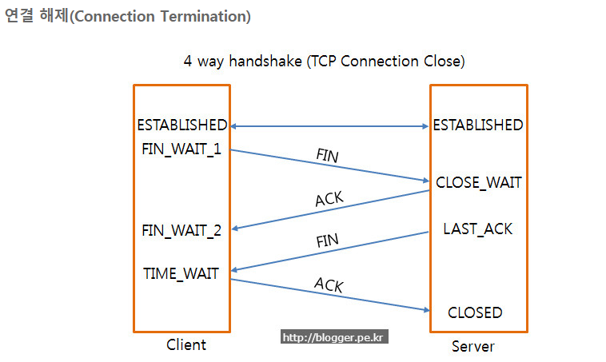
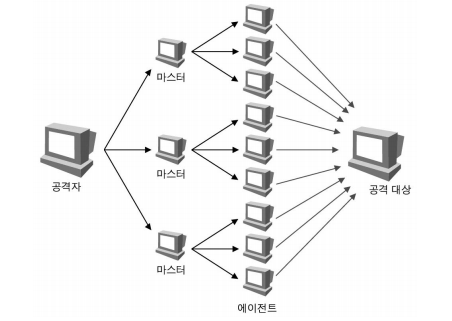

라인 서버

## LINE Fintech

* Java의 이해도가 높은 분
* Data structure, Algorithm, Network 등의 전산 기본 지식을 이해하고 활용할 수 있는 사람
* 페어 프로그래밍, 코드 리뷰 등에 거부감이 없으신 분
* 암호화 기술/ 네트워크 / 보안에 대한 이해도가 높으신 분

## Fintech Client 나왔던 질문

* 자기소개
* 자신있는 언어와 재밌었던 과목
* tcp udp 차이
* 트랜잭션이란?
* 트랜잭션이 길면 어떤 문제가 있냐
* 가비지 컬렉션이 언제 발생하냐
* 맵의 종류가 뭐가 있고 해쉬맵과 해쉬 테이블의 차이
* 어레이와 리스트의 차이 스레드의 관점에서 차이가 있나
* 스레드와 프로세스의 차이
* 데이터베이스에서 인덱스의 역할과 장점
* 데이터베이스 일관성을 위한 기술은?
* 어느 분야에서 개발하고 싶나
* 핀테크 분야면 블록체인 핀테크 분야인지
* 자바말고 할 줄 아는 언어 있느냐
* 지갑을 만들 때 중요한 게 뭔지
* 비동기 함수, 동기함수, 블로킹, 논블로킹
* synchronized는 언제 사용하나
* 안드로이드 생명 주기

## Fintech Server 경력직 자격 요건/ 담당 업무

### 담당업무

* LINE 보험/투자/증권뱅크 와 같은 핀테크 서비스의 백엔드 시스템 개발
* 대용량 데이터 처리 및 분석
* 글로벌 서비스로서 지속적으로 증가하는 트래픽과 국가별 다양한 요구사항 처리
* 최신 Fintech 트렌드와 신기술에 대한 연구 및 적용

### 자격 요건

* Java, Java Framework 기반 개발 능숙 자
* Restful API 디자인 능숙 자
* Network/ System programming에 대한 경험
* 모바일 금융 서비스에 익숙하고 관련 최신 트렌드 관심도
* 모바일 환경을 고려하여 서비스를 개발한 경험
* 대용량 데이터를 처리/저장/분석하는 환경을 구축/운영 경험한 자

# 라인 필기 대비

## 알고리즘

### 버블 소트

* 인접한 두 개의 데이터를 비교해가면서 정렬을 진행하는 방식
* 빅 오 엔 제곱

### 선택 정렬(셀렉션 소트)

* 순회하면서 젤 작은 값(큰 값)의 인덱스 찾고 맨 앞(뒤)으로 보냄
* 빅 오 엔 제곱

### 삽입 정렬

* 두 번째 값부터 앞의 값과 비교 시작
* temp가 앞의 값보다 작다면 앞의 값은 뒤로 밀어준다.
* 크면 그 자리에 넣는다.
* 빅 오 엔 제곱

### 머지 소트

* 나눠지지 않을 때까지 반으로 나눈 후 합칠 때, 큰 건 뒤로 작은 건 앞으로 합친다.
* 빅오 엔 로그 엔

### 힙 소트

* 힙은 맥스힙 민 힙 있는데 맥스힙은 부모 노드가 자식 노드보다 큰 것
* 힙의 삭제 연산(루트 값을 꺼내고 힙의 마지막 노드를 루트에 삽입)을 계속해서 진행해서 정렬 마무리
* 빅오 엔 로그 엔

### 퀵 소트

* 배열 중 숫자 하나를 피벗으로 설정하고 맨 끝으로 보낸다.
* 왼쪽과 오른쪽 인덱스에서 하나씩 줄여가며 피벗과 비교
* 왼쪽 거가 피벗보다 작으면 다음으로 넘어가고 크면 가만히 있는다.
* 오른쪽 거가 피벗보다 크면 다음으로 넘어가고 작으면 가만히 있는다.
* 왼쪽거가 크고 오른쪽거가 크면 바꿔주고 둘다 다음으로 넘어간다.
* 왼쪽과 오른쪽이 만난 수와 피벗을 바꿔준다.
* 피벗의 왼쪽과 오른쪽에 대해서 다시 퀵소트 진행
* 최악은 빅오 엔제곱 평균 빅오 엔로그엔

### 카운팅 소트

* 좁은 범위에 존재하는 데이터 정렬할 때 좋음
* 수 중 최대값의 크기만큼 배열 생성하고 한바퀴 돌면서 해당 수가 있으면 배열의 해당 수 인덱스에 카운트를 올려준다.
* 그리고 마지막에 해당 수의 카운트만큼 적어준다.
* 공간복잡도 최대값의 크기, 시간복잡도 빅오 엔

### 래딕스 소트(기수 정렬)

* 빅 오 엔
* 가장 작은 자리수부터 비교 lsd 큰 자리수 비교 msd

## 네트워크

### TCP

#### 정의

* 신뢰성과 순차적인 전달을 할 수 있음
* 신뢰성 있는 바이트 스트림을 전송
* 소켓이라고 부르는 종단점을 생성함으로써 이루어짐
* 연결 설정은 3-way-handshake를 통해 이루어진다.
* 전이중 : 전송이 양방향으로 동시에 일어날 수 있음
* 점대점 : 각 연결이 정확히 2 개의 종단점을 가지고 있음

#### TCP handshake

* 클라이언트 to 서버 서버 접속 요청인 syn(m)
* 서버 to 클라이언트 요청 수락 ack(m + 1), syn(n)
* 클라이언트 to 서버 ack(n + 1) 이 끝나면 연결 성립

* 클라이언트 to 서버 연결 종료 요청 fin 플래그
* 서버 to 클라이언트 확인 메세지 ack
* 서버에서 데이터를 모두 보낼 때까지 Time out
* 데이터를 모두 보내고 통신이 끝나면 연결이 종료됐다고 서버 to 클라이언트 fin 플래그
* 클라이언트 to 서버 fin메세지 확인인 ack
* 클라이언트는 못 받은 데이터를 대비해 세션을 남겨놓고 time wait

#### 패킷 종류

두 종류인 이유는 요청과 응답에 대한 패킷을 주고 받아야 하기 때문

##### syn

* synchronize sequence number

##### ack

* acknowledgement

#### why 3 way?

* TCP는 양방향성이기 때문에 자신의 존재를 알리고 목소리가 들리는지 확인해야 한다.

#### why randomized sequence number?

* 포트는 범위가 한정적이고 재사용되기 때문에 과거의 사용했던 포트를 사용할 수 있다.
* 이 때, 순차적인 수가 전송된다면 이전의 연결에서 온 패킷으로 인식할 수 있다.

### UDP

#### 정의

* 비연결형 프로토콜
* IP 데이터그램을 캡슐화하여 보내는 방법과 연결 설정을 하지 않고 보내는 방법 제공
* 오류제어나 손상된 세그먼트에 대해 재전송을 하지 않는다
* TCP보다 적은 메시지가 요구됨

### HTTP/HTTPS

#### HTTP의 문제점

* 평문 통신이기 때문에 도청 가능
* 통신 상대를 확인하지 않기 때문에 위장 가능
* 완전성을 증명할 수 없기에 변조 가능

#### TCP/IP는 도청 가능한 네트워크

* 통신 경로 상에서 엿볼수 있다.
* 보안 방법
  * 통신 자체를 암호화
    * SSL or  TSL이라는 다른 프로토콜을 조합해서 통신 내용을 암호화
  * 콘텐츠를 암호화
    * 암호화해서 전송하면 받은 측에서는 암호를 해독하여 출력하는 처리가 필요

#### 위장 가능

* 상대가 누구인지 확인하는 처리가 없기 때문에 누구든 리퀘스트를 보내고 서버는 리스폰스를 반환한다.
  * 서버가 원래 의도한 리스폰스를 보내야 하는 서버인지 확인 불가
  * 리스폰스를 반환한 곳이 의도한 클라이언트인지 확인 불가
  * 상대가 접근이 허가된 상대인지를 알 수 없음
  * 의미 없는 리퀘스트도 수신 (DoS 공격 방지 불가)
* SSL로 상대를 확인한다.
* SSL
  * 상대를 확인하는 수단으로 증명서 제공
  * 신뢰할 수 있는 제 3자 기관에서 발행된 것이기 때문에 실재하는 사실을 증명
  * 통신하고 싶은 서버임을 확인하고 개인 정보 누설 위험성 줄어듬
  * 본인 확인과 웹 사이트 인증 가능

#### 변조 가능

* 정보가 정확한 지 알 수 없다.
* 통신 중간에 누군가에 의해 변조될 수 있다.
* MD5, SHA-1 등의 해쉬 값을 확인을 통해 방지 가능
* 그러나 HTTPS를 사용하는 것이 좋다 SSL에는 인증이나 암호화, 다이제스트 기능이 있다

#### HTTPS

* HTTP의 소켓 부분을 SSL(Secure Socket Layer)나 TLS(Transport Layer Security)라는 프로토콜로 대체
* HTTP가 SSL과 통신하고 SSL이 TCP와 통신
* 공통키 암호화 와 공개키 암호화
* 공통키는 공통키를 공개키 방식으로 교환하고 다음부터 통신은 공통키 암호를 사용

### DNS round robin

#### 문제점

* 서버의 수만큼 공인 IP 주소가 필요함 부하 분산을 위해 서버의 대수를 늘리려면 그만큼 공인 IP가 필요함
* 균등하게 분산되지 않음
  * 스마트폰 접속은 캐리어 게이트웨이라고 하는 프록시 서버 경유
  * 이 때 이름변환 결과가 캐싱되므로 항상 같은 서버로 접속
  * PC에서도 DNS 질의 결과를 캐싱하기 때문에 균등하게 부하분산이 안됨

#### 해결 방안

##### weighted round robin

* 각각의 웹 서버에 가중치를 가미해서 분산 비율을 변경 가중치가 큰 서버일 수록 빈번하게 선택되므로 처리능력이 높은 서버에 가중치를 높게 둔다

##### least-connection

* 접속 클라이언트 수가 가장 적은 서버를 선택, 로드 밸런서에서 실시간으로 커넥션 수를 관리하거나 각 서버에서 주기적으로 알려줘야 한다.

### 웹 통신의 큰 흐름

* 브라우저 -> 프로토콜 스택, LAN어댑터 -> 허브, 스위치, 라우터 -> 액세스 회선, 프로바이더 -> 방화벽, 캐시 서버 -> 웹 서버

##### 브라우저

* url에 입력된 값을 브라우저 규칙에 따라 의미 조사
* 의미에 따라 request 메시지 만들고 웹서버로 전송

##### 프로토콜 스택, LAN어댑터

* 프로토콜 스택(운영체제에 내장된 네트워크 제어용 소프트웨어)가 브라우저로부터 메시지를 받음
* 메시지를 패킷 속에 저장
* 수신처 주소 등의 제어정보를 덧붙임
* 패킷을 LAN어댑터에 넘긴다
* LAN어댑터는 패킷을 전기신호로 변환
* LAN 케이블에 송출

##### 허브, 스위치, 라우터

* LAN 어댑터가 송신한 패킷은 스위칭 허브를 경유해 인터넷 접속용 라우터에 도착
* 라우터는 패킷을 프로바이더(통신사)에게 전달
* 인터넷으로 접속

##### 액세스 회선, 프로바이더

* 패킷은 인터넷의 입구에 있는 액세스 회선(통신 회선)에 의해 통신사용 라우터(POP)까지 운반
* POP를 거쳐 인터넷의 핵심부로 들어감
* 수 많은 고속 라우터들 사이로 패킷이 목적지를 향해 흘러감

##### 방화벽, 캐시서버

* 패킷은 인터넷 핵심부를 통과하여 웹 서버 측의 LAN에 도착
* 기다리고 있던 방화벽이 도착한 패킷을 검사
* 패킷이 웹 서버까지 가야하는지 가지 않아도 되는지 판단하는 캐시서버가 있음
* 액세스한 페이지의 데이터가 캐시서버에 있으면 웹 서버에 의뢰하지 않고 바로 그 값을 전송

##### 웹 서버

* 패킷이 물리적인 웹 서버에 도착하면 웹 서버의 프로토콜 스택은 패킷을 추출하여 메시지를 복원하고 웹 서버 애플리케이션에 넘긴다

* 메시지를 받은 웹 서버 애플리케이션은 요청 메시지에 따른 데이터를 응답 메시지에 넣어 클라이언트로 회송

* 왔던 방식대로 응답 메시지가 클라이언트에게 전달

  

### OSI 7계층

응용 -> 표현 -> 세션 -> 전송 -> 네트워크 -> 데이터 링크 -> 물리

#### 물리

* 전송에 필요한 두 장치 간의 실제 접소고가 절단 등 규칙 정의

#### 데이터 링크

* 두 개의 인접한 개방 시스템들 간에 신뢰성 있고 효율적인 정보 전송
* 송신 측과 수신 측의 속도 차이를 해결하기 위한 흐름 제어
* 프레임의 시작과 끝을 구분하기 위해 프레임 동기화
* 오류의 검출과 회복을 위한 오류 제어
* 프레임의 순서적 전송을 위한 순서 제어

#### 네트워크

* 개방 시스템들 간의 네트워크 연결을 관리하고 데이터의 교환 및 중계
* 네트워크 연결을 설정 유지 해제
* 경로 설정(routing), 데이터 교환 및 중계, 트래픽 제어, 패킷 정보 전송

#### 전송

* 논리적 안정과 균일한 데이터 전송 서비스를 제공함으로 엔드 투 엔드 간에 투명한 데이터 전송을 가능케 함
* 하위 3계층과 상위 3계층의 인터페이스 담당
* 엔드 투 엔드 간의 전송 연결 설정, 데이터 전송, 연결 해제
* 주소 설정, 다중화, 오류 제어, 흐름 제어
* TCP, UDP

#### 세션

* 송 수신 측 간의 관련성을 유지하고 대화 제어를 담당
* 송 수신 측 간의 대화 동기를 위해 전송하는 정보의 일정한 부분에 체크점을 두어 정보의 수신 상태를 체크하고 체크점을 동기점이라 한다.
* 대화 구성 및 동기 제어, 데이터 교환 관리
* 동기점은 오류가 있는 데이터의 회복을 위해 사용

#### 표현

* 응용 계층으로부터 받은 데이터를 세션 계층에 보내기 전에 통신에 적당한 형태로 변환하고, 세션 계층에서 받은 데이터는 응용 계층에 맞게 변환
* 서로 다른 데이터 표현 형태를 갖는 시스템 간의 상호 접속을 위해 필요함
* 코드 변환, 데이터 암호화, 데이터 압축, 구문 검색, 정보 형식 변환, 문맥 관리

#### 응용

* 사용자(응용 프로그램)가 osi 환경에 접근할 수 있도록 서비스를 제공
* 응용 프로세스 간의 정보 교환, 전자 사서함, 파일 전송, 가상 터미널 제공

### 주소 체계

* IP 32bit
* 8bit씩 나눈다
* A클래스.B클래스.C클래스.D클래스/E클래스
* 국가.중대형.소규모.멀티캐스트/실험적 주소

#### 서브네팅

* 할당된 네트워크 주소를 다시 여러 개의 작은 네트워크로 나누어 사용하는 것

* 클래스마다 다르게 사용 기본값은 255.0.0.0 255.255.0.0 255.255.255.0

* 한 개의 C 클래스 주소를 나누어 사용하기 위해 호스트 주소를 8비트가 아닌 6비트만 사용하고, 네트워크 주소로 24비트가 아닌 26비트를 사용하면

  서브넷 마스크는 255.255.255.192가 된다.

  11111111.11111111.11111111.11000000

#### IPv6

* IPv4의 주소 부족 문제를 해결하기 위해 개발됨
* 16 비트씩 8부분 총 128비트로 구성됨

### 프로세스와 스레드

#### 프로세스

* 실행 중인 프로그램으로 디스크로부터 메모리에 적재되어 CPU의 할당을 받을 수 있는 것
* 운영체제로부터 주소 공간, 파일, 메모리 등을 할당받고 이를 총칭해서 프로세스라고 함
* 함수의 매개변수, 복귀 주소, 로컬 변수 같은 임시 자료를 갖는 프로세스 스택
* 전역 변수들을 수록하는 데이터 섹션을 포함
* 실행 중에 동적으로 할당되는 메모리인 힙을 포함

##### 프로세스 제어 블록(PCB)

* 특정 프로세스에 대한 중요한 정보를 저장하고 있는 운영체제의 자료구조
* 프로세스 생성과 동시에 고유한 PCB 생성
* 작업 도중 프로세스 전환이 발생하면 작업을 저장하고 CPU에 반환해야 하는데 진행 상황이 PCB에 저장됨
* 저장되는 정보
  * 프로세스 식별자(PID)
  * 프로세스 상태
  * 프로그램 카운터 : 다음 실행할 명령어의 주소
  * CPU 레지스터
  * CPU 스케쥴링 정보 : 프로세스의 우선수위, 스케줄 큐에 대한 포인터
  * 메모리 관리 정보 : 페이지 테이블 또는 세그먼트 테이블
  * 입출력 상태 정보 : 프로세스에 할당된 입출력 장치들과 열린 파일 목록
  * 어카운팅 정보 : 사용된 CPU 시간, 시간 제한, 계정 번호

#### 스레드

* 프로세스의 실행 단위
* 한 프로세스 내에서 동작되는 여러 실행 흐름으로 프로세스 내의 주소 공간이나 자원을 고유 가능
* 스레드 ID, 프로그램 카운터, 레지스터 집합, 스택으로 구성
* 같은 프로세스에 속한 다른 스레드와 코드, 데이터 섹션, 열린 파일, 신호 같은 운영체제 자원 공유
* 하나의 프로세스를 다수의 실행단위로 구분하여 자원을 공유하고 자원의 생성과 관리 중복을 최소화하여 수행 능력을 향상시키는 것을 멀티스레딩이라 한다
* 멀티스레딩의 경우 독립적인 작업을 수행해야 하므로 각자의 스택과 PC 레지스터 값을 갖고 있다.

##### 스택을 스레드마다 독립적으로 할당하는 이유

* 스택은 함수 호출 시 전달되는 인자, 되돌아갈 주소값 및 함수 내에서 선언하는 변수 등을 저장하기 위해 사용되는 메모리 공간이므로 스택 메모리 공간이 독립적이라는 것은 독립적인 함수 호출이 가능하다는 것이다.
* 독립적인 실행 흐름을 추가하기 위해 독립된 스택을 할당

##### PC Register를 스레드마다 독립적으로 할당하는 이유

* PC 값은 스레드가 명령어의 어디까지 수행했는지를 나타낸다.
* 스레드는 CPU를 할당받았다가 스케줄러에 의해 뺏길 수 있기 때문에 어디까지 수행했는지 기억해야함
* 따라서 독립적으로 할당

#### 멀티 스레드

##### 장점

* 메모리 공간과 시스템 자원 소모가 줄어듦
* 스레드 간의 통신이 필요한 경우에도 전역 변수의 공간이나 Heap 영역을 이용해 통신 가능
* 스레드의 context switch는 캐시 메모리를 비울 필요가 없기 때문에 빠르다
* 자원소모가 줄어들어 응답시간이 단축됨

##### 문제점

* 멀티 프로세스 프로그램은 자원을 공유하지 않기 때문에 상관없지만 멀티 스레드는 공유하기 때문에 관리해줘야됨
* 동기화 작업을 해줘야 함 동기화를 통해 작업 처리 순서를 제어하고 자원 접근을 제어
* 병목현상이 발생해 성능 저하 가능성이 있음

## 보안

### 보안사고 유형

- 국제웹보안표준기구가 정한 10대 취약점
- 운영체제
- 웹 취약성 이용한 웹쉘/홈페이지 변조
- 네트워크 프로토콜 취약점 노린 DDoS/DOS 공격
- 서버/소셜
- DNS 취약점을 악용한 피싱과 파밍
- 사회 물리 취약성을 이용한 APT 공격

#### DOS 공격

* Denial of Service

* 공격 대상이 수용할 수 있는 능력 이상의 정보나 사용자 또는 네트워크의 용량을 초과 시켜 정상적으로 작동하지 못하게 함

* 파괴 공격

  * 디스크나 데이터, 시스템의 파괴

* 시스템 자원의 고갈

  * CPU, 메모리, 디스크의 사용에 과다한 부하를 가중시킴

* 네트워크 자원의 고갈

  * 쓰레기 데이터로 네트워크의 대역폭을 고갈 시킴

* Ping of Death

  * Ping을 이용하여 ICMP 패킷을 정상적인 크기보다 아주 크게 만드는 것
  * 공격대상 시스템은 정상적인 Ping의 경우보다 훨씬 많은 부하

* Syn Flooding

  * 서버별 한정되어 있는 동시 사용자 수를 존재하지 않는 클라이언트가 접속한 것처럼 속임
  * 다른 사용자가 서버에서 제공하는 서비스를 받지 못하게 하는 것

  

  * 보안 대책
    * 보안 패치로서 대기 시간을 줄이는 것
    * 일차적으로 시스템에 패치
    * 다음으로는 IDS의 설치
  * 아주 짧은 시간 안에 똑같은 형태의 패킷을 전송
  * 매우 정형화된 형태로 네트워크에서 쉽게 인지가 가능
  * 해당 ISP 업체에 연락하여 그에 해당하는 IP 대역을 접속 금지

#### DDoS 공격

* DoS 공격이 짧은 시간에 여러 곳에서 일어나게 하는 공격

* 피해 양상이 상당히 심각하며, 확실한 대책이 없음

* 공격자의 위치와 구체적인 발원지를 파악하는 것이 불가능

* 자동화된 툴을 이용

* 공격의 범위가 방대

* 최종 공격대상 이외에도 공격을 증폭시켜주는 중간자가 필요

  

* 공격자 : 공격을 주도하는 해커의 컴퓨터

* 마스터 : 공격자에게서 직접 명령을 받는 시스템으로 여러 대의 에이전트를 관리하는 시스템

* 에이전트 : 공격대상에 직접적인 공격을 가하는 시스템

* 대응책

  * 방화벽 설치와 운영
  * IDS(침입 탐지 시스템 Intrusion Detection System) 설치와 운영
    * IDS는 악의적인 것으로 추정되는 트래픽 또는 어플리케이션 데이터의 패턴을 감시하여 침입을 식별
  * 안정적인 네트워크의 설계
  * 시스템 패치
  * 모니터링
  * 서비스별 대역폭 제한

#### 기타 공격

##### 스푸핑

* 속이는 것
* IP 주소, 호스트 이름, MAC 주소 등
* 모든 연결에 스푸핑이 가능하며, 정보를 얻어내는 것 외에도 시스템을 마비시키는 것도 가능

##### 세션 하이재킹

* 이미 인증을 받아 세션을 유지하고 있는 연결을 여러 가지 방법으로 빼앗는 공격
* TCP 세션 하이재킹은 연결의 신뢰성을 확보하기 위한 시퀀스 넘버를 이용한 공격
* 클라이언트와 서버간의 통신을 관찰
* 대응책
  * 데이터 전송의 암호화
  * 지속적인 인증
    * 어떤 특정한 행동을 하거나 일정 시간이 되면 재인증을 하는 것

##### 스니핑

* 정보를 데이터 속에서 찾는 것
* 프러미스큐어스 모드 : 자신의 주소 값을 무시하고 모든 패킷을 받아들이는 상태
* 스니퍼 탐지
  * 네트워크에 이상 현상을 만들지 않음
  * ping을 이용 : 의심이 가는 호스트에 ping -> ICMP Echo reply를 받으면 해당 호스트가 스니퍼
  * ARP를 이용 : 위조된 ARP request를 전송 -> ARP response가 오면 프러미스큐어스 모드로 설정
  * DNS 방법 : 테스트 대상 네트워크로 ping sweep을 보내고 들어오는 Inverse-DNS lookup을 감시하여 스니퍼를 탐지
  * 유인 방법 : 가짜 계정과 패스워드를 네트워크에 뿌려 접속을 시도하는 시스템 탐지

### 보안 방법

#### 방화벽

* 네트워크에서의 보안을 높이는 데 일차적인 것
* 신뢰하지 않는 외부 네트워크와 신뢰하는 내부 네트워크 사이를 지나는 패킷을 정해 놓은 규칙에 따라 차단하거나 보내주는 기능
* 주 기능
  * 접근 제어
  * 로깅과 감사추적
  * 인증
  * 데이터의 암호화

#### 스크리닝 라우터

* 3계층인 네트워크 계층과 4계층 트랜스포트 계층에서 실행되며, IP 주소와 포트에 대한 접근 제어가 가능
* 외부 네트워크와 내부 네트워크의 경계선
* 라우터에 패킷 필터링 규칙을 적용하는 것으로 방화벽의 역할을 수행

#### 단일 홈 게이트 웨이

* 강력한 보안 정책 실행 가능(방화벽 구성)
* 방화벽이 손상되면 내부 네트워크에 대한 무조건적인 접속을 허용
* 방화벽으로의 원격 로그인 정보가 노출되어 방화벽에 대한 제어권을 공격자가 얻게 되면 내부 네트워크를 더 이상 보호할 수가 없음

#### 스크린된 호스트 게이트웨이 - 단일 홈

* 스크리닝 라우터와 단일 홈 게이트웨이의 조합
* 가장 많이 이용되는 구조이며 융통성이 좋음

#### 패킷 필터링

* 명백히 허용하지 않은 서비스에 대한 거부를 적용
  * 허용할 서비스를 확인
  * 제공하고자 하는 서비스가 보안의 문제점은 없는지와 허용에 대한 타당성을 검토
  * 서비스가 이루어지고 있는 형태를 확인하고, 어떤 규칙을 적용할 지 구체적인 결정
  * 방화벽에 실제 적용을 하고, 적용된 규칙을 검사

#### NAT(Network Address Translation)

* 현재 가용 가능한 공인 주소의 부족 문제를 해결하기 위해 개발된 기술 중 하나
* 내부 네트워크에서 시스템 사설 주소를 소유하고 있으나 외부로 접근할 때 라우팅이 가능한 외부 공인 주소를 NAT 규칙에 따라 할당 받아 접속

### 네트워크 보안

#### 스테판 노스컷 보안의 3단계

* 보호 : 시스템과 네트워크를 최대한 올바르게 설정해야 함
* 탐지 : 설정이 변경되거나 일부 네트워크 트래픽에 문제가 생기면 이를 파악할 수 있어야 함
* 대응 : 문제를 신속하게 파악한 후에는 대응 조치를 취하고 가능한 빨리 안전한 상태로 돌아가야 함

#### 보안 방법론

* 액세스 제어 : 권한 없는 사용자와 디바이스가 네트워크에 액세스 하는 것을 차단할 수 있어야 함, 네트워크 액세스가 허용된 사용자라도 승인을 받은 한정된 자원만 사용해야 함
* 안티맬웨어 : 바이러스나 웜, 트로이 목마 등은 네트워크 전체로 확산하려고 시도함, 보안은 초기 감염을 방지하기 위해 최선을 다해야 하고, 악성코드가 네트워크로 확산되기 전에 막아야 한다.
* 애플리케이션 보안 : 안전하지 않은 애플리케이션은 공격자가 네트워크에 침입하는 데 이용하는 요소가 된다. 조심하자!
* 행위 분석 : 정상적인 네트워크 행위가 어떤 모습인지 알아야 비정상적인 행위나 악용이 발생했을 때 알아차릴 수 있다.
* 데이터 손실 방지 : 직원들이 민감한 데이터를 네트워크 외부로 보내지 않도록 하는 기술과 프로세스를 구현
* 이메일 보안 : 피싱은 공격자가 네트워크 액세스 권한을 획득하는 가장 보편적인 방법, 이메일 보안툴로 내부로 들어오는 공격과 민감한 데이터를 담은 채 외부로 나가는 메시지를 차단
* 방화벽 : 기업 네트워크와 인터넷 사이의 경계선에서 트래픽을 허용하거나 거부하도록 정의한 규칙에 따라 이루어짐, 신뢰할 수 있는 영역과 거친 외부 영역 사이에 장벽을 구축
* 모바일 디바이스 및 무선 보안 : 무선 디바이스 역시 보안 결함의 가능성 존재, 조사해야 한다.
* 네트워크 세그먼테이션 (망 분리) : 소프트웨어 정의 세그먼테이션은 네트워크 트래픽을 서로 다른 분류로 보내 보안 정책을 좀 더 쉽게 적용 가능
* SIEM : 다양한 네트워크의 정보를 자동으로 취합해 위협을 파악하고 대응하는 데 필요한 데이터를 제공
* VPN : IPSec이나 SSL을 기반으로 하는 툴, 디바이스와 안전한 네트워크 간의 커뮤니케이션을 인증하고 개방된 인터넷을 가로질러 안전하고 암호화된 일종의 터널을 생성

## 암호화

* 두 가지 기본 요소가 있음. 암호 알고리즘 과 암호화 키
* 암호알고리즘은 표준화되어 공개되어 있으므로 핵심은 암호화 키

### 대칭키와 비대칭키

#### 대칭키(ex: AES & DES)

- 대칭키 암호시스템은 송신측과 수신측간에 각각 암호화와 복호화를 위하여 동일한 비밀키를 사용
- 이 키는 비밀 통신망 또는 직접전달 등의 안전한 전송방식을 통해 사전에 전달되어야 함
- 대칭키 암호화 방식은 암복호화 속도가 빠른 이점이 있으나 키 관리에 어려움이 있음
- 데이터를 변환하는 방식에 따라 블록암호와 스트림 암호로 구분
- 블록암호
  - 고정된 크기의 블록 단위로 암호화, 복호화 연산을 수행
  - 암호키 크기에 따라 64 ~ 256비트 블록 크기로 연산 수행
  - 암호 블록으로 만들 때 적용되는 방식에 따라 파이스텔 블록과 SPN블록으로 구분
  - 파이스텔 블록 구조 : 평문 블록을 좌우 두 개 블록으로 분할하고, 좌측 블록을 파티스텔 함수라 불리는 라운드 함수를 적용하여 출력된 결과를 우측 블록에 적용하는 과정을 반복적으로 수행(DES)
  - SPN 블록 구조 : 평문 블록을 분할하지 않고 전체 블록을 적용하는 방식으로 라운드 함수의 역함수를 구해야 하는 어려움이 있음(AES)
  - DES
    - 56비트라는 작은 암호키로 인해 깨기 쉬움
  - AES
    - DES를 대체하기 위해 나왔으며 키의 크기는 128, 192, 256 비트 지원
    - 암호 블록 크기는 128비트

#### 비대칭키(공개키 암호시스템 RSA)

- 대칭키 암호시스템에 반해 비대칭키(공개키 암호시스템)은 암호화와 복호화를 위해 서로 다른 키를 사용
- 다른 키는 공개 키라고 하며 공개된 장소에서 쉽게 접근이 가능하도록 보관
- 암호화 할 때 사용하는 공개키는 공개된 시스템에 전화번호처럼 공개하고 복호화할 때 사용하는 비밀키는 안전하게 보관하여야 함
- 비대칭키는 암/복호화할 때의 키 값이 다르다.
- 대표적으로는 RSA라는 암호화가 있으며 암호화할 때의 키를 공개키 복호화할 때의 키를 개인키라고 한다.

### Public key & Private key

- 각자 A와 B에 요청해 서로의 공개키를 갖고 있다.
- A는 A의 공개키, 개인키, B의 공개키
- B는 B의 공개키, 개인키, A의 공개키
- B는 A에게 요청을 보낼 때 A의 공개키로 암호화 하여 전송한다.
- A는 자신의 개인키로 받은 메세지를 복호화한다.

#### RSA 암호 알고리즘

- 공개키 암호시스템의 하나로, 암호화 뿐만 아니라 전자서명이 가능한 최초의 알고리즘으로 알려져 있다. RSA가 갖는 전자서명 기능은 인증을 요구하는 전자 상거래 등에 RSA의 광범위한 활용을 가능하게 했다.
- RSA 암호체계의 안정성은 큰 숫자를 소인수 분해하는 것이 어렵다는 것에 기반을 두고 있다. 그러므로 큰 수의 소인수 분해를 획기적으로 빠르게 할 수 있는 알고리즘이 발견된다면 이 암호체계는 가치가 떨어진다.
- RSA는 두 개의 키를 사용한다.(키란 메시지를 열고 잠그는 상수를 의미)
- RSA를 이용한 인증 과정
  - C가 은행에 자신의 공개키를 보낸다.
  - 은행은 대칭형 암호 알고리즘에서 사용할 비밀키를 C의 공개키를 이용하여 암호화한 다음 전송한다.
  - C는 자신의 개인키로 복호화하여 은행의 비밀키를 얻어낸다.
  - C와 은행간의 통신은 전송받은 비밀키를 통해 암호화 된다.
  - 공격자가 중간에서 암호화된 비밀키를 획득하더라도 C의 개인키를 알지 못하면 복호화 할 수 없기 때문에 비밀키로 암호화된 내용을 볼 수 없다.
  - 문제점
    - 공격자가 은행에 접속해서 C인 것처럼 가장하고 자신의 공개키로 전송하면?
    - 은행이 속는다면 은행은 A는 비밀키를 획득할 수 있게 된다.
    - 은행이 C의 공개키를 인증할 수 있는 방법이 필요한데 그것이 바로 인증서다.
- 흔히 1024비트를 이용(슈퍼컴퓨터로 155자리(512비트)짜리 수가 소인수 분해 됐음)
- 실행법
  - 두 개의 큰 소수 p, q를 선정하여 비밀키로 설정
  - n = pq인 n을 공개하고 φ(n)(n과 서로소의 관계에 있는 원소들의 개수)과 서로 소인 임의의 정수 e를 선택하여 공개키로 한다.
  - ed   ≡ 1(modφ(n)) 이 되는 d를 Euclidean Algorithm 등으로 계산하여 비밀 열쇠로 한다.
  - 즉, p와 q 그리고 d는 비밀 열쇠로, n과 e는 공개키로 한다.
  - 암호화 Step
    - 평문 M을 공개키 e를 사용하여 $M^e$를 계산한 다음 modular n으로 간단히 한다.
    - 암호문 C는 $M^e(modn)$
  - 복호화 Step
    - 암호문 C를 비밀열쇠 d를 이용하여 $C^d$한 다음 modular n으로 간단히 한다.
    - $C^d = (M^e)^d = M^{tφ(n)+1}=M^{φ(n)t}M = M(mod n)$
    - $ed = 1(modφ(n))$에서 유도되는 $ed = tφ(n)+1$을 만족하는 정수 t

### 단방향 암호

* 평문을 암호문으로 암호화하는 것은 가능하지만 암호문을 평문으로 복호화하는 것은 불가능한 암호화 기법
* 패스워드는 단방향 암호로 저장하는 것이 안전하다.
* 암호화한 값끼리 비교하여 인증하면 된다.
* 주로 해시 기법을 사용하며 최소한 SHA-256 가능하면 SHA-3를 쓰는 것이 좋다.
* MD5는 단시간 내에 충돌값을 찾아낼 수 있음

