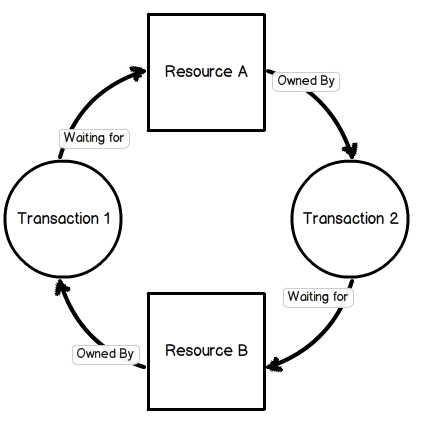
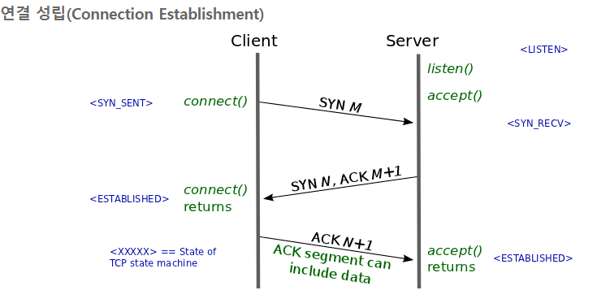
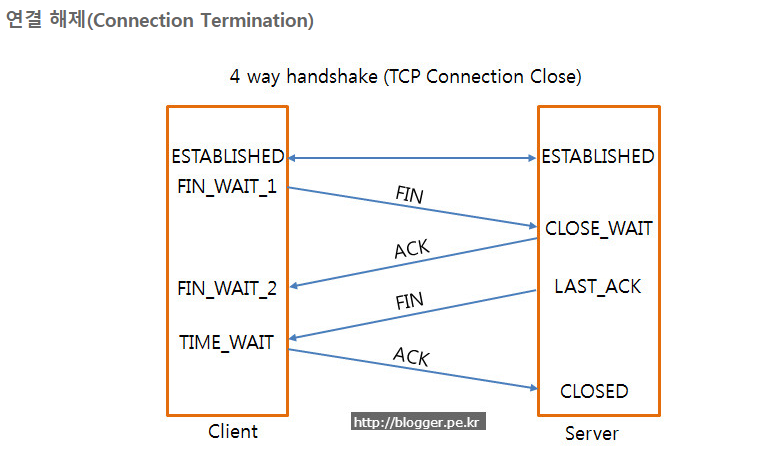
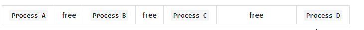
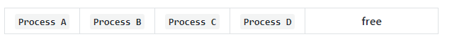

# 라인 면접 대비

## LINE Fintech

- Java의 이해도가 높은 분
- Data structure, Algorithm, Network 등의 전산 기본 지식을 이해하고 활용할 수 있는 사람
- 페어 프로그래밍, 코드 리뷰 등에 거부감이 없으신 분
- 암호화 기술/ 네트워크 / 보안에 대한 이해도가 높으신 분

## Fintech Client 나왔던 질문

- 자기소개
- 자신있는 언어와 재밌었던 과목
- tcp udp 차이
- 트랜잭션이란?
- 트랜잭션이 길면 어떤 문제가 있냐
- 가비지 컬렉션이 언제 발생하냐
- 맵의 종류가 뭐가 있고 해쉬맵과 해쉬 테이블의 차이
- 어레이와 리스트의 차이 스레드의 관점에서 차이가 있나
- 스레드와 프로세스의 차이
- 데이터베이스에서 인덱스의 역할과 장점
- 데이터베이스 일관성을 위한 기술은?
- 어느 분야에서 개발하고 싶나
- 핀테크 분야면 블록체인 핀테크 분야인지
- 자바말고 할 줄 아는 언어 있느냐
- 지갑을 만들 때 중요한 게 뭔지
- 비동기 함수, 동기함수, 블로킹, 논블로킹
- synchronized는 언제 사용하나
- 안드로이드 생명 주기

## Fintech Server 경력직 자격 요건/ 담당 업무

### 담당업무

- LINE 보험/투자/증권뱅크 와 같은 핀테크 서비스의 백엔드 시스템 개발
- 대용량 데이터 처리 및 분석
- 글로벌 서비스로서 지속적으로 증가하는 트래픽과 국가별 다양한 요구사항 처리
- 최신 Fintech 트렌드와 신기술에 대한 연구 및 적용

### 자격 요건

- Java, Java Framework 기반 개발 능숙 자
- Restful API 디자인 능숙 자
- Network/ System programming에 대한 경험
- 모바일 금융 서비스에 익숙하고 관련 최신 트렌드 관심도
- 모바일 환경을 고려하여 서비스를 개발한 경험
- 대용량 데이터를 처리/저장/분석하는 환경을 구축/운영 경험한 자

## 알고리즘

### 안정정렬/ 불안정정렬

* 안정정렬 : 동일한 값에 대해 기존의 순서가 유지되는 정렬 방식
  * 버블 소트
  * 인설션 소트
  * 머지 소트
  * 카운팅 소트
  * 버킷 소트
  * 래딕스 소트
* 불안정 정렬 : 동일한 값에 대해 기존의 순서가 유지되지 않는 정렬 방식
  * 셀렉션 소트
  * 쉘 소트
  * 힙 소트
  * 퀵 소트

### 버블 소트

* 인접한 두 개의 데이터를 비교해가면서 정렬을 진행하는 방식
* 빅 오 엔 제곱

### 선택 정렬(셀렉션 소트)

* 순회하면서 젤 작은 값(큰 값)의 인덱스 찾고 맨 앞(뒤)으로 보냄
* 빅 오 엔 제곱

### 삽입 정렬

* 두 번째 값부터 앞의 값과 비교 시작
* temp가 앞의 값보다 작다면 앞의 값은 뒤로 밀어준다.
* 크면 그 자리에 넣는다.
* 빅 오 엔 제곱

### 머지 소트

* 나눠지지 않을 때까지 반으로 나눈 후 합칠 때, 큰 건 뒤로 작은 건 앞으로 합친다.
* 빅오 엔 로그 엔

### 힙 소트

* 힙은 맥스힙 민 힙 있는데 맥스힙은 부모 노드가 자식 노드보다 큰 것
* 힙의 삭제 연산(루트 값을 꺼내고 힙의 마지막 노드를 루트에 삽입)을 계속해서 진행해서 정렬 마무리
* 빅오 엔 로그 엔

### 퀵 소트

* 배열 중 숫자 하나를 피벗으로 설정하고 맨 끝으로 보낸다.
* 왼쪽과 오른쪽 인덱스에서 하나씩 줄여가며 피벗과 비교
* 왼쪽 거가 피벗보다 작으면 다음으로 넘어가고 크면 가만히 있는다.
* 오른쪽 거가 피벗보다 크면 다음으로 넘어가고 작으면 가만히 있는다.
* 왼쪽거가 크고 오른쪽거가 크면 바꿔주고 둘다 다음으로 넘어간다.
* 왼쪽과 오른쪽이 만난 수와 피벗을 바꿔준다.
* 피벗의 왼쪽과 오른쪽에 대해서 다시 퀵소트 진행
* 최악은 빅오 엔제곱 평균 빅오 엔로그엔

### 카운팅 소트

* 좁은 범위에 존재하는 데이터 정렬할 때 좋음
* 수 중 최대값의 크기만큼 배열 생성하고 한바퀴 돌면서 해당 수가 있으면 배열의 해당 수 인덱스에 카운트를 올려준다.
* 그리고 마지막에 해당 수의 카운트만큼 적어준다.
* 공간복잡도 최대값의 크기, 시간복잡도 빅오 엔

### 래딕스 소트(기수 정렬)

* 빅 오 엔
* 가장 작은 자리수부터 비교 lsd 큰 자리수 비교 msd

### 해쉬테이블

- hash는 내부적으로 배열을 사용하여 데이터를 저장하기 때문에 빠른 검색 속도를 갖는다.
- 인덱스로 저장되는 key값이 불규칙함
- 특별한 알고리즘을 이용하여 저장할 데이터와 연관된 고유한 숫자를 만들어 낸 뒤 이를 인덱스로 사용함

#### 해쉬함수

- 고유한 인덱스 값을 만들어내는 특별한 알고리즘
- 어설픈 해쉬 함수를 통해서 키 값들을 결정하면 동일한 값이 도출됨
- 임의의 길이를 갖는 임의의 데이터에 대해 고정된 길이의 데이터로 매핑하는 함수

#### 해쉬충돌 해결

- 개방 주소법

  - 다른 해시 버킷에 해당 자료를 삽입함
  - 방법
    - 순차적으로 탐색하며 비어있는 버킷을 찾음
    - 2차 함수를 이용해 탐색할 위치를 찾는다.
    - 하나의 해쉬 함수에서 충돌이 발생하면 2차 해쉬 함수를 이용해 새로운 주소를 할당

- 분리 연결법

  - 해시 충돌이 잘 발생하지 않도록 보조 해시 함수를 통해 조정하여 최악의 경우에 가까워지는 빈도를 줄인다.

  - 자바의 해쉬맵

  - 방법

    - 연결 리스트를 이용하는 방식

      각각의 버킷들을 연결리스트로 만들어 충돌이 발생하면 해당 버킷의 리스트에 추가함

    - 트리를 사용하는 방식(레드블랙트리)

      연결 리스트 대신 트리를 사용함

    연결리스트를 사용할 지 트리를 사용할 지 기준은 하나의 해시 버킷에 할당된 키 밸류 쌍의 개수

    데이터의 개수가 적다면 리스트를 사용하는 것이 좋음

## 데이터베이스

### SQL

#### create

* create schema 스키마 이름

* create table 테이블 이름(칼럼명 datatype not null)

  primary key()

  foreign key()

#### alter

* alter table 테이블 이름 add 속성이름 data type, alter 속성 이름, drop 속성 이름 

#### drop

* drop schema 스키마 이름, domain 도메인 이름, table 테이블 이름 등등

#### select

* select 속성명 from 테이블명 where 조건 group by  속성명 having (그룹함수 count, max, min, sum, avg)  조건 (그룹 조건) order by 속성명

#### insert

* insert into 테이블명(속성명) values (데이터)

#### delete

* delete from 테이블명 where 조건

#### update

* update 테이블명 set 속성명 = 데이터 where 조건

### 특징

#### 독립성

* 물리적 독립성 : 데이터 베이스 사이즈를 늘리거나 성능 향상을 위해 데이터 파일을 늘리거나 새롭게 추가하더라도 관련된 응용 프로그램을 수정할 필요가 없다.
* 논리적 독립성 : 데이터베이스는 논리적인 구조로 다양한 응용 프로그램의 논리적 요구를 만족시켜줄 수 있다.

#### 무결성

* 잘못된 데이터가 발생하는 경우의 수를 방지, 데이터 유효성 검사를 통해 무결성 구현

#### 보안성

* 인가된 사용자들만 자원에 접근하도록 설정

#### 일관성

* 연관된 정보를 논리적인 구조로 관리, 하나의 데이터만 변경했을 때 데이터의 불일치성을 배제

#### 중복 최소화

* 데이터를 통합해서 관리함으로써 자료의 중복과 데이터 중복성 문제 해결

#### 성능

* 랜덤 I/O 작업을 순차 I/O로 바꿔서 실행하기 위해 데이터베이스 쿼리 튜닝을 한다.

### 인덱스

* 항상 정렬된 상태를 유지하므로, 원하는 값을 탐색하는데는 빠르지만 새로운 값을 추가하거나 삭제, 수정하는 경우에는 느리다. 인덱스는 데이터의 저장 성능을 희생하고 읽기 속도를 높이는 기능이다.

#### 인덱스 자료구조

* B+- 트리 사용

### 정규화

#### 생긴 배경

* 여러 엔티티의 애트리뷰트들을 혼합하게 되면 정보가 중복 저장되고 저장 공간이 낭비됨
* 중복 정보로 인한 갱신 이상 발생
* 동일한 정보를 한 릴레이션에는 변경하고, 나머지 릴레이션에서는 변경하지 않은 경우 무엇이 정확한지 알수 없게 된다.

##### 갱신 이상

* 삽입 이상
  * 원하지 않는 자료가 삽입 or 삽입하는데 자료가 부족해 삽입이 되지 않아 발생
* 삭제 이상
  * 하나의 자료만 삭제하고 싶지만, 자료가 포함된 튜플 전체가 삭제됨
* 수정 이상
  * 정확하지 않거나 일부의 튜플만 갱신되어 정보가 모호해지고 일관성이 없어짐

#### 정규화란?

* 관계형 데이터베이스에서 중복을 최소화하기 위해 데이터를 구조화함
* 나쁜 릴레이션의 어트리뷰트들을 나눠서 좋은 작은 릴레이션으로 분해
* 나쁜 릴레이션
  * 엔티티를 구성하고 있는 애트리뷰트 간에 함수적 종속성 판단
  * 판단된 함수적 종속성은 좋은 릴레이션 설계의 정형적 기준으로 사용
* 함수적 종속성
  * 어트리뷰트 데이터들의 의미와 어트리뷰트들 간의 상호 관계로부터 유도되는 제약조건
  * X와 Y를 임의의 어트리뷰트 집합이라고 하면, X의 값이 Y의 값을 유일하게 결정한다면 X는 Y를 함수적으로 결정한다.
  * 함수적 종속성은 실세계에 존재하는 어트리뷰트들 사이의 제약조건으로 유도

#### 정규화의 장점

* 데이터베이스 변경 시 이상 현상 제거
* 데이터베이스 구조 확장 시 재 디자인 최소화
* 사용자에게 데이터 모델을 더욱 의미있게 제공

#### 정규화의 단점

* 릴레이션의 분해로 인해 릴레이션 간 연산이 많아진다. 이로 인해 쿼리의 응답시간이 느려질 수 있다.

### 트랜잭션

#### 정의

* 작업의 완전성을 보장해주는 것
* 논리적인 작업 셋을 모두 완벽하게 처리하거나 처리하지 모살 경우 원상태로 복구해서 작업의 일부만 적용되는 현상이 발생하지 않게 만드는 기능

#### 트랜잭션과 락

* 락은 동시성을 제어하기 위한 기능 트랜잭션은 데이터의 정합성을 보장하기 위한 기능
* 락은 동시에 동일한 자원을 요청할 경우 먼저 요청한 순서로 변경하게 해줌
* 트랜잭션은 하나의 논리적인 작업 셋 중 몇 개의 쿼리든 100% 적용하거나 아예 안하게 한다. 에러가 있을 경우 다 적용하지 않는다. 커밋이 돼야 데이터베이스에 적용된다.

#### 교착 상태

* 복수의 트랜잭션을 사용할 때 발생

* 두 개 이상의 트랜잭션이 특정 자원의 잠금을 획득한 채 다른 트랜잭션이 소유하고 있는 잠금을 요구하면 아무리 기다려도 상황이 바뀌지 않는 상태(데드락)

  

* 빈도를 낮추는 방법

  * 트랜잭션을 자주 커밋한다
  * 정해진 순서로 테이블 접근
  * 읽기 잠금 획득의 사용을 피한다.(SELECT ~ FOR UPDATE)


## 네트워크

### TCP

#### 정의

* 신뢰성과 순차적인 전달을 할 수 있음
* 신뢰성 있는 바이트 스트림을 전송
* 소켓이라고 부르는 종단점을 생성함으로써 이루어짐
* 연결 설정은 3-way-handshake를 통해 이루어진다.
* 전이중 : 전송이 양방향으로 동시에 일어날 수 있음
* 점대점 : 각 연결이 정확히 2 개의 종단점을 가지고 있음

#### TCP handshake



* 클라이언트 to 서버 서버 접속 요청인 syn(m)
* 서버 to 클라이언트 요청 수락 ack(m + 1), syn(n)
* 클라이언트 to 서버 ack(n + 1) 이 끝나면 연결 성립



* 클라이언트 to 서버 연결 종료 요청 fin 플래그
* 서버 to 클라이언트 확인 메세지 ack
* 서버에서 데이터를 모두 보낼 때까지 Time out-
* 데이터를 모두 보내고 통신이 끝나면 연결이 종료됐다고 서버 to 클라이언트 fin 플래그
* 클라이언트 to 서버 fin메세지 확인인 ack
* 클라이언트는 못 받은 데이터를 대비해 세션을 남겨놓고 time wait

#### TCP 4계층

- 4계층 application/ HTTP, FTP, DNS
- OSI 7계층의 5, 6, 7 계층에 해당한다.
- TCP/IP 기반의 응용프로그램을 구분할 때 사용
- 3계층
- TCP/UDP
- osi중 4계층
- 통신노드간의 연결제어하고 자료 송수신담당
- 2계층
- Interner
- IP
- osi 중 3계층
- 통신 노드간의 ip패킷을 전송하는 기능과 라우팅 기능담당
- 1계층
- network interface
- ethernet
- 1, 2계층

#### 패킷 종류

두 종류인 이유는 요청과 응답에 대한 패킷을 주고 받아야 하기 때문

##### syn

* synchronize sequence number

##### ack

* acknowledgement

#### why 3 way?

* TCP는 양방향성이기 때문에 자신의 존재를 알리고 목소리가 들리는지 확인해야 한다.

#### why randomized sequence number?

* 포트는 범위가 한정적이고 재사용되기 때문에 과거의 사용했던 포트를 사용할 수 있다.
* 이 때, 순차적인 수가 전송된다면 이전의 연결에서 온 패킷으로 인식할 수 있다.

### UDP

#### 정의

* 비연결형 프로토콜
* IP 데이터그램을 캡슐화하여 보내는 방법과 연결 설정을 하지 않고 보내는 방법 제공
* 오류제어나 손상된 세그먼트에 대해 재전송을 하지 않는다
* TCP보다 적은 메시지가 요구됨

### HTTP/HTTPS

#### HTTP의 문제점

* 평문 통신이기 때문에 도청 가능
* 통신 상대를 확인하지 않기 때문에 위장 가능
* 완전성을 증명할 수 없기에 변조 가능

#### TCP/IP는 도청 가능한 네트워크

* 통신 경로 상에서 엿볼수 있다.
* 보안 방법
  * 통신 자체를 암호화
    * SSL or  TSL이라는 다른 프로토콜을 조합해서 통신 내용을 암호화
  * 콘텐츠를 암호화
    * 암호화해서 전송하면 받은 측에서는 암호를 해독하여 출력하는 처리가 필요

#### 위장 가능

* 상대가 누구인지 확인하는 처리가 없기 때문에 누구든 리퀘스트를 보내고 서버는 리스폰스를 반환한다.
  * 서버가 원래 의도한 리스폰스를 보내야 하는 서버인지 확인 불가
  * 리스폰스를 반환한 곳이 의도한 클라이언트인지 확인 불가
  * 상대가 접근이 허가된 상대인지를 알 수 없음
  * 의미 없는 리퀘스트도 수신 (DoS 공격 방지 불가)
* SSL로 상대를 확인한다.
* SSL
  * 상대를 확인하는 수단으로 증명서 제공
  * 신뢰할 수 있는 제 3자 기관에서 발행된 것이기 때문에 실재하는 사실을 증명
  * 통신하고 싶은 서버임을 확인하고 개인 정보 누설 위험성 줄어듬
  * 본인 확인과 웹 사이트 인증 가능
  * 실제 데이터 : 대칭키
  * 대칭키의 키 : 비대칭키(공개키)
  * handshake -> session -> session finish
  * 공개키 방식으로 대칭키를 주고받고 실제데이터는 대칭키로 암호화 복호화 함
  * 비공개키로 하면 컴퓨터 파워 소모가 심함

#### 변조 가능

* 정보가 정확한 지 알 수 없다.
* 통신 중간에 누군가에 의해 변조될 수 있다.
* MD5, SHA-1 등의 해쉬 값을 확인을 통해 방지 가능
* 그러나 HTTPS를 사용하는 것이 좋다 SSL에는 인증이나 암호화, 다이제스트 기능이 있다

#### HTTPS

* HTTP의 소켓 부분을 SSL(Secure Socket Layer)나 TLS(Transport Layer Security)라는 프로토콜로 대체
* HTTP가 SSL과 통신하고 SSL이 TCP와 통신
* 공통키 암호화 와 공개키 암호화
* 공통키는 공통키를 공개키 방식으로 교환하고 다음부터 통신은 공통키 암호를 사용

### DNS round robin

#### 문제점

* 서버의 수만큼 공인 IP 주소가 필요함 부하 분산을 위해 서버의 대수를 늘리려면 그만큼 공인 IP가 필요함
* 균등하게 분산되지 않음
  * 스마트폰 접속은 캐리어 게이트웨이라고 하는 프록시 서버 경유
  * 이 때 이름변환 결과가 캐싱되므로 항상 같은 서버로 접속
  * PC에서도 DNS 질의 결과를 캐싱하기 때문에 균등하게 부하분산이 안됨

#### 해결 방안

##### weighted round robin

* 각각의 웹 서버에 가중치를 가미해서 분산 비율을 변경 가중치가 큰 서버일 수록 빈번하게 선택되므로 처리능력이 높은 서버에 가중치를 높게 둔다

##### least-connection

* 접속 클라이언트 수가 가장 적은 서버를 선택, 로드 밸런서에서 실시간으로 커넥션 수를 관리하거나 각 서버에서 주기적으로 알려줘야 한다.

### 웹 통신의 큰 흐름

* 브라우저 -> 프로토콜 스택, LAN어댑터 -> 허브, 스위치, 라우터 -> 액세스 회선, 프로바이더 -> 방화벽, 캐시 서버 -> 웹 서버

##### 브라우저

* url에 입력된 값을 브라우저 규칙에 따라 의미 조사
* 의미에 따라 request 메시지 만들고 웹서버로 전송

##### 프로토콜 스택, LAN어댑터

* 프로토콜 스택(운영체제에 내장된 네트워크 제어용 소프트웨어)가 브라우저로부터 메시지를 받음
* 메시지를 패킷 속에 저장
* 수신처 주소 등의 제어정보를 덧붙임
* 패킷을 LAN어댑터에 넘긴다
* LAN어댑터는 패킷을 전기신호로 변환
* LAN 케이블에 송출

##### 허브, 스위치, 라우터

* LAN 어댑터가 송신한 패킷은 스위칭 허브를 경유해 인터넷 접속용 라우터에 도착
* 라우터는 패킷을 프로바이더(통신사)에게 전달
* 인터넷으로 접속

##### 액세스 회선, 프로바이더

* 패킷은 인터넷의 입구에 있는 액세스 회선(통신 회선)에 의해 통신사용 라우터(POP)까지 운반
* POP를 거쳐 인터넷의 핵심부로 들어감
* 수 많은 고속 라우터들 사이로 패킷이 목적지를 향해 흘러감

##### 방화벽, 캐시서버

* 패킷은 인터넷 핵심부를 통과하여 웹 서버 측의 LAN에 도착
* 기다리고 있던 방화벽이 도착한 패킷을 검사
* 패킷이 웹 서버까지 가야하는지 가지 않아도 되는지 판단하는 캐시서버가 있음
* 액세스한 페이지의 데이터가 캐시서버에 있으면 웹 서버에 의뢰하지 않고 바로 그 값을 전송

##### 웹 서버

* 패킷이 물리적인 웹 서버에 도착하면 웹 서버의 프로토콜 스택은 패킷을 추출하여 메시지를 복원하고 웹 서버 애플리케이션에 넘긴다

* 메시지를 받은 웹 서버 애플리케이션은 요청 메시지에 따른 데이터를 응답 메시지에 넣어 클라이언트로 회송

* 왔던 방식대로 응답 메시지가 클라이언트에게 전달

  

### OSI 7계층

응용 -> 표현 -> 세션 -> 전송 -> 네트워크 -> 데이터 링크 -> 물리

#### 물리

* 전송에 필요한 두 장치 간의 실제 접속과 절단 등 규칙 정의
* 케이블의 연결 상태 장비의 전원 등

#### 데이터 링크

* 두 개의 인접한 개방 시스템들 간에 신뢰성 있고 효율적인 정보 전송
* 송신 측과 수신 측의 속도 차이를 해결하기 위한 흐름 제어
* 프레임의 시작과 끝을 구분하기 위해 프레임 동기화
* 오류의 검출과 회복을 위한 오류 제어
* 프레임의 순서적 전송을 위한 순서 제어
* MAC(lan 카드 번호)계층 논리적 연결 제어(LLC)계층

#### 네트워크

* 개방 시스템들 간의 네트워크 연결을 관리하고 데이터의 교환 및 중계
* 네트워크 연결을 설정 유지 해제
* 경로 설정(routing), 데이터 교환 및 중계, 트래픽 제어, 패킷 정보 전송
* ip,ipx, icmp 등

#### 전송

* 논리적 안정과 균일한 데이터 전송 서비스를 제공함으로 엔드 투 엔드 간에 투명한 데이터 전송을 가능케 함
* 하위 3계층과 상위 3계층의 인터페이스 담당
* 엔드 투 엔드 간의 전송 연결 설정, 데이터 전송, 연결 해제
* 주소 설정, 다중화, 오류 제어, 흐름 제어
* TCP, UDP

#### 세션

* 송 수신 측 간의 관련성을 유지하고 대화 제어를 담당
* 송 수신 측 간의 대화 동기를 위해 전송하는 정보의 일정한 부분에 체크점을 두어 정보의 수신 상태를 체크하고 체크점을 동기점이라 한다.
* 대화 구성 및 동기 제어, 데이터 교환 관리
* 동기점은 오류가 있는 데이터의 회복을 위해 사용
* 데이터를 분리해서 유지해 주는 기능

#### 표현

* 응용 계층으로부터 받은 데이터를 세션 계층에 보내기 전에 통신에 적당한 형태로 변환하고, 세션 계층에서 받은 데이터는 응용 계층에 맞게 변환
* 서로 다른 데이터 표현 형태를 갖는 시스템 간의 상호 접속을 위해 필요함
* 코드 변환, 데이터 암호화, 데이터 압축, 구문 검색, 정보 형식 변환, 문맥 관리
* 데이터 압축 암호화

#### 응용

* 사용자(응용 프로그램)가 osi 환경에 접근할 수 있도록 서비스를 제공
* 응용 프로세스 간의 정보 교환, 전자 사서함, 파일 전송, 가상 터미널 제공
* 브라우저나 응용 프로그램 http, ftp, www, telnet, smtp

### 주소 체계

* IP 32bit
* 8bit씩 나눈다
* A클래스.B클래스.C클래스.D클래스/E클래스
* 국가.중대형.소규모.멀티캐스트/실험적 주소

#### 서브네팅

* 할당된 네트워크 주소를 다시 여러 개의 작은 네트워크로 나누어 사용하는 것

* 클래스마다 다르게 사용 기본값은 255.0.0.0 255.255.0.0 255.255.255.0

* 한 개의 C 클래스 주소를 나누어 사용하기 위해 호스트 주소를 8비트가 아닌 6비트만 사용하고, 네트워크 주소로 24비트가 아닌 26비트를 사용하면

  서브넷 마스크는 255.255.255.192가 된다.

  11111111.11111111.11111111.11000000

#### IPv6

* IPv4의 주소 부족 문제를 해결하기 위해 개발됨
* 16 비트씩 8부분 총 128비트로 구성됨

## 운영체제

### 프로세스와 스레드

#### 프로세스

* 실행 중인 프로그램으로 디스크로부터 메모리에 적재되어 CPU의 할당을 받을 수 있는 것
* 운영체제로부터 주소 공간, 파일, 메모리 등을 할당받고 이를 총칭해서 프로세스라고 함
* 함수의 매개변수, 복귀 주소, 로컬 변수 같은 임시 자료를 갖는 프로세스 스택
* 전역 변수들을 수록하는 데이터 섹션을 포함
* 실행 중에 동적으로 할당되는 메모리인 힙을 포함

##### 프로세스 제어 블록(PCB)

* 특정 프로세스에 대한 중요한 정보를 저장하고 있는 운영체제의 자료구조
* 프로세스 생성과 동시에 고유한 PCB 생성
* 작업 도중 프로세스 전환이 발생하면 작업을 저장하고 CPU에 반환해야 하는데 진행 상황이 PCB에 저장됨
* 저장되는 정보
  * 프로세스 식별자(PID)
  * 프로세스 상태
  * 프로그램 카운터 : 다음 실행할 명령어의 주소
  * CPU 레지스터
  * CPU 스케쥴링 정보 : 프로세스의 우선수위, 스케줄 큐에 대한 포인터
  * 메모리 관리 정보 : 페이지 테이블 또는 세그먼트 테이블
  * 입출력 상태 정보 : 프로세스에 할당된 입출력 장치들과 열린 파일 목록
  * 어카운팅 정보 : 사용된 CPU 시간, 시간 제한, 계정 번호

#### 스레드

* 프로세스의 실행 단위
* 한 프로세스 내에서 동작되는 여러 실행 흐름으로 프로세스 내의 주소 공간이나 자원을 고유 가능
* 스레드 ID, 프로그램 카운터, 레지스터 집합, 스택으로 구성
* 같은 프로세스에 속한 다른 스레드와 코드, 데이터 섹션, 열린 파일, 신호 같은 운영체제 자원 공유
* 하나의 프로세스를 다수의 실행단위로 구분하여 자원을 공유하고 자원의 생성과 관리 중복을 최소화하여 수행 능력을 향상시키는 것을 멀티스레딩이라 한다
* 멀티스레딩의 경우 독립적인 작업을 수행해야 하므로 각자의 스택과 PC 레지스터 값을 갖고 있다.

##### 스택을 스레드마다 독립적으로 할당하는 이유

* 스택은 함수 호출 시 전달되는 인자, 되돌아갈 주소값 및 함수 내에서 선언하는 변수 등을 저장하기 위해 사용되는 메모리 공간이므로 스택 메모리 공간이 독립적이라는 것은 독립적인 함수 호출이 가능하다는 것이다.
* 독립적인 실행 흐름을 추가하기 위해 독립된 스택을 할당

##### PC Register를 스레드마다 독립적으로 할당하는 이유

* PC 값은 스레드가 명령어의 어디까지 수행했는지를 나타낸다.
* 스레드는 CPU를 할당받았다가 스케줄러에 의해 뺏길 수 있기 때문에 어디까지 수행했는지 기억해야함
* 따라서 독립적으로 할당

#### 멀티 스레드

##### 장점

* 메모리 공간과 시스템 자원 소모가 줄어듦
* 스레드 간의 통신이 필요한 경우에도 전역 변수의 공간이나 Heap 영역을 이용해 통신 가능
* 스레드의 context switch는 캐시 메모리를 비울 필요가 없기 때문에 빠르다
* 자원소모가 줄어들어 응답시간이 단축됨

##### 문제점

* 멀티 프로세스 프로그램은 자원을 공유하지 않기 때문에 상관없지만 멀티 스레드는 공유하기 때문에 관리해줘야됨
* 동기화 작업을 해줘야 함 동기화를 통해 작업 처리 순서를 제어하고 자원 접근을 제어
* 병목현상이 발생해 성능 저하 가능성이 있음

#### Semaphore & Mutex

##### Semaphore

공유된 자원 속 하나의 데이터는 한번에 하나의 프로세스만 접근할 수 있도록 제한하기 위해 고안됨

- 공유된 자원의 데이터를 여러 프로세스가 접근하는 것을 막는다

- 리소스의 상태를 나타내는 간단한 카운터

- 일반적으로 비교적 긴 시간을 확보하는 리소스에 대해 이용함

- 운영체제의 리소스를 경쟁적으로 사용하는 다중 프로세스에서 행동을 조정하거나 동기화 시키는 기술

- 세마포어는 1개 이상의 열쇠가 있음

  

##### Mutex

- 공유된 자원의 데이터를 여러 쓰레드가 접근하는 것을 막음

- Mutex 객체를 두 쓰레드가 동시에 사용할 수 없음

- 뮤텍스는 무조건 1개의 열쇠만 있음

  

##### Semaphore 와 Mutex의 차이

- Semaphore는 Mutex가 될 수 있지만 Mutex는 Semaphore가 될 수 없다.
- Semaphore는 파일 시스템 상 파일형태로 존재 Mutex는 프로세스 범위
- Mutex의 경우 Mutex를 소유하고 있는 쓰레드가 Mutex를 해제할 수 있음
- Semaphore의 경우 Semaphore를 소유하고 있지 않은 쓰레드도 Semaphore를 해제할 수 있음

### 스케쥴러

스케쥴링을 위한 Queue

* Job Queue : 현재 시스템 내에 있는 모든 프로세스의 집합
* Ready Queue : 현재 메모리 내에 있으면서 CPU를 잡아서 실행되기를 기다리는 프로세스의 집합
* Device Queue : Device I/O 작업을 대기하고 있는 프로세스의 집합

#### 장기 스케줄러(or job scheduler)

* 메모리는 한정되어 있는데 많은  프로세스들이 한꺼번에 메모리에 올라올 경우, 대용량 메모리에 임시로 저장됨, 이 풀에 저장되어 있는 프로세스 중 어떤 프로세스에 메모리를 할당하여 ready queue에 올릴 지 결정함

#### 단기 스케줄러(or CPU scheduler)

* CPU와 메모리 사이의 스케줄링을 담당
* Ready Queue에 존재하는 프로세스 중 어떤 프로세스를 실행 시킬지 결정
* 프로세스에 CPU 할당

#### 중기 스케줄러(Swapper)

* 여유 공간 마련을 위해 프로세스를 통째로 메모리에서 디스크로 쫓아냄
* 프로세스에게서 memory를 deallocate
* degree of Multiprogramming 제어
* 메모리에 너무 많은 프로그램이 동시에 올라가는 것을 조절하는 스케쥴러

### CPU Scheduler

#### FCFS(First Come First Served)

* 먼저 온 고객을 먼저 처리
* 비 선점형 - cpu가 반환되면 스케줄링함
* 문제점 - 소요시간이 긴 프로세스가 먼저 도달하면 효율성을 낮춤

#### SJF(Short Job First)

* 다른 프로세스가 먼저 도착했어도 CPU 쓰는 시간이 짧은 프로세스에게 선 할당
* 비선점형 스케줄링
* 문제점 - 사용 시간이 긴 프로세스는 거의 영원히 CPU를 할당받을 수 없다.

#### SRT(Shortest Remaining time First)

* 새로운 프로세스가 올 때마다 새로운 스케줄링
* 선점형 스케줄링 - 현재 수행중인 프로세스의 남은 시간보다 짧은 시간을 가지는 새로운 프로세스가 도착하면 CPU 뺏김
* 문제점 - 새로운 프로세스가 도달할 때마다 스케줄링을 다시하기 때문에 CPU 사용시간 측정 불가

#### Priority Scheduling

* 우선수위가 가장 높은 프로세스에게 CPU 할당
* 선점형 스케줄링 - 더 높은 우선순위의 프로세스가 도착하면 뺏김
* 비선점형 스케줄링 - 더 높은 우선순위의 프로세스가 오면 레디큐의 head에 넣음
* 문제점 - 무기한 봉쇄(실행 준비는 되었으나 CPU를 사용 못하는 프로세스를 CPU가 무기한 대기)
* 해결책 - 아무리 우선순위가 낮더라도 오래 기다리면 높여주자

#### Round Robin

* 현대적인 스케쥴링
* 각 프로세스는 동일한 크기의 할당 시간을 갖는다
* 할당시간이 지나면 프로세스는 선점당하고 레디큐의 제일 뒤에가서 줄선다
* CPU 사용시간이 랜덤한 프로세스들이 섞여있을 경우에 효율적
* 프로세스의 context를 저장할 수 있기 때문
* 장점 - 응답시간이 빨라짐
* 공정하다

* ### 동기 / 비동기, 블로킹 / 논블로킹

  #### 동기

  - 요청과 결과가 동시에 일어남
  - 어떤 객체 또는 함수 내부에서 다른 함수를 호출했을 때 이 함수의 결과를 호출한 쪽에서 처리하면 동기
  - 일반적으로 사용하는 함수들의 대부분
  - 
  - sc.nextint() 결과 사용자가 입력을하면 그 값은 num이라는 변수에 담김
  - nextint 메서드를 호출하고 그 결과를 자신이 직접 처리함

  #### 비동기

  - 요청과 결과가 동시에 일어나지 않음
  - 어떤 객체 또는 함수 내부에서 다른 함수를 호출했을 때 이 함수의 결과를 호출한 쪽에서 처리하지 않으면 비동기
  - 
  - setTimeout함수를 호출하면 3초 뒤에 foo() 함수가 수행됨
  - 3초가 흐르는 동안 다음 코드를 읽기 때문에 1, 2가 순서대로 출력됨
  - foo()함수를 setTimeout()함수의 콜백함수라고 한다.
  - 콜백함수란 비동기 방식에서 어떤 수행이 완료되었을 때 수행해야 할 함수를 의미

  #### 블로킹

  - 자신의 수행결과가 끝날 때까지 제어권을 갖고 있는 것을 의미
  - 위의 동기 예제 코드에서 사용자가 입력할 때까지 프로그램은 어떤 동작도 수행하지 않음
  - 제어권은 nextInt 메서드에게 존재하며 사용자가 입력을 해야 제어권이 넘어감

  #### 논블로킹

  - 자신이 호출되었을 때 제어권을 바로 자신을 호출한 쪽으로 넘기며, 자신을 호출한 쪽에서 다른 일을 할 수 있도록 하는 것을 의미
  - 위의 비동기 예제 코드에서 함수를 호출할 때 제어권을 바로 반납함
  - 다른의미
  - 어떤 스레드에서 오류가 발생하거나 멈추었을 때 다른 쓰레드에게 영향을 끼치지 않도록 만드는 방법
  - 특정 공유 자원을 사용하는 부분에서 뮤텍스나 세마포어 등을 사용하여 여러 쓰레드에서 동시에 접근하지 못하도록 보장하는 것이 전통적인 방법
  - 논블로킹을 사용하면 공유 자원을 안전하게 동시에 사용할 수 있다.

  

  

  

  Blocking-Async는 별다른 장점이 없어서 일부러 사용할 필요는 없지만, NonBlocking-Async 방식을 쓰는데 그 과정 중에 하나라도 Blocking으로 동작하는 놈이 포함되어 있다면 의도하지 않게 Blocking-Async로 동작할 수 있다.

  - 바로 리턴하지 않으면 Blocking
  - 바로 리턴하면 NonBlocking
  - 호출되는 함수의 작업 완료를 호출한 함수가 신경쓰면 Synchronous
  - 호출되는 함수의 작업 완료를 호출된 함수가 신경쓰지 않으면 Asynchronous
  - NonBlocking은 제어문 수준에서 지체없이 반환하는 것
  - Asynchronous는 별도의 쓰레드로 빼서 실행하고, 완료되면 호출하는 측에 알려주는 것

  ### 동시성(Concurrency)

  - 프로그램 조각들이 실행 순서와 무관하게 동작할 수 있도록 만들어 한 번에 여러 개의 작업을 처리할 수 있도록 만든 구조
  - 하나의 작업자가 여러 개의 작업을 번갈아가면 수행할 수 있도록 만드는 것
  - 작업이 완료되지 않았더라도 필요에 따라 번갈아 가며 작업을 수행함으로써 전체 작업 수행 속도 향상
  - 한 개의 프로세서에서도 가능 : 잘게 쪼갠 작업들이 서로 영향을 끼치지 않으면 작업이 완료되지 않았더라도 번갈아가며 수행하는 것이 가능
  - 효율화!

  ### 병렬성(Parallelism)

  - 많은 작업을 물리적으로 동시에 수행하는 것
  - 작업자를 물리적으로 여럿 둠으로써 같은 작업을 동시에 수행할 수 있도록 만듬
  - 물리적으로 동일한 시간 내에 동일한 작업을 여러 번 수행할 수 있음
  - 한 개의 프로세서에서는 확보할 수 없는 개념
  - 처리량!

### 메모리 관리 전략

#### 배경

* 각각의 프로세스는 독립된 메모리 공간을 갖는다.
* 운영체제 혹은 다른 프로세스의 메모리 공간에 접근할 수 없는 제한이 걸려있다.
* 운영체제만이 운영체제 메모리 영역과 사용자 메모리 영역의 접근에 제약이 없다

##### Swapping

메모리의 관리를 위해 사용되는 기법 라운드 로빈 같은 스케줄링의 다중 프로그래밍 환경에서 CPU 할당 시간이 끝난 프로세스의 메모리를 보조 기억장치로 보내고 다른 프로세스의 메모리를 불러올 수 있다

메모리 공간이 부족할 때 진행된다.

##### 단편화(Fragmentation)

프로세스들이 메모리에 적재되고 제거되는 일이 반복되면 프로세스들이 차지하는 메모리 틈에 사용하지 못할 만큼의 자유공간이 늘어남 이를 단편화라 한다

* 외부 단편화 : 메모리 공간 중 사용하지 못하게 되는 일부분. RAM 사이사이 남는 공간들을 모두 합치면 충분한 공간이 되는 부분들이 분산되어 있을 때 발생함
* 내부 단편화 : 프로세스가 사용하는 메모리 공간에 포함된 남는 부분, 메모리 분할 자유공간 중 프로세스가 일부를 남기면 이를 내부 단편화라 한다.





#### Paging

하나의 프로세스가 사용하는 메모리 공간이 연속되어야 한다는 제약을 없애는 메모리 관리 방법

물리 메모리는 Frame이라는 고정 크기로 분리되어 있고, 논리 메모리는 페이지라 불리는 고정 크기의 블록으로 분리

페이징 기법을 통해 논리 메모리는 물리 메모리에 저장될 때, 연속되어 저장될 필요가 없고 물리 메모리의 남는 프레임에 적절히 배치됨으로 외부 단편화를 해결할 수 있음

하나의 프로세스가 사용하는 공간은 여러개의 페이지로 나뉘어 관리되고(논리 메모리에서) 개별 페이지는 순서에 상관없이 물리 메모리에 있는 프레임에 mapping 되어 저장됨

단점 : 내부 단편화 문제의 비중이 늘어남

##### 페이징 기법 주소 변환

* 주소 형식에 따른 페이지 맵 테이블 구성

  * 가상주소는 페이지 번호를 나타내는 p와 페이지 내에서 실제 내용이 위치하고 있는 곳 까지의 거리를 나타내는 변위값 d로 구성된다.
  * 가상주소 형식 페이지 번호(p) | 변위값(d)
  * 실기억주소는 페이지 프레임 번호를 나타내는 p'와 페이지 프리엠 내에서 실제 참조하는 위치까지의 거리를 나타내는 변위값 d로 구성된다.
  * 실 기억주소 형식 페이지 프레임(p') | 변위값(d)
  * 페이지 맵 테이블은 사용자 페이지가 주기억장치에 존재하는지 여부를 나타내는 상태 비트와 주기억장치에 없을 때의 보조기억장치 주소를 나타내는 디스크 주소, 페이지가 주기억장치에 있을 때의 페이지 프레임 번호로 구성
  * 페이지 맵 테이블 디스크 주소 | 페이지 프레임 번호 | 상태 비트

* 주소 변환 순서

  * 가상 주소의 페이지 번호에 해당하는 페이지 프레임 번호와 가상주소의 변위값을 이용하여 실기억주소를 만든다.
  * 만들어진 실기억주소를 이용하여 주기억장치를 액세스한다.

* 물리 메모리를 사용할 때, 페이지를 고정크기의 프레임단위로 나눈다.

* 가상 메모리도 같은 프레임단위인 페이지로 나누어 프레임과 페이지를 대응하게 한다.

* 물리메모리(프레임)과 가상메모리(페이지)를 대응하기 위해 page mapping이 필요함 이를 위해 page table 설정해야함

  

  

* 페이지 디렉토리

  * 1024개의 디렉토리 엔트리로 구성된 데이터
  * 시스템 당 하나만 조내
  * 페이지 테이블의 첫 주소, 페이지 테이블의 포인터가 있음

* 페이지 테이블

  * 각각의 페이지 테이블은 1024개의 페이지 테이블 엔트리를 갖고 있음
  * 페이지 테이블의 엔트리는 페이지의 포인터를 가지고 있음

* 전체 페이지 엔트리수 1024 * 1024 = 1MB 각각 4kb 크기이므로 1mb * 4kb = 4Gb

* 페이징을 사용해 4GB 영역의 주소를 지정 가능

* 최상위 10비트는 페이지 디렉토리에서 몇 번째 엔트리를 사용할지 결정

* 다음 10비트는 페이지 테이블에서 몇 번째 엔트리를 사용할 지 나타냄

* 하위 12비트는 4kb 물리 페이지상에서 오프셋을 나타냄

* 예제

* 어떤 컴퓨터는 사용자에게 2^32 바이트 크기의 가상 메모리 공간을 제공해준다. 컴퓨터는 2^18 바이트 크기의 실제 메모리 공간을 가진다. 가상메모리는 페이징에 의해 구현되고 페이지 크기는 4kb(2^12)이다. 사용자 프로세스는 가상주소 0x11123456을 생성한다. 시스템이 이 가상주소에 해당하는 실제 주소를 찾는 방법은?

* 2^32 바이트 크기의 가상 메모리 공간을 제공해줌으로 32bit 프로세서임을 알 수 있다. 페이지 크기는 4096 = 2 ^ 12 이고 4kb이다. 변위는 12bit이다. 논리 주소는 20비트와 12비트로 나눌 수 있다. 그래서 20비트는 페이제 테이블에 접근해서 프레임 번호를 알 수 있다. 거기에 오프셋 12bit를 더해준다.

* 

  

### 가상 메모리

실행되는 코드의 전부를 물리 메모리에 존재 시켜야 했고, 메모리 용량보다 큰 프로그램은 실행할 수 없었다. 그래서 프로그램의 일부분만 메모리에 올릴 수 있다면 해서 나온 개념

#### 하는 일

작은 메모리를 가지고 큰 가상 주소 공간을 프로그래머에게 제공 가능

##### 가상 주소 공간

* 한 프로세스가 메모리에 저장되는 논리적인 모습을 가상메모리에 구현한 공간
* 프로세스가 요구하지 않는 메모리 공간은 실제 물리 메모리에 올리지 않으므로 절약 가능

##### 프로세스 간의 페이지 공유

* 시스템 라이브러리가 여러 프로세스들 사이에 공유될 수 있도록 한다.
* 프로세스들이 메모리를 공유하게 하고 공유 메모리를 통해 통신 가능
* 프로세스들은 자신의 주소 공간인줄 알지만 실제로는 공유 중임
* fork를 통한 프로세스 생성 과정에서 페이지들이 공유되는 것을 가능케함

#### 요구 페이징

프로그램을 가상메모리에서 페이지로 관리하고 실행에 필요할 때만 물리 메모리에 적재된다.

프로세스 내의 개별 페이지들은 페이저(pager)에 의해 관리된다. 사용되지 않을 페이지를 가져오는 시간 낭비와 메모리 낭비를 줄일 수 있다.

##### Page Fault

프로세스의 동작에 필요한 페이지를 요청하는 과정에서 page fault가 발생하면 원하는 페이지를 보조저장장치에서 가져온다. 물리 메모리가 모두 사용중이라면 페이지 교체가 이뤄져야 한다.

* 디스크에서 필요한 페이지의 위치를 찾는다.
* 빈 페이지 프레임을 찾는다.
  * 페이지 교체 알고리즘을 통해 희생될 페이지를 고른다.
  * 희생될 페이지를 디스크에 기록하고 관련 페이지 테이블을 수정한다.
* 새롭게 비워진 페이지 테이블 내 프레임에 새 페이지를 읽어오고, 프레임 테이블을 수정
* 사용자 프로세스 재시작

#### 페이지 교체 알고리즘

##### FIFO 페이지 교체

먼저 메모리에 올라온 순서대로 교체

활발히 사용되는 페이지를 교체해서 page fault를 늘릴 수도 있다.

##### 최적 페이지 교체

앞으로 가장 오랫동안 사용되지 않을 페이지를 찾아 교체

알고리즘 중 가장 낮은 페이지 부재율을 보장하지만 구현의 어려움이 있다.

각 페이지의 호출 순서와 참조 상황을 미리 예측해야 하므로 실현 가능성 희박

##### LRU (Least - Recently - Used)

가장 오랫동안 사용되지 않은 페이지를 교체

##### LFU(Least Frequently Used)

참조 횟수가 가장 적은 페이지를 교체

어떤 프로세스가 특정 페이지를 집중적으로 사용하다 다른 기능을 사용하게 되면 더 이상 사용하지 않아도 계속 있을 수 있음

##### MFU(Most Frequently Used)

참조 횟수가 가장 적은 페이지가 최근에 메모리에 올라왔고, 앞으로 계속 사용될 것이라는 가정에 기반

### 보안 기법

#### 비밀키 시스템

* 동일한 키로 데이터를 암호화하고, 해독하는 대칭 암호화 기법
* 해독키를 아는 사람은 누구든지 암호문을 해독 가능하므로 해독키의 비밀성을 유지해야함
* 사용자의 증가에 따라 관리해야 할 키의 수가 상대적으로 많아지고 키의 분배가 어려움

#### 공용키 시스템(공개키 시스템)

* 서로 다른 키로 데이터를 암호화하고 해독하는 비대칭 암호화 기법
* 암호키는 공개하고 해독키는 비밀로 함으로써 누구나 암호문을 만들어 송신 또는 저장할 수 있으나 해독키를 가진 사람만이 해독할 수 있따.
* 키의 분배가 용이하고 관리해야할 키의 개수가 적다.
* 공용키 암호화의 대표적인 방식으로는 RSA가 있다.

### UNIX

#### 시스템 구성

* 하드웨어 - 커널 - 쉘 - 유틸리티 - 사용자

##### 커널

* UNIX의 가장 핵심적인 부분
* 주기억장치에 상주하며 실행됨
* 하드웨어를 보호하고 프로그램과 하드웨어 간 인터페이스 역할 담당
* 프로세스(스케줄링) 관리, 기억장치 관리, 파일 관리, 입출력 관리, 프로세스간 통신, 데이터 전송 및 변환 등을 수행

##### 쉘

* 사용자의 명령어를 인식하여 프로그램을 호출하고 명령을 수행하는 명령어 해석기
* 파이프라인 기능을 지원하고 입,출력 재지정을 통해 출력과 입력의 방향을 변경 가능

##### 유틸리티

* 일반 사용자가 작성한 응용프로그램을 처리하는 데 사용
* 유틸리티 프로그램에는 에디터, 컴파일러, 인터프리터, 디버거 등이 있다

### 명령어

* fork 새로운 프로세스를 생성 하위 프로세스 호출, 프로세스 복제 명령
* exec 새로운 프로세스를 수행
* exit  프로세스 수행 종료

## 보안

### 보안사고 유형

- 국제웹보안표준기구가 정한 10대 취약점
- 운영체제
- 웹 취약성 이용한 웹쉘/홈페이지 변조
- 네트워크 프로토콜 취약점 노린 DDoS/DOS 공격
- 서버/소셜
- DNS 취약점을 악용한 피싱과 파밍
- 사회 물리 취약성을 이용한 APT 공격

#### DOS 공격

- Denial of Service

- 공격 대상이 수용할 수 있는 능력 이상의 정보나 사용자 또는 네트워크의 용량을 초과 시켜 정상적으로 작동하지 못하게 함

- 파괴 공격

  - 디스크나 데이터, 시스템의 파괴

- 시스템 자원의 고갈

  - CPU, 메모리, 디스크의 사용에 과다한 부하를 가중시킴

- 네트워크 자원의 고갈

  - 쓰레기 데이터로 네트워크의 대역폭을 고갈 시킴

- Ping of Death

  - Ping을 이용하여 ICMP 패킷을 정상적인 크기보다 아주 크게 만드는 것
  - 공격대상 시스템은 정상적인 Ping의 경우보다 훨씬 많은 부하

- Syn Flooding

  - 서버별 한정되어 있는 동시 사용자 수를 존재하지 않는 클라이언트가 접속한 것처럼 속임
  - 다른 사용자가 서버에서 제공하는 서비스를 받지 못하게 하는 것

  

  - 보안 대책
    - 보안 패치로서 대기 시간을 줄이는 것
    - 일차적으로 시스템에 패치
    - 다음으로는 IDS의 설치
  - 아주 짧은 시간 안에 똑같은 형태의 패킷을 전송
  - 매우 정형화된 형태로 네트워크에서 쉽게 인지가 가능
  - 해당 ISP 업체에 연락하여 그에 해당하는 IP 대역을 접속 금지

#### DDoS 공격

- DoS 공격이 짧은 시간에 여러 곳에서 일어나게 하는 공격

- 피해 양상이 상당히 심각하며, 확실한 대책이 없음

- 공격자의 위치와 구체적인 발원지를 파악하는 것이 불가능

- 자동화된 툴을 이용

- 공격의 범위가 방대

- 최종 공격대상 이외에도 공격을 증폭시켜주는 중간자가 필요

  

- 공격자 : 공격을 주도하는 해커의 컴퓨터

- 마스터 : 공격자에게서 직접 명령을 받는 시스템으로 여러 대의 에이전트를 관리하는 시스템

- 에이전트 : 공격대상에 직접적인 공격을 가하는 시스템

- 대응책

  - 방화벽 설치와 운영
  - IDS(침입 탐지 시스템 Intrusion Detection System) 설치와 운영
    - IDS는 악의적인 것으로 추정되는 트래픽 또는 어플리케이션 데이터의 패턴을 감시하여 침입을 식별
  - 안정적인 네트워크의 설계
  - 시스템 패치
  - 모니터링
  - 서비스별 대역폭 제한

#### 기타 공격

##### 스푸핑

- 속이는 것
- IP 주소, 호스트 이름, MAC 주소 등
- 모든 연결에 스푸핑이 가능하며, 정보를 얻어내는 것 외에도 시스템을 마비시키는 것도 가능

##### 세션 하이재킹

- 이미 인증을 받아 세션을 유지하고 있는 연결을 여러 가지 방법으로 빼앗는 공격
- TCP 세션 하이재킹은 연결의 신뢰성을 확보하기 위한 시퀀스 넘버를 이용한 공격
- 클라이언트와 서버간의 통신을 관찰
- 대응책
  - 데이터 전송의 암호화
  - 지속적인 인증
    - 어떤 특정한 행동을 하거나 일정 시간이 되면 재인증을 하는 것

##### 스니핑

- 정보를 데이터 속에서 찾는 것
- 프러미스큐어스 모드 : 자신의 주소 값을 무시하고 모든 패킷을 받아들이는 상태
- 스니퍼 탐지
  - 네트워크에 이상 현상을 만들지 않음
  - ping을 이용 : 의심이 가는 호스트에 ping -> ICMP Echo reply를 받으면 해당 호스트가 스니퍼
  - ARP를 이용 : 위조된 ARP request를 전송 -> ARP response가 오면 프러미스큐어스 모드로 설정
  - DNS 방법 : 테스트 대상 네트워크로 ping sweep을 보내고 들어오는 Inverse-DNS lookup을 감시하여 스니퍼를 탐지
  - 유인 방법 : 가짜 계정과 패스워드를 네트워크에 뿌려 접속을 시도하는 시스템 탐지

### 보안 방법

#### 방화벽

- 네트워크에서의 보안을 높이는 데 일차적인 것
- 신뢰하지 않는 외부 네트워크와 신뢰하는 내부 네트워크 사이를 지나는 패킷을 정해 놓은 규칙에 따라 차단하거나 보내주는 기능
- 주 기능
  - 접근 제어
  - 로깅과 감사추적
  - 인증
  - 데이터의 암호화

#### 스크리닝 라우터

- 3계층인 네트워크 계층과 4계층 트랜스포트 계층에서 실행되며, IP 주소와 포트에 대한 접근 제어가 가능
- 외부 네트워크와 내부 네트워크의 경계선
- 라우터에 패킷 필터링 규칙을 적용하는 것으로 방화벽의 역할을 수행

#### 단일 홈 게이트 웨이

- 강력한 보안 정책 실행 가능(방화벽 구성)
- 방화벽이 손상되면 내부 네트워크에 대한 무조건적인 접속을 허용
- 방화벽으로의 원격 로그인 정보가 노출되어 방화벽에 대한 제어권을 공격자가 얻게 되면 내부 네트워크를 더 이상 보호할 수가 없음

#### 스크린된 호스트 게이트웨이 - 단일 홈

- 스크리닝 라우터와 단일 홈 게이트웨이의 조합
- 가장 많이 이용되는 구조이며 융통성이 좋음

#### 패킷 필터링

- 명백히 허용하지 않은 서비스에 대한 거부를 적용
  - 허용할 서비스를 확인
  - 제공하고자 하는 서비스가 보안의 문제점은 없는지와 허용에 대한 타당성을 검토
  - 서비스가 이루어지고 있는 형태를 확인하고, 어떤 규칙을 적용할 지 구체적인 결정
  - 방화벽에 실제 적용을 하고, 적용된 규칙을 검사

#### NAT(Network Address Translation)

- 현재 가용 가능한 공인 주소의 부족 문제를 해결하기 위해 개발된 기술 중 하나
- 내부 네트워크에서 시스템 사설 주소를 소유하고 있으나 외부로 접근할 때 라우팅이 가능한 외부 공인 주소를 NAT 규칙에 따라 할당 받아 접속

### 네트워크 보안

#### 스테판 노스컷 보안의 3단계

- 보호 : 시스템과 네트워크를 최대한 올바르게 설정해야 함
- 탐지 : 설정이 변경되거나 일부 네트워크 트래픽에 문제가 생기면 이를 파악할 수 있어야 함
- 대응 : 문제를 신속하게 파악한 후에는 대응 조치를 취하고 가능한 빨리 안전한 상태로 돌아가야 함

#### 보안 방법론

- 액세스 제어 : 권한 없는 사용자와 디바이스가 네트워크에 액세스 하는 것을 차단할 수 있어야 함, 네트워크 액세스가 허용된 사용자라도 승인을 받은 한정된 자원만 사용해야 함
- 안티맬웨어 : 바이러스나 웜, 트로이 목마 등은 네트워크 전체로 확산하려고 시도함, 보안은 초기 감염을 방지하기 위해 최선을 다해야 하고, 악성코드가 네트워크로 확산되기 전에 막아야 한다.
- 애플리케이션 보안 : 안전하지 않은 애플리케이션은 공격자가 네트워크에 침입하는 데 이용하는 요소가 된다. 조심하자!
- 행위 분석 : 정상적인 네트워크 행위가 어떤 모습인지 알아야 비정상적인 행위나 악용이 발생했을 때 알아차릴 수 있다.
- 데이터 손실 방지 : 직원들이 민감한 데이터를 네트워크 외부로 보내지 않도록 하는 기술과 프로세스를 구현
- 이메일 보안 : 피싱은 공격자가 네트워크 액세스 권한을 획득하는 가장 보편적인 방법, 이메일 보안툴로 내부로 들어오는 공격과 민감한 데이터를 담은 채 외부로 나가는 메시지를 차단
- 방화벽 : 기업 네트워크와 인터넷 사이의 경계선에서 트래픽을 허용하거나 거부하도록 정의한 규칙에 따라 이루어짐, 신뢰할 수 있는 영역과 거친 외부 영역 사이에 장벽을 구축
- 모바일 디바이스 및 무선 보안 : 무선 디바이스 역시 보안 결함의 가능성 존재, 조사해야 한다.
- 네트워크 세그먼테이션 (망 분리) : 소프트웨어 정의 세그먼테이션은 네트워크 트래픽을 서로 다른 분류로 보내 보안 정책을 좀 더 쉽게 적용 가능
- SIEM : 다양한 네트워크의 정보를 자동으로 취합해 위협을 파악하고 대응하는 데 필요한 데이터를 제공
- VPN : IPSec이나 SSL을 기반으로 하는 툴, 디바이스와 안전한 네트워크 간의 커뮤니케이션을 인증하고 개방된 인터넷을 가로질러 안전하고 암호화된 일종의 터널을 생성


## 암호화

- 두 가지 기본 요소가 있음. 암호 알고리즘 과 암호화 키
- 암호알고리즘은 표준화되어 공개되어 있으므로 핵심은 암호화 키

### 대칭키와 비대칭키

#### 대칭키(ex: AES & DES)

- 대칭키 암호시스템은 송신측과 수신측간에 각각 암호화와 복호화를 위하여 동일한 비밀키를 사용
- 이 키는 비밀 통신망 또는 직접전달 등의 안전한 전송방식을 통해 사전에 전달되어야 함
- 대칭키 암호화 방식은 암복호화 속도가 빠른 이점이 있으나 키 관리에 어려움이 있음
- 데이터를 변환하는 방식에 따라 블록암호와 스트림 암호로 구분
- 블록암호
  - 고정된 크기의 블록 단위로 암호화, 복호화 연산을 수행
  - 암호키 크기에 따라 64 ~ 256비트 블록 크기로 연산 수행
  - 암호 블록으로 만들 때 적용되는 방식에 따라 파이스텔 블록과 SPN블록으로 구분
  - 파이스텔 블록 구조 : 평문 블록을 좌우 두 개 블록으로 분할하고, 좌측 블록을 파티스텔 함수라 불리는 라운드 함수를 적용하여 출력된 결과를 우측 블록에 적용하는 과정을 반복적으로 수행(DES)
  - SPN 블록 구조 : 평문 블록을 분할하지 않고 전체 블록을 적용하는 방식으로 라운드 함수의 역함수를 구해야 하는 어려움이 있음(AES)
  - DES
    - 56비트라는 작은 암호키로 인해 깨기 쉬움
  - AES
    - DES를 대체하기 위해 나왔으며 키의 크기는 128, 192, 256 비트 지원
    - 암호 블록 크기는 128비트

#### 비대칭키(공개키 암호시스템 RSA)

- 대칭키 암호시스템에 반해 비대칭키(공개키 암호시스템)은 암호화와 복호화를 위해 서로 다른 키를 사용
- 다른 키는 공개 키라고 하며 공개된 장소에서 쉽게 접근이 가능하도록 보관
- 암호화 할 때 사용하는 공개키는 공개된 시스템에 전화번호처럼 공개하고 복호화할 때 사용하는 비밀키는 안전하게 보관하여야 함
- 비대칭키는 암/복호화할 때의 키 값이 다르다.
- 대표적으로는 RSA라는 암호화가 있으며 암호화할 때의 키를 공개키 복호화할 때의 키를 개인키라고 한다.

### Public key & Private key


- 각자 A와 B에 요청해 서로의 공개키를 갖고 있다.
- A는 A의 공개키, 개인키, B의 공개키
- B는 B의 공개키, 개인키, A의 공개키
- B는 A에게 요청을 보낼 때 A의 공개키로 암호화 하여 전송한다.
- A는 자신의 개인키로 받은 메세지를 복호화한다.

#### RSA 암호 알고리즘

- 공개키 암호시스템의 하나로, 암호화 뿐만 아니라 전자서명이 가능한 최초의 알고리즘으로 알려져 있다. RSA가 갖는 전자서명 기능은 인증을 요구하는 전자 상거래 등에 RSA의 광범위한 활용을 가능하게 했다.
- RSA 암호체계의 안정성은 큰 숫자를 소인수 분해하는 것이 어렵다는 것에 기반을 두고 있다. 그러므로 큰 수의 소인수 분해를 획기적으로 빠르게 할 수 있는 알고리즘이 발견된다면 이 암호체계는 가치가 떨어진다.
- RSA는 두 개의 키를 사용한다.(키란 메시지를 열고 잠그는 상수를 의미)
- RSA를 이용한 인증 과정
  - C가 은행에 자신의 공개키를 보낸다.
  - 은행은 대칭형 암호 알고리즘에서 사용할 비밀키를 C의 공개키를 이용하여 암호화한 다음 전송한다.
  - C는 자신의 개인키로 복호화하여 은행의 비밀키를 얻어낸다.
  - C와 은행간의 통신은 전송받은 비밀키를 통해 암호화 된다.
  - 공격자가 중간에서 암호화된 비밀키를 획득하더라도 C의 개인키를 알지 못하면 복호화 할 수 없기 때문에 비밀키로 암호화된 내용을 볼 수 없다.
  - 문제점
    - 공격자가 은행에 접속해서 C인 것처럼 가장하고 자신의 공개키로 전송하면?
    - 은행이 속는다면 은행은 A는 비밀키를 획득할 수 있게 된다.
    - 은행이 C의 공개키를 인증할 수 있는 방법이 필요한데 그것이 바로 인증서다.
- 흔히 1024비트를 이용(슈퍼컴퓨터로 155자리(512비트)짜리 수가 소인수 분해 됐음)
- 실행법
  - 두 개의 큰 소수 p, q를 선정하여 비밀키로 설정
  - n = pq인 n을 공개하고 φ(n)(n과 서로소의 관계에 있는 원소들의 개수)과 서로 소인 임의의 정수 e를 선택하여 공개키로 한다.
  - ed   ≡ 1(modφ(n)) 이 되는 d를 Euclidean Algorithm 등으로 계산하여 비밀 열쇠로 한다.
  - 즉, p와 q 그리고 d는 비밀 열쇠로, n과 e는 공개키로 한다.
  - 암호화 Step
    - 평문 M을 공개키 e를 사용하여 $M^e$를 계산한 다음 modular n으로 간단히 한다.
    - 암호문 C는 $M^e(modn)$
  - 복호화 Step
    - 암호문 C를 비밀열쇠 d를 이용하여 $C^d$한 다음 modular n으로 간단히 한다.
    - $C^d = (M^e)^d = M^{tφ(n)+1}=M^{φ(n)t}M = M(mod n)$
    - $ed = 1(modφ(n))$에서 유도되는 $ed = tφ(n)+1$을 만족하는 정수 t

### 단방향 암호

- 평문을 암호문으로 암호화하는 것은 가능하지만 암호문을 평문으로 복호화하는 것은 불가능한 암호화 기법
- 패스워드는 단방향 암호로 저장하는 것이 안전하다.
- 암호화한 값끼리 비교하여 인증하면 된다.
- 주로 해시 기법을 사용하며 최소한 SHA-256 가능하면 SHA-3를 쓰는 것이 좋다.
- MD5는 단시간 내에 충돌값을 찾아낼 수 있음

#### SHA

- Secure Hash Algorithm
- 암호학적 해시 함수들의 모음
- SHA-1이 가장 많이 쓰이며 TLS, SSL, PGP, SSH, IPSec 등 많은 보안 프로토콜과 프로그램에서 사용됨
- 해시 함수가 출력하는 압축된 문장을 다이제스트라고 한다.

## 자바

### JVM

#### JVM이란?

- JAVA Virtual Machine의 약자
- JVM의 역할은 자바 애플리케이션을 클래스 로더를 통해 읽어 들여 자바 API와 함께 실행하는 것
- JAVA와 OS 사이에서 중개자 역할을 수행하여 JAVA가 OS에 구애받지 않고 재사용을 가능하게 해준다.
- 메모리관리, Garbage collection을 수행함
- 스택기반의 가상머신

#### 자바 프로그램 실행과정

1. 프로그램이 실행되면 JVM은 OS로부터 이 프로그램이 필요로 하는 메모리를 할당받는다.

   JVM은 이 메모리를 용도에 따라 여러 영역으로 나누어 관리한다.

2. 자바 컴파일러(javac)가 자바 소스코드(.java)를 읽어들여 자바 바이트코드(.class)로 변환

3. Class Loader를 통해 class파일들을 JVM으로 로딩

4. 로딩된 class 파일들은 Execution engine을 통해 해석됨

5. 해석된 바이트 코드는 Runtime Data Areas에 배치되어 실질적인 수행이 이루어짐

이러한 실행 과정 속에서 JVM은 필요에 따라 Thread Synchronization과 GC같은 관리작업을 수행


#### Runtime Data Area

- 프로그램을 수행하기 위해 OS에서 할당받은 메모리 공간

  

1. PC Register

   - Thread가 시작될 때 생성되며 생성될 때마다 생성되는 공간으로 스레드마다 하나씩 존재

   - Thread가 어떤 부분을 어떤 명령으로 실행해야할 지에 대한 기록을 하는 부분으로 현재 수행 중인 JVM 명령의 주소를 가짐

2. JVM 스택 영역

   - 프로그램 실행과정에서 임시로 할당되었다가 메소드를 빠져나가면 바로 소멸되는 특성의 데이터를 저장하기 위한 영역
   - 각종 형태의 변수나 임시 데이터, 스레드나 메소드의 정보를 저장한다.
   - 메소드 호출 시마다 각각의 스택 프레임이 생성된다.
   - 머소드 수행이 끝나면 프레임 별로 삭제를 한다.
   - 메소드 안에서 사용되는 값들(local variable)을 저장한다.
   - 호출된 메소드의 매개변수, 지역변수, 리턴 값 및 연산 시 일어나는 값들을 임시로 저장

3. Native method stack

   - 자바 프로그램이 컴파일되어 생성되는 바이트 코드가 아닌 실제 실행할 수 있는 기계어로 작성된 프로그램을 실행시키는 영역
   - JAVA Native Interface를 통해 바이트 코드로 전환하여 저장함
   - 일반 프로그램처럼 커널이 스택을 잡아 독자적으로 프로그램을 실행시키는 영역

4. Method Area( = Class area = Static area)

   - 클래스 정보를 처음 메모리 공간에 올릴 때 초기화되는 대상을 저장하기 위한 메모리 공간
   - 올라가게 되는 메소드의 바이트 코드는 프로그램의 흐름을 구성하는 바이트 코드
   - 자바 프로그램은 main 메소드의 호출에서부터 계속된 메소드의 호출로 흐름을 이러감
   - Runtime Constant Pool이라는 별도의 관리 영역도 함께 존재함(상수 자료형을 저장하여 참조하고 중복을 막는 역할을 수행)
   - 올라가는 정보의 종류
     - Field Information(멤버 변수의 이름, 데이터 타입, 접근 제어자에 대한 정보)
     - Method Information(메소드의 이름, 리턴 타입, 매개 변수, 접근 제어자에 대한 정보)
     - Type Information(class인지 interface인지의 여부 저장, Type의 속성, 전체 이름, super class의 전체 이름)
   - 클래스 데이터를 위한 공간
   - GC의 관리 대상에 포함됨

5. Heap

   - 객체를 저장하는 가상 메모리 공간
   - new 연산자로 생성된 객체와 배열을 저장함
   - class area 영역에 올라온 클래스들만 객체로 생성 가능

   

   - Permanent Generation
     - 생성된 객체들의 정보의 주소값이 저장되는 공간
     - Class loader에 의 해 load되는 Class, Method 등에 대한 Meta 정보가 저장되고 JVM에 의해 사용됨
     - Reflection을 사용하여 동적으로 클래스가 로딩되는 경우에 사용됨
     - Reflection 기능을 자주 사용하는 Spring Framework를 이용할 경우 이영역에 대한 고려가 필요함
   - New/Young 영역
     - Eden : 객체들이 최초로 생성되는 공간
     - Survivor 0/1 : Eden에서 참조되는 객체들이 저장되는 공간
   - Old 영역
     - New area에서 일정 시간 참조되고 있는, 살아남은 객체들이 저장되는 공간
     - Eden 영역에 객체가 가득차게 되면 첫번째 GC(minor GC)가 발생함
     - Eden 영역에 있는 값들을 Survivor 1 영역에 복사하고 이 영역을 제외한 나머지 영역의 객체를 삭제함

### GC(Garbage Collection)

#### Minor GC

- 새로 생성된 대부분의 객체(Instance)는 Eden 영역에 위치함
- Eden 영역에서 GC가 한 번 발생한 후 살아남은 객체는 Survivor 영역 중 하나로 이동된다.
- 이 과정을 반복하다가 계속해서 살아남아 있는 객체는 일정시간 참조되고 있다는 뜻이므로 Old 영역으로 이동시킴

#### Major GC

- Old 영역에 있는 모든 객체들을 검사하여 참조되지 않은 객체들을 한꺼번에 삭제
- 시간이 오래 걸리고 실행 중 프로세스가 정지된다.
- GC를 실행하는 스레드를 제외한 나머지 스레드는 모두 작업을 멈춤

#### 소멸시킬 대상을 선정하는 원리

- Garbage Collector는 힙 내의 객체 중에서 Garbage를 찾아내고 Garbage를 처리해서 힙의 메모리를 회수한다.

- 참조되고 있지 않은 객체(Instance)를 Garbage라고 하며 객체가 Garbage인지 판단하기 위해서 **reachability**라는 개념을 사용한다.

- 어떤 힙 영역에 할당된 객체가 유효한 참조가 있으면 **reachability**, 없다면 **unreachability**로 판단

- 하나의 객체는 다른 객체를 참조하고, 다른 객체는 또 다른 객체를 참조할 수 있기에 참조 사슬이 형성되는데, 이 참조 사슬 중 최초에 참조한 것을 Root Set이라 한다.

- 객체들의 참조 유형

  

  1. 힙 내의 다른 객체에 의한 참조
  2. Java 스택, 즉 Java 메서드 실행 시에 사용하는 지역변수와 파라미터들에 의한 참조
  3. 네이티브 스택(Java Native Interface)에 의해 생성된 객체에 대한 참조
  4. 메서드 영역의 정적 변수에 의한 참조

  2, 3, 4는 Root Set이다.

- 인스턴스가 GC의 대상이 되었다고 해서 바로 소멸되지 않는다.

- 실행 타이밍은 별도의 알고리즘을 기반으로 계산됨

  - Serial GC : 적은 메모리와 CPU 코어 개수가 적을 때 적합함
  - Parallel GC : 기본적인 GC 알고리즘은 Serial GC와 동일하지만 GC를 처리하는 스레드가 여러 개라서 빠른 GC를 수행 가능, 메모리가 충분하고 코어의 개수가 많을 때 유리
  - Parallel Old GC : 별도로 살아있는 객체를 식별한다는 부분에서 보다 복잡한 단계로 수행됨

### Collection

- List, Map, Set 인터페이스를 기준으로 여러 구현체가 존재함

- Stack과 Queue 인터페이스도 존재함

- Collection을 사용하는 이유

  - 다수의 Data를 다루는 데 표준화된 클래스들을 제공해주기 때문에 Data Structure를 직접 구현하지 않고 편하게 사용할 수 있기 때문
  - 배열과 다르게 객체를 보관하기 위한 공간을 미리 정하지 않아도 되므로, 상황에 따라 객체의 수를 동적으로 정할 수 있음 -> 프로그램의 공간적인 효율성도 높여준다.

- List

  List 인터페이스를 직접 오버라이드를 통해 사용자가 정의하여 사용할 수 있으며, 대표적인 구현체로는 ArrayList가 있음

  Array라고 생각하면 쉽지만 내부적으로는 레드블랙트리로 구성되어 있음

  LinkedList 등의 구현체가 있음

- Map

  대표적인 구현체로 HashMap이 존재한다.

  key - value의 구조로 이루어져 있으며 구체적인 내용은 hashtable과 일치한다.

  key를 기준으로 중복된 값을 저장하지 않으며 순서를 보장하지 않음

  key에 대해서 순서를 보장하기 위해서는 LinkedHashMap을 사용한다.

- Set

  대표적인 구현체로 HashSet이 존재함

  Value에 대해서 중복된 값을 저장하지 않는다.

  Map의 key-value 구조에서 key 대신에 value가 들어가 value를 key로 하는 자료구조

  순서를 보장하지 않으며 순서를 보장해주기 위해서는 LinkedHashSet을 사용함

- Stack과 Queue

  Stack 객체는 직접 new 키워드로 사용할 수 있으며, Queue 인터페이스는 LinkedList에 new 키워드를 적용하여 사용 가능

### 자바의 특징

* 기본 자료형을 제외한 모든 요소들이 객체로 표현
* 객체 지향 개념의 특징인 캡슐화, 상속, 다형성이 잘 적용됨
  * 데이터를 객체로 취급하여 프로그램에 반영한 것
  * 객체는 데이터와 그 데이터에 관련되는 동작 등을 모두 포함한 개념
  * 다형성 
    * 하나의 메소드나 클래스가 있을 때 이것들이 다양한 방법으로 동작하는 것 
    * 상속을 통해 기능을 확장하거나 변경하는 것을 가능하게 해주고 같은 클래스 내에 코드의 길이를 줄여줌
  * 캡슐화
    * 중요한 데이터를 보존, 보호하는 것
    * 일반적으로 연관 있는 변수와 함수를 클래스로 묶는 작업 은닉성이 있어서 클래스에 담는 내용 중 중요한 데이터나 기능을 외부에서 접근하지 못하게 함
  * 상속
    * 자식 클래스가 부모 클래스의 멤버를 물려받는 것
    * 부모 클래스를 재사용해서 빠르게 개발 가능
    * 반복된 코드의 중복을 줄여줌
    * 유지 보수의 편리성 제공
    * 객체의 다형성 구현 가능

### Miscellaneous

#### Overriding vs Overloading

- Overriding
  - 상위 클래스에 존재하는 메소드를 하위 클래스에서 필요에 맞게 재정의하는 것
- Overloading
  - 상위 클래스의 메소드와 이름, return 값은 동일하지만 매개 변수만 다른 메소드를 만드는 것을 의미함

#### Access Modifier

변수 또는 메소드의 접근 범위를 설정해주기 위해서 사용하는 Java의 예약어

- public

  어떤 클래스에서라도 접근이 가능함

- protected

  클래스가 정의되어 있는 해당 패키지 내 그리고 해당 클래스를 상속받은 외부 패키지의 클래서에서 접근 가능

- (default)

  클래스가 정의되어 있는 해당 패키지 내에서만 접근이 가능하도록 접근 범위를 제한

- private

  정의된 해당 클래스에서만 접근이 가능하도록 접근 범위를 제한

#### Multi-Thread

##### Field member

Field란 클래스에 변수를 정의하는 공간

이 곳에 변수를 만들어두면 메소드끼리 변수를 주고 받는 데 있어서 참조하기 쉬움

객체가 여러 스레드가 접근하는 싱글톤 객체라면 field에서 상태 값을 갖고 있으면 안됨

모든 변수를 parameter로 넘겨받고 return 하는 방식으로 코드를 구성해야 한다.

##### 동기화

Java에서는 synchronized 키워드를 사용하여 스레드간 race condition을 통제함

##### ThreadLocal

스레드 사이에 간섭이 없어야 하는 데이터에 사용함

멀티스레드 환경에서는 클래스의 필드에 멤버를 추가할 수 없고 매개 변수로 넘겨받아야 하기 때문

스레드 내부의 싱글톤을 사용하기 위해 사용함

사용자 인증, 세션 정보, 트랜잭션 컨텍스트에 사용함

ThreadLocal 변수에 보과뇐 데이터의 사용이 끝나면 반드시 해당 데이터를 삭제해 주어야 함

#### Servelet, JSP, JDBC

* Servlet - container가 이해할 수 있게 구성된 순수 자바 코드로만 이루어진 것(Html in JAVA)
* JSP(Java Server Page) - html 기반에 JAVA 코드를 블록화하여 삽입한 것
* JDBC(Java Data Base Connection) - JAVA 언어를 통해 데이터 베이스에 접근할 수 있는 프로그래밍을 의미

## 자소서 기반 면접 대비

### C#

- Java가 JVM에서 돌아가듯이 C#은 닷넷프레임워크에서 돌아간다.
- Java보다는 약간 빠르지만 C/C++이 훨 빠름
- .NET Core : C#, VB.NET 등 모든 닷넷 프레임워크 기반 언어를 모든 운영체제에서 돌아가도록 만든 오픈소스 프레임워크이다.
- WPF vs Window Forms
  - 윈폼즈는 CPU 렌더링 방식이며 연산량이 적고 메모리를 많이 먹지 않아서 가벼움, 동기식
  - WPF는 DirectX 렌더링 방식이기 때문에 연산량 많음(벡터 방식) 무겁고 메모리 많이 먹음, 비동기식
  - 윈폼즈는 디자인패턴이 제한적이고 WPF는 모던한 디자인 패턴이 가능함
  - 윈폼즈는 CPU렌더링이 기본이지만 GPU렌더링도 가능함 스레드관리가 어려움
  - WPF는 GPU로 렌더링 스레드 관리와 프레임에 대한 접근 쉬움
- Java보다 좋은 언어지만 시장성으로 이어지지 않는 이유
  - 많은 솔루션들이 웹으로 컨버전되고 있기 때문에 데스크톱 애플리케이션 분야 시장이 줄어듦
  - C#도 ASP.NET이라는 웹 언어가 있기는 하지만 JSP나 PHP 등에 밀림
    - JSP(Java Server Pages) : Java를 이용한 서버 사이드 스크립트 언어
    - PHP(Personal Home Page Tools) : 서버 사이드 스크립트 언어
- 완전한 객체 지향 언어
- 모든 변수나 함수는 반드시 클래스에 속해야 하며 전역 함수나 변수를 만들 수 없다.
- 다중 상속 불가, 포인터 못씀
- 타입 체크가 엄격해져 실수를 방지, 정수형과 논리형이 완전히 분리됨
- 함수 포인터를 대체하는 델리게이트는 편리하고 안전함
- 문법이 엄격해짐 case에 break가 빠지면 에러로 처리되고 초기화되지 않은 변수도 에러 처리됨
- 배열 경계를 점검하여 범위를 벗어나면 예외를 일으킴, 변수의 오버플로우도 예외 처리됨
- UI를 쉽게 만들 수 있는 컴포넌트 기능 제공

### 스마트책상

#### NFC

- PN532 NFC 모듈을 라즈베리 파이와 연결
- 고유한 ID값을 갖는 학생증과 달리 스마트폰에서는 사용자를 식별하기 위해선 HCE(Host Card Emulation)기능이 필요하다.

##### 어플

#### PHP

- Pin 번호를 php에서 제공하는 crypt함수를 통해 암호화해서 DB에 저장
- Pin 번호가 일치하면 DB에 저장되어 있던 클라우드 정보를 JSON 형식으로 책상에 전달

#### SQL

#### Apache

#### 서버통신

- https 사용

#### UI - 웹브라우저

##### Qt

- Webview
- 오픈소스 C++ 개발 프레임워크
- 크로스플랫폼 GUI

##### C++

#### AWS

### 로봇팔

#### python thread 구현

threading 모듈 사용

전역 인터프리터 락킹

#### ROS

로봇용 공개소스 운영체제

일반 운영체제에서 제공하는 하드웨어 추상화, 저수준 기기 제어, 빈번히 사용되는 기능들이 구현되어 있음

프로세스간 메시지 전달, 패키지 관리 기능

노드라고하는 프로세스의 분산 프레임웍으로 실행 프로그램을 독립적으로 설계하고, 실행시 프로세스간 결합도를 낮춰주는 역할

실행프로그램들은 패키지와 스택이라는 공유 및 배포가 쉬운 형태로 묶인다

### 살빼Go

#### 구글 지도 연동

### 맥주kit

#### 통신

- C언어에서 thread를 이용한 소켓 통신

#### Java랑 C언어 소켓 통신

### 핀테크 편리하고 새로운 아이디어

## 예상 질문

1. 채팅 프로그램 로직

2. 서버 직군에 지원한 이유

3. 라이브러리와 프레임워크

   제어 흐름에 대한 주도성이 누구에게 어디에 있는가에 있다.

   프레임워크는 전체적인 흐름을 스스로가 쥐고 있고 사용자는 그 안에 필요한 코드를 짜 넣음

   라이브러리는 사용자가 전체적인 흐름을 만들며 라이브러리를 가져다 쓰는 것

4. 웹서버와 웹 애플리케이션 서버

   apache란 아파치 단체에서 만든 http웹서버

   http 웹서버는 http 요청을 처리할 수 있는 웹서버

   클라이언트가 get, post, delete 등의 메소드를 이용해 용청하면 프로그램이 결과를 돌려줌

   tomcat은 웹 애플리케이션 서버

   웹서버와 웹 컨테이너의 결합으로 다양한 기능을 컨테이너에 구현하여 다양한 역할 수행 가능

   클라이언트의 요청이 있을 때 내부의 프로그램을 통해 결과를 만들어내고 이것을 다시 클라이언트에 전달해주는 역할이 웹 컨테이너

   둘의 차이는 웹서버는 정적인 데이터를 처리하는 서버, 이미지나 단순 html 파일과 같은 리소스를 제공하는 웹 서버를 통하면 빠르고 안정적이다.

   웹 애플리케이션 서버는 동적인 데이터를 처리하는 서버 db와 연결되어 데이터를 주고 바더나 프로그램으로 데이터 조작이 필요한 경우에는 was를 활용해야함

   두 서버를 연동하면 더욱 효과적임 사용자 요청은 웹 서버를 통해 받고 내부 프로그램은 was를 통해 처리하는 식으로 하면 정적인 데이터와 동적인 데이터를 효과적으로 처리 가능

5. 캐시와 세션, 쿠키

   쿠키는 사용자의 브라우저에 저장됨 사용자의 컴퓨터를 만질 수 있다면 누구라도 쿠키에 입력된 값을 확인 가능 보안성이 없다.

   세션은 서버에 저장되는 쿠키 서버에 저장되고 서버에 직접 접근하지 않는 이상 세션 내의 데이터를 탈취하는 것은 어렵다

   캐시는 홈페이지를 접속하면 css, js, 이미지 파일이 사용자의 브라우저에 저장됨 그래서 같은 페이지에 접속하면 사용자의 pc에서 가져온다

   쿠키는 중요 데이터가 입력되어선 안된다.

   세션은 위의 쿠키에서 저장하지 않는 중요한 데이터를 저장할 때 주로 쓰임

   쿠키는 사용자가 웹 페이지를 접속할 때마다 서버에 보내짐 서버는 이 쿠키 값을 가지고 해당 세션이 있는지 검사한 뒤 세션이 있다면 사용자를 판별 가능

6. 추상클래스 인터페이스

   추상클래스는 클래스 내 추상 메소드가 하나 이상 포함되거나 abstract로 정의된 경우

   인터페이스는 모든 메소드가 추상 메소드인 경우

   추상클래스의 목적은 추상클래스를 상속받아서 기능을 이용하고 확장시키는데 있음

   인터페이스의 목적은 인터페이스는 함수의 껍데기만 있는데, 함수의 구현을 강제하기 위해서임 구현을 강제함으로써 구현 객체의 같은 동작을 보장 가능

   두 개가 상호보완적인 면이 나타나는 이유는 자바가 다중 상속을 지원하지 않기 때문

7. 블록체인

   데이터를 분산 저장 여러명이 데이터를 저장하기 때문에 위, 변조가 어려움

## 1분 자기소개

1. 나를 소개[가장 뽐내고 싶은 경험을 넣는 것도 좋음]
2. A 직무를 수행하기 위해서 000 역량을 길러왔다.
3. 경험 간단하게 상황 -> 결과
4. 경험 간단하게 상황 -> 결과, 나의 전문성, 관심도 같은 뽐내고 싶은 것 
5. 간단한 포부

```
안녕하세요 저는 이번 라인 핀테크 서버 직무 인턴에 지원하게 된 기계공학도 오진석입니다.

저는 핀테크 서버 직무를 수행하기 위해서 문제 해결 능력과 서버 개발 능력을 길러왔습니다.

먼저, 저는 '핸드폰 센서를 이용한 로봇팔 제어', '다이어트를 위한 증강현실 게임', '알코올 도수

측정이 가능한 수제 맥주 kit'라는 세상에 없던 것을 만드는 프로젝트를 진행하면서 생긴 

수많은 문제들을 해결하면서 문제 해결 능력을 길렀습니다.

또한, 저는 '클라우드에 접속 가능한 디스플레이 내장형 책상'이라는 프로젝트를 진행하면서

AWS를 이용하여 회원관리 서버의 처음부터 끝까지를 제작하면서 서버 개발 능력을 길렀습니다.

모든 신입 개발자들이 들어오고 싶은 LINE의 면접까지 오게돼서 노력을 보상받는 기분이지만

꼭 LINER가 되어 실력있는 개발자들과 함께 소통하고 배우며 LINE Fintech 기술로 세상의 금융을

편리하게 만들겠습니다.
```

