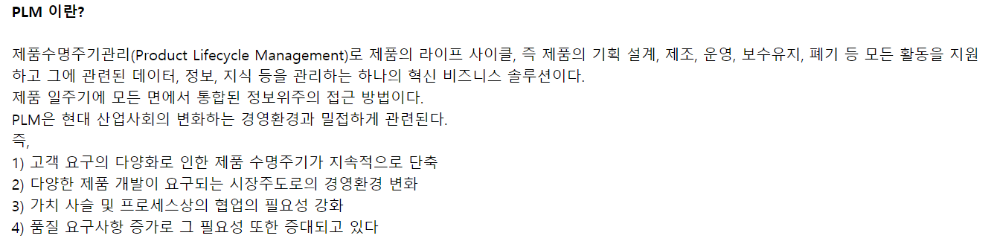

# 오토에버 PT Script

Why Me? (직무/역량 관점에서 본인이 채용되어야 하는 이유)

다 대 일 심층 대면면접

주제에 대한 구술 PT(5분) + 면접위원 질의응답(15~20분)

제조 IoT 플랫폼 확대

CPS 플랫폼 개발

직무 : 현대기아차 및 기타 그룹사 PLM프로젝트 수행(요구사항 정의, 화면/기능 설계, 개발, 테스트), PLM관련 컨설팅 및 SI 수행

희망 직무 및 사유, 직무 수행을 위한 본인만의 강점 어필(관련 지식, 경험, 기술, 전공, 가능성, 포부 등)

안녕하십니까? 이번 2019년 현대 오토에버 신입 공개채용 지원자 오진석입니다. 지금부터 Why Me?를 주제로 발표를 시작하겠습니다.
제가 지원한 직무는 제조 IT 직무입니다. 제가 제조 IT 직무에 지원하게 된 이유는 제조 기술 혁신을 꿈꿨기 때문입니다. 제가 제조 기술 혁신을 꿈꾸게 된 이유는 부모님이 운영하시는 공장이 기술자의 능력에 따라 품질에 영향을 많이 받고 기술자 관리에 스트레스를 받는 것을 보면서 제조 기술 혁신을 꿈꿨습니다. 그리고 해당 분야에서 업무를 수행하기 위해 역량을 길러왔습니다. 이번에 제가 키워온 역량을 현대오토에버에서 제조 IT 직무를 수행하면서 펼쳐보기 위해 지원하게 됐습니다.

제가 공부해온 과정을 토대로 어떤 역량을 쌓았는지 말씀드리겠습니다. 저는 제조업에 대한 전문성을 키우기 위해 기계공학과에 진학하게 됐습니다. 기계공학과에서 CATIA를 통해 제품을 직접 설계해보고 ANSYS tool을 이용하여 4대 역학을 직접 적용해보면서 해당 제품이 정상적으로 사용될 수 있을 지 분석하는 법을 배웠습니다. 그리고 '재난현장 탐사에 용이한 육족 보행 로봇'이라는 프로젝트를 진행하면서 제품의 고안부터 설계, 분석까지 직접 해보면서 능력을 키울 수 있었습니다. 또한, 제조에는 어떤 방법이 있는지 어떤 과정으로 이루어지는 지 배웠습니다. 이처럼 제품의 설계부터 생산까지의 과정을 배우면서 제조업에 대한 전문성을 키웠습니다. 하지만 더 높은 수준의 제조 기술 혁신을 이루기 위해서는 CAD와 CAE를 넘어서 더 높은 수준의 IT 역량이 필요하다는 것을 느꼈고 IT 역량을 쌓기 위해서 노력했습니다.

먼저, 학과 내에 개설되어 있는 IT 과목을 수강하고 프로젝트 과목에서도 소프트웨어 개발 부분을 전적으로 맡으면서 IT 능력을 키웠습니다. 프로그래밍 언어나 자료구조 및 알고리즘에 대해 배우면서 기초 역량을 키우고 이를 바탕으로 '핸드폰 센서를 이용한 로봇팔 제어', '클라우드에 접속 가능한 디스플레이 내장형 책상', '알코올 도수 측정이 가능한 수제맥주 키트' 등 다양한 프로젝트를 하면서 IT 역량 수준을 더 높일 수 있었습니다. 그 중 제가 가장 많은 역량을 키웠던 클라우드에 접속 가능한 디스플레이 내장형 책상 프로젝트에서 AWS에 회원 관리 서버 구축을 하고 NFC를 이용한 자동 로그인 기능과 클라이언트 프로그램의 일부 개발 업무를 맡았고 독학을 통해 DB 구축과 서버 구축 등을 배워서 완성시킬 수 있었습니다. 이처럼 다양한 프로젝트를 진행하면서 어떤 것이든 만들 수 있다는 자신감을 가지게 됐습니다.

 이를 토대로 더 많은 IT 경험을 쌓고 싶어서 삼성 청년 SW 아카데미를 지원하게 됐습니다. 현재는 삼성청년SW아카데미에서 설계를 통해 SW를 만드는 방법과 자료구조와 알고리즘에 대해서 차근차근 배우고 명세서에 따라 SW를 만드는 방법에 대해서 배우고 있습니다.

이처럼 저는 제조 기술 혁신을 꿈꾸면서 기계공학과부터 SW 아카데미까지 계속 달려왔습니다. 이제는 현대 오토에버에서 제 domain knowledge를 살려 설계, 분석, 품질 팀에 있는 현업자분들의 요구사항을 정확히 이해하겠습니다. 그리고 다양한 IT 프로젝트 수행 경험을 살려 PLM 시스템을 구현하겠습니다. 이처럼 PLM 시스템을 구축하며 전문성을 키우고 후에는 ERP와 PLM을 통합시켜 현대 자동차 그룹의 ONE-IT 목표를 달성하는데 이바지하겠습니다.  또한, 그룹의 ONE-IT 목표를 달성하고 나면 그 다음 단계인 CPS 플랫폼 구축에 힘쓰겠습니다. CPS 플랫폼 또한, 제 전공 분야인 기계 공학에 대한 이해가 중요하기 때문에 전 공장에 CPS 플랫폼을 구축하고 이를 통해 현대자동차 그룹의 스마트 팩토리화 구축에 앞장서는 인재가 되겠습니다.

## 예상질문

* 과거 제조기술의 문제점

  ```
  제가 아버지가 운영하시는 공장을 보면서 느끼게된 과거 제조기술의 문제점은 두 가지라고 생각합니다. 첫 번째는 기술자의 숙련도가 제품의 품질에 영향을 많이 주기 때문에, 기술자의 숙련도가 낮다면 제품의 품질을 보증할 수 없다는 것입니다. 두 번째는 이전 제조과정들이 데이터화 돼있지 않기 때문에 제조과정에 있어서 똑같은 문제들이 계속 발생할 수 있고 품질 개선의 여지가 낮다는 것입니다.
  ```

* 위 문제점을 해결할 수 있는 방법

  ```
  기술자의 숙련도의 영향력을 줄이기 위해 자동화 공정을 도입하고, 이 공정들의 센서 데이터를 수집하여 PLM, MES 같은 솔루션을 통해 데이터들을 관리하고 분석하여 공정의 효율성을 높이고 품질을 향상시켜야 합니다.
  ```

* PLM 시스템 설계 구축 관련 프로젝트를 진행해본적?

  ```
  직접적인 PLM 시스템을 설계하거나 구축해본적은 없으나 관련된 역량을 키운 프로젝트는 있습니다. 먼저 '재난현장 탐사에 용이한 육족보행로봇'이라는 프로젝트에서 CATIA로 제품을 모델링하고 분석하는 역할을 맡으면서 제품수명주기 중 분석/설계에 대한 역량을 키웠고, 또한 PLM 시스템을 구축하는데 있어서 필수적인 데이터베이스를 구축하는데 있어서도 여러 프로젝트에서 회원관리 서버의 회원관리 데이터베이스 설계, 영화 평점 사이트의 데이터베이스 설계 등을 통해 구축해보면서 역량을 키웠습니다.
  ```

* 고객최우선 가치를 어떻게 실행할 것인가?

  ```
  고객최우선 가치를 실행하기 위해서는 자기소개서에도 적었듯이, 고객들의 생각하는 불편함을 찾는 것이 우선이라고 생각합니다. 그래서 저는 직접 현장에 찾아가 고객들과 소통하여 고객들이 겪는 불편함을 파악하고 이를 해결하기 위해 노력할 것입니다.
  ```

* 해당 직무를 수행하기 위해서는 어떤 역량이 필요할 것인가?

  ```
  해당 직무를 수행하기 위해서는 기본적으로는 고객의 요구사항을 정의하고 요구사항에 따라 PLM 시스템을 구축할 수 있는 개발 역량, 자세히는 제품의 다양한 데이터들을 저장할 수 있는 DB구축 능력, 데이터를 필요로 하는 사람들이 원하는 데이터를 꺼내볼 수 있도록 네트워크 프로그램 개발 능력 등이 필요하다고 생각합니다.
  ```

* 해당 역량을 키우기 위해서 어떻게 노력했나?

  ```
  먼저 저는 현재 삼성청년소프트웨어아카데미에서 매주 금요일마다 프로젝트를 진행할 때, 주어진 명세서에 따라 프로젝트를 완성시켜보면서 고객의 요구사항에 따라 프로그램을 만들어보는 연습을 하고 있습니다. 또한, 영화추천사이트의 DB나 '클라우드에 접속가능한 스마트 책상' 프로젝트의 회원관리용 DB를 직접 만들어보면서 DB 구축 능력을 키웠습니다. 그리고 해당 프로젝트에서 AWS 상에서 회원관리 서버를 만들면서 서버 개발 능력을 키웠고, 클라이언트 프로그램의 일부분 개발을 맡으면서 클라이언트 프로그램 개발 능력도 키웠습니다.
  ```

* 당신의 단점은 무엇인가?

  ```
  제 단점은 다른 컴퓨터공학 전공 지원자들에 비해 개발 경험이 부족하다는 것입니다. 하지만 CAD나 공정 과정에 있어서 다른 전공자들보다 도메인 지식이 뛰어나기 때문에 단점을 조금은 가릴 수 있을 것 같습니다. 현대 오토에버에 입사한다면 업무시간 외에도 저 자신만의 공부를 통해 단점을 줄이고 제가 가진 강점은 유지하여 뛰어난 인재가 되도록 노력할 생각입니다.
  ```

* 현업에서 다른 언어를 배워야한다면 어떻게 익힐 것인가?

  ```
  현재 제가 잘 사용할 수 있는 언어는 C언어와 Python입니다. C언어는 대부분의 언어의 기초가 되는 언어이기 때문에 다른 언어를 익히는데 도움이 될 것이고 또한 객체지향의 개념을 python을 공부하면서 익혔기 때문에 Java를 익히는데 도움이 될 것입니다. 이를 바탕으로 개인 시간을 할애하여 언어를 빠르게 익힐 수 있도록 공부하겠습니다.
  ```

* PLM에 대해서 설명해봐라

  [PLM](<https://zorbanoverman.tistory.com/811>)

  ```
  제품의 기획, 설계, 시험, 생산, 사후지원, 단종까지 Life Cycle 전반에서 생성되는 Data를 공유, 관리, 협업하여 신속한 시장 변화에 대응하고 지원하는 시스템
  실제로 해당 답변자가 참여중인 프로젝트에서는 PLM 솔루션 고도화 프로젝트를 진행중인데, 현업에서 계신 분들(CAD, 해석, 품질 엔지니어분들)에게 요구사항을 받고,
  분석, 설계하는 업무를 진행중이라고 하네요.
  좁게 보자면 제품의 도면을 관리하는 시스템이고, 넓게 보면 제품의 라이프사이클 동안 발생하는 데이터들을 통합관리하여 제품의 설계부터 생산까지 분업화된 각 업무의 담당자들이 쉽게 제품의 데이터들을 조회할 수 있는 시스템입니다.
  장점
  고객 요구의 다양화로 제품수명주기가 단축되고 있기 때문에, 각 부문의 담당자간 정보의 공유를 효과적으로 하여 간접업무를 줄이고 직접업무에 집중하면서 연구개발에서 제조로 이어지는 과정을 단축하여 고객 요구에 빠르게 대응할 수 있음.
  ```

  

* 핸드폰 센서를 이용한 로봇팔 제어 프로젝트에 대해서 설명해봐라

  ```
  상박과 하박에 각각 핸드폰을 한 대씩 부착해서 자이로 센서와 방향 센서에서 나오는 데이터들을 상보필터를 통해 튀는 값들을 잡아주고 이를 로봇팔을 제어하는 ROS 시스템에 전송하게 됩니다. 그러면 센서 데이터를 통해 팔의 위치와 각도를 계산하고 가상 환경의 로봇팔을 제어하는 프로젝트였습니다.
  저는 여기서 컴퓨터에서 python 코드를 통해 센서 데이터를 받고 팔의 위치와 각도를 계산하는 알고리즘을 구현하고 로봇팔을 제어하는 역할을 맡았습니다.
  ```

* Udacity에서 배운 AI에 대해 설명해봐라

  ```
  먼저 머신러닝에 대해서 공부를 하고 있었는데 머신러닝에서 컴퓨터가 어떤 방식으로 의사 결정하는지 알게 됐고 그 기법 중 하나로 Naive-Bayes 방식을 이용하는 법을 배웠습니다.
  ```

* Google 머신러닝 스터디 잼에서 배운 것에 대해서 설명해봐라

  ```
  아직은 입문반이라 많은 것을 배울 수는 없었지만, 구글 클라우드 API를 사용하는 법에 대해서 배울 수 있었습니다. 그 중 하나로 클라우드 API를 통해서 자연어에서 감정을 분석하고 문법, 품사를 분석하는 것들을 실습하며 머신러닝을 배워 어디에 활용할 수 있을 지에 대해서 느꼈습니다.
  ```

* 재난 현장 탐사에 용이한 육족보행 로봇에 대해서 설명해보라 

  ```
  해당 프로젝트는 재난 현장 탐사에 용이한 로봇을 만들기 위해 다양한 모델링을 해보고 역할을 잘 수행할 수 있을 지 분석한 프로젝트였습니다. 먼저 재난 현장 탐사에 용이한 로봇을 만들기 위해서는 세 가지 요건을 고려했습니다. 첫 번째는 움직임의 안정성이고, 두 번째는 다양한 움직임이 구현, 세 번째는 본체의 강도입니다. 움직임의 안정성을 구현하기 위해 육족 보행 로봇이라는 모델을 구현하게 됐고 다양한 움직임을 구현하기 위해 다리 가운데에 다리를 접을 수 있는 액츄에이터를 달아서 다리를 접고 좁은 곳도 지나갈 수 있게 만들었습니다. 또한 본체의 강도가 위험한 재난 현장을 다닐 수 있는지 확인하기 위해 ansys라는 툴에서 다양한 재료로 제작을 해보고 본체가 받는 stress나 strain을 줄일 수 있도록 stress가 집중되는 곳을 줄일 수 있도록 모델을 변경해가면서 모델링을 완성했습니다. 저는 여기서 팀장과 모델링, 분석 역할을 수행했습니다.
  ```

* 클라우드에 접속 가능한 스마트 책상에 대해서 설명해봐라

  ```
  해당 프로젝트는 디스플레이가 내장된 책상에서 모바일이나 학생증을 이용해 개인의 클라우드에 접속하고 본인의 클라우드에서 학습자료를 다운받아 책상에서 열람하고 필기 프로그램을 이용하여 필기를 저장할 수 있는 프로젝트였습니다. 저는 여기서 회원관리 서버와 자동로그인 기능, 클라이언트 프로그램 일부 개발 업무를 맡았습니다.
  ```

* 제조 공정에 대해서 잘 안다고 했는데 설명해봐라.

  ```
  다양한 제조 공정이 있어서 하나의 예로 현대 자동차 그룹과 관련된 자동차 생산 공정에 대해서 말씀드리겠습니다. 먼저 자동차 생산 라인은 차체 공정 라인, 도장 공정 라인, 의장 공정 라인으로 이루어져 있고 각 공정 라인에서 발생한 결함을 리페어하는 리페어 라인과 해당 차량에 대한 출고를 결정하는 출고 라인으로 이루어져 있습니다. 차체 공정 라인에서는 프레스 공정을 통해 자동차용 강판을 대형 프레스를 통해 차량의 기본 구조 틀을 만들고, 차체를 조립하게 됩니다. 도장 공정 라인에서는 조립된 차체에 색을 칠하게 되고 의장 공정 라인에서는 실내,외 부품을 장착하고 기계부품, 엔진 등을 조립하고, 전장 부품과 배선 배관 작업 등을 해서 차량을 완성하게 됩니다. 각 공정에서 결함이 생기면 리페어라인에서 수리하고 다음 공정으로 나오게 되고 출고라인에서 마지막 검수를 통해 세상에 나오게 됩니다.
  ```

* 신뢰도가 높은 분석 tool을 만든다고 했는데 어떻게 만들 것인가?

  ```
  신뢰도가 높은 분석 tool을 만들기 위해서는 빅데이터 분석이 가장 중요합니다. 이미 현대자동차 그룹 공장의 제조과정에서 생기는 데이터를 많이 보유하고 있기 때문에 이를 빅데이터 분석팀과 협업하여 다양한 제품에 적용 가능한 분석 tool을 만들겠습니다.
  ```

* 캡티브 마켓에 주력한다고 했는데 왜 밖으로 나가려 그러나?

  ```
  제가 자기소개서를 작성할 때 충분한 조사를 하지 못해서, 외부 사업에 진출하겠다는 말을 적었습니다. 하지만 캡티브 마켓 업무를 수행하기에도 벅차다는 대표님의 말을 보게 됐고, 현대자동차 그룹의 스마트 팩토리 구축이 우선이라는 말이 당연하다고 생각되고 제 목표도 현대자동차 그룹의 스마트 팩토리화로 바뀌게 됐습니다.
  ```

* 삼성청년SW아카데미에서 어떤 것을 배우나?

  ```
  python 언어와 자료구조와 알고리즘을 토대로 django라는 웹프레임워크를 사용해서 백엔드 개발을 배웠고, 현재는 자바스크립트 언어를 배우고 vue.js 프레임워크를 통해 프론트엔드 개발을 배우고 있습니다.
  ```

* 삼성 가지 왜 현대에 왔나?

  ```
  현대자동차 그룹과 협력사까지 해서 국내에서 가장 많은 제조업에 제조 IT를 적용해볼 수 있을 것 같아서 현대 오토에버에 지원하게 됐습니다. 많은 경험이 제 성장과 직결된다고 생각하기 때문입니다.
  ```

* mySQL 명령문 기억나는 것?

  ```
  SELECT 문, DELETE, ALTER, INSERT 등등
  ```

* 기계랑 IT 융합해서 직무에 도움이 될만한 것이 있나?

  ```
  제 직무에서는 제조업에 계신 분들에게 직접 요구사항을 받고 PLM을 설계하고 구축하기 때문에 제조업에 대한 이해가 높다면 해당 요구사항을 더 잘 이해하고 시스템을 만들 수 있다고 생각합니다.
  ```

* 포부를 말해봐라

  ```
  PLM 시스템을 고도화 시키면 CPS 개념이 도입되거나 제품의 품질 개선을 할 수 있으므로 기계전공을 가지고 IT 업무를 수행할 수 있는 제 역량이 더 잘 드러날 수 있다고 생각합니다. 그래서 현대오토에버의 PLM 시스템을 고도화 시키고 이를 현대자동차 그룹의 공장에 적용하여 스마트팩토리화 시키는 것이 제 목표입니다.
  ```

* 마지막 할 말?

  ```
  
  ```

* 기계쪽으로 가진 강점은?

  ```
  저는 CATIA 조작 능력이 우수합니다. 그 역량을 살려 컴퓨터이용제도라는 과목에서 A+ 학점을 받았습니다. 또한, 기계요소설계라는 과목에서 주어진 사양에 따라 제품을 설계하고 분석하는 프로젝트를 수행했는데, 해당 과목에서도 A+ 학점을 받았습니다.
  ```

* 부모님 공장에 제조 기술 혁신을 시도해본 적 있나?

  ```
  기존에는 공장에 CAD를 할 줄 아는 사람이 없어서 제품 의뢰가 들어와도 금형 회사와 컨택을 하느라 가격 산출이 어려웠습니다. 그래서 제가 누나에게 CAD 사용법을 알려주어 회사차원에서 가격 산출을 할 수 있게 만들었습니다.
  ```

* 현대 그룹 공장 어디어디 있느냐~

  ```
  
  ```

* 학점이 낮은데 이유가 있느냐

  ```
  대학생 초반에는 다양한 경험을 해보고 싶어서, 아르바이트를 해서 해외 여행을 가보는 것을 목표로 일을 하다보니 공부할 시간이 모자라서 학점을 챙기지 못했습니다.
  ```

* 창업동아리에서 어떤 걸 했느냐

  ```
  먼저 두 가지 일을 했었는데, 처음에는 국토교통부에서 진행하는 사업제안 공모전에서 고속도로 휴게소 하이패스를 만드는 사업을 제안했습니다. 사용자 어플리케이션에서 미리 사고 싶은 품목을 구매하면 하이패스처럼 품목을 바로 받고 나갈 수 있는 시스템을 제안했었습니다.
  두 번째는, 인디 게임을 제작했었는데, 스파르탄의 복수라는 게임을 제작했습니다.
  ```

* 스마트 팩토리란?

  ```
  기본적으로는 ICT 기술을 이용하여 공정과 공정 사이 간 데이터를 연계하여 공정의 유연성을 높인다. 더 나아가서는 생산 에너지 경영 물류 등 제조업에 필요한 다양한 분야가 유기적으로 연결되어 지능적으로 운영되는 공장
  ```

* 제조 기술 혁신에 관심이 있었다고 하는데, 뭘 했나?

  ```
  해당 분야의 일을 하기 위한 역량을 쌓는데 집중했습니다. 제조업에 대한 전문성을 키우고, 이제 제조 기술 혁신과 뗄 수 없는 IT 역량을 쌓기 위해 노력했습니다.
  ```

* CATIA 사용했던 것

  ```
  catia 스케치로 2d도면 constraint로 제약 조건 주고 
  패드로 볼륨 주기 
  포켓 2d로 스케치하고 스케치 모양대로 빵꾸내기 
  서페이스로 굴곡진 평면 같은 거 만들기 쉬움
  샤프트로 원기둥 만들 수 있음 두께 조절로 비게 만들 수도 있음
  그루브로 둥글게 팔 수 있음
  어셈블리로 부품들 합치기
  dmu로 애니메이션 구현
  리브랑 슬롯 같은걸로 선따라 구멍파거나 올릴 수 있음
  knowledge 기능으로 변수를 통해 도면 만들어서 유연성 키울 수 있음
  =======
  ```
* ERP와 PLM을 통합시키면 장점?

  ```
  PLM은 설계에 관련된 데이터들을 관리하는 반면, ERP는 경영 전반에 대한 정보를 담당합니다. 현업에서는 빈번하게 설계가 변경될 수 있는데, 이는 생산계획에 차질을 일으킬 수 있습니다. 하지만 PLM과 ERP가 통합된다면, 설계가 변경될 때 생산계획 같은 경영 정보를 유연하게 변경할 수 있고 회사 전반에서 해당 정보에 대한 공유가 쉬워질 것입니다.
  ```

  
