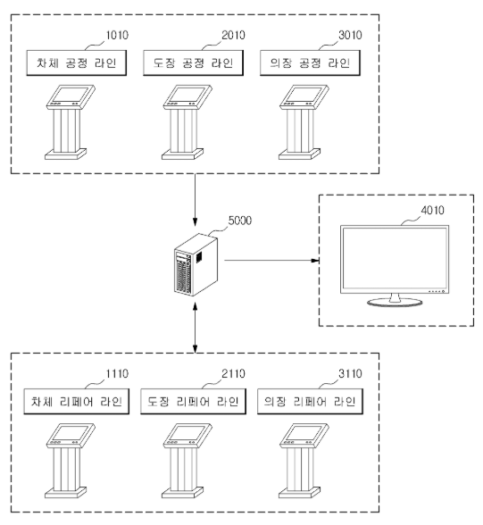

# 현대 오토에버 면접 준비

## 면접 스터디 자료

### 각자 분야의 기업 활동 정리(최소 5장 .hwp)

* 기사
* 현대오토에버 명의 특허
* IR 정보 요약
* 그 외 소스

### dart 사업보고서

* ICBM(IoT, Cloud, Big Data, Mobile) 중요시

* AI, 블록체인

* 판매 조직

  * 융합디지털 사업부
    * 완성차 업체 대상 IT 서비스 판매 및 지원
  * 부품 디지털 사업부
    * 자동차 부품 업체 대상 IT 서비스 판매 및 지원

* 판매 전략

  * 현대자동차그룹의 IT관련 서비스를 제공하면서 기술력 축적
  * 기술력 바탕으로 완성차 업체 및 부품 업체, 협력 업체로 고객군 다변화
  * 타산업(건설/철강)으로도 고객군 다변화 시도

  

* 연구개발 실적

  * 제어기용 암호 라이브러리 개발
  * 제어기용 HSM운영스택 개발

### 현대오토에버 특허

Google Patents에서 검색한 현대오토에버 관련 특허

* [자동차부품 컨테이너에 사용되는 rfid 태그 라벨링포켓](https://patents.google.com/patent/KR20130044085A/)

  자동차 부품의 컨테이너에 사용되는 RFID 태그 라벨링 기술

  생산이 완료된 자동차 부품은 출하 시에 컨테이너에 적재하여 출하 및 수송된다.

  자동차부품의 특징 상 컨테이너로는 철제로 만들어진 철제팔레트가 이용되고 있음.

  바코드 리딩 방식이 이용되고 있었는데 이 방식은 먼지, 날씨 등의 외부환경에 의해 바코드 인식의 오류가 빈번하게 발생하여 정확하고 신속한 물류정보를 획득하는데 저해 요인으로 작용되고 있음

  이를 해결하기 위해 RFID 태그를 철제팔레트에 부착하는데 기존에는 같은 철제인 RFID 메탈 태그가 적용됨 하지만 이는 고가고 물리적 충격에 취약함

  이 특허는 메탈태그를 대체하고 충격과 같은 외력에 잘 견딜 수 있는 RFID 태그 라벨링 포켓을 제공함.

  

* [웹 기반의 글로벌 통합 설비관리시스템](https://patents.google.com/patent/KR20150014569A/)

  국내외 산재해 있는 공장들의 설비관리가 통합적으로 이루어지도록 네트워크 및 통합관리서버를 도입함으로써(설비 관리에 대한 공장들 사이의 정보 공유가 이루어져) 전체 공장들의 설비관리에 대한 현황 파악이 가능하고 설비관리에 대한 통합적인 계획수립 및 분석을 수행할 수 있어 전체적인 기업관리의 효율성을 향상시킬 수 있고, 전사적자원관리(ERP) 시스템과 전사적 어플리케이션 통합(EAI)을 용이하게 할 수 있는 글로벌 통합 설비관리시스템을 제공함.

  

  

  

  

  

* [품질불량 이력을 활용한 선제적 금형 예방관리시스템 및 그 운용 방법](<https://patents.google.com/patent/KR20160005995A/ko>)

  제품생산계획 수립 시 DB의 금형 정보로부터 제품생산 불량률이 기준된 금형 목록화가 이루어지고, 선정된 선제적 품질관리대상을 제품생산 시작 전까지 모니터링 되어야 하는 설비관리기일이 설정되며, PDA(Personal Digital Assistant)를 이용한 무선 송수신으로 설비관리기일 동안 점검 및 수리가 이루어진 선제적 품질관리대상의 이력이 DB에 업데이트됨으로써 생산계획수립자가 공수 과다 소요나 현황 분석 어려움이나 과도한 노동 강도 없이 작업을 필요로 하지 않고, 특히 이메일 대신 PDA를 사용함으로써 생산계획수립자, 품질관리자, 금형설비관리자가 서로의 정보를 무선으로 실시간 공유할 수 있음

  

  

* [자동차 생산 라인에서의 품질 관리 시스템](https://patents.google.com/patent/KR20160048317A/)

  일반적으로 자동차 생산 라인은 차체 공정 라인, 도장 공정 라인, 의장 공정 라인, 각 공정 라인에서 발생한 결함을 리페어하는 리페어 라인 및 해당 차량에 대한 출고를 결정하는 출고 라인으로 이루어짐.

  각 공정 라인에 위치하는 작업자는 해당 공정의 기준 사양과 검사 대상 차량을 비교하여 해당 차량에 결함이 있는지 여부를 판단하고 검사지에 검사 대상 차량에 대한 검사 내역을 기입하고, 해당 검사지를 다음 공정 라인 또는 결함 리페어를 위한 리페어 라인으로 전달함

  리페어 라인에 위치하는 작업자는 공정 라인으로부터 전달되는 검사지를 확인하고, 해당 차량에 대한 결함을 리페어한 후, 리페어 내역을 기입하여 다음 공정 라인 또는 출고 라인으로 전달함.

  위 시스템에 의하면 차량에 대한 검사 내역 및 리페어 내역에 대한 누락이 발생할 가능성이 크므로, 결함이 있는 차량의 출고가 이루어질 가능성이 높음

  이 발명은 자동차 생산 라인들에서 생성되는 데이터들을 실시간으로 수집하고, 수집된 데이터들을 필요로 하는 라인으로 제공할 수 있음

  실시 예) 전자 펜으로부터 수신되는 궤적 정보를 기반으로 검사 대상 차량에 대한 디지털 검사 내역 데이터를 생성하는 제 1 키오스크

  제 1 키오스크로부터 수신되는 디지털 검사 내역 데이터를 저장하며, 상기 디지털 검사 내역 데이터가 해당 차량에 결함이 있음을 나타내는 경우 해당 결함과 관련된 리페어 요구 데이터를 생성하여 제 2 키오스크로 전송하는 품질 관리 서버를 포함한다. 이러한 실시 예들에 따르면, 자동차 생산 라인에서 차량 품질과 관련된 데이터를 실시간으로 수집할 수 있다.

  

  

  

  

* [조립품질 검증장치 및 그 방법](https://patents.google.com/patent/KR101483956B1/)

  기존에 부품들이 정상적으로 조립됐는 지 확인할 때 담당자가 육안으로 감지했음

  부품 조립 현장에서 촬영된 영상을 수신하고 해당 영상을 각 부품에 대한 기준 데이터와 비교함으로써 원격으로 각 부품들이 정상적으로 조립되어 있는지 검증하는, 조립품질 검증장치를 발명

  피사체의 2차원 영상을 촬영하는 촬영부, 촬영부를 통해서 촬영된 2차원 영상을 3차원 영상으로 변환하는 영상 변환부, 촬영부를 통해서 촬영된 피사체로부터 기준 거리 이내에 위치한 부품에 대한 기준 3차원 영상을 부품데이터 서버로부터 수신하는 통신부, 3차원 영상과 기준 3차원 영상을 비교하여 부품의 조립품질을 검증하는 제어부 및 3차원 영상과 기준 3차원 영상을 출력하는 디스플레이부를 포함함.

  

  

  

* [자동화 설비 cms의 제어 방법](<https://patents.google.com/patent/KR101913474B1/>)

  자동화 설비에 대한 CMS(Condition Monitoring System)에 관한 발명

  종래 자동화 설비에 적용된 CMS는 고가의 프로그램으로 구성됨, 특히 Raw Data를 저장하는 프로그램이 고가임

  종래 자동화 설비에 적용된 CMS의 경우, 별도의 독립적인 프로그램에서 알람 및 에러코드가 정의되어 있고 시스템에 이상이 발생하면 이러한 독립적인 프로그램이 구동되는 화면에 알람정보가 표시됨 프로그램이 이원화되어 있다보니 사용자는 서로 다른 2개의 프로그램을 이용하여 데이터를 분석하고 상황을 판단해야 해서 번거로움. 또한, 에러코드와 수집된 데이터를 이용해서 전문담당자가 분석함, 사전에 정의된 알람 및 에러 정보만 표시됨, 잠재적 알람이나 에러를 예지하거나 분석할 수 없음

  따라서 사전에 정의되지 않은 알람 및 에러에 대하여 조치 방법을 구체적으로 알려줄 수 있는 기술을 제공하고 비정형화된 데이터의 상관관계를 통한 설비의 예방점검이 가능하도록 지원하는 기술을 제공, 또한 담당자는 설비의 특정 부분에 대한 고장 또는 알람을 명확히 인지할 수 있으며 신속한 정비지원 환경을 지원하는 기술을 제공함

  

  

  

  

  

  

  

  

* [품질불량예방 관리시스템](<https://patents.google.com/patent/KR101549743B1/>)

  부품협력사의 품질관리서버와 완제품사의 품질관리서버를 연동시키고, 부품협력사들 및 완제품사의 부품품질에 대한 부품품질정보를 각 생산공정 별로 통계적 기법을 통해 분석하여 자동으로 각 생산공정 별 품질불량 경고를 생성함으로써 부품협력사로부터 완제품사까지의 전 제조 공정에서의 부품 불량율을 낮출 수 있는 관리시스템 제공

  부품협력사들에 품질불량예방관리시스템이 독립적으로 구축되고, 부품의 생산공정 별로 검사된 결과를 관리하며, 관리되는 검사정보를 네트워크를 통해 전송하는 품질관리 서버

  완제품사에 구축되어 상기 완제품사의 생산공정 별로 검사된 결과를 관리하고 상기 부품협력사로부터 전송되는 검사정보 및 상기 완제품사에 의해 관리되는 검사정보를 사전에 정해진 시간 별로 연속하여 축적하고 상기 축적된 검사 정보 중 해당 검사항목의 검사값이 생산공정 별로 사전에 정해진 설정기간 동안 설정 범위 내에 존재하는 분포여부를 분석하며, 그 해당 검사항목의 검사값의 분포여부에 대응하여 상기 생산공정 별 해당 검사항목의 공정품질의 상태를 생성하여 표시하는 부품불량관리서버를 포함함.

  상기 설정기간 및 설정범위는 생산공정 중 검사항목에 따라 다르게 정해질 수 있고, 설정범위는 해당 검사항목의 공정품질의 상태의 양호 여부를 판단하기 위한 관리하한선 이상 및 관리하한선 이하의 관리만족 범위와 공정품질의 규격 만족 여부를 판단하기 위한 규격하한선 이상 및 규격상한선 이하의 규격만족범위로 정해진다.

  공정품질 상태는 검사항목의 검사값이 관리만족 범위에서 분포하는경우 안정상태, 관리만족 범위에서 벗어나고 규격만족 범위에 분포하면 관리한계 이탈상태, 규격만족 범위를 벗어나 분포하면 규격한계 이탈상태

  공정품질의 상태가 설정기간 동안 관리한계 이탈상태에 해당되는 부포여부와 규격한계 이탈상태에 해당되는 분포여부를 분석하고 분석 결과에 대응하여 생산공정 별 검사항목에 대해 공정 불량 경보를 생성 가능

  부품불량관리서버는 공정불량 경보에 대응하는 UI를 생성하여 사용자에게 디스플레이하고, 품질관리서버로 전송

  

  

  

  

  

* [프로그램 실행장치, 네트워크 장치 및 자원분산 처리방법](<https://patents.google.com/patent/KR101771351B1>)

  하드웨어를 통해 연산을 처리하는 물리자원, 네트워크 통신으로 연결된 하나의 네트워크 장치를 통해 연산을 처리하는 논리자원, 물리자원 및 논리자원을 로컬자원으로 인식하고 물리자원 및 논리자원을 통해 프로그램의 실행에 필요한 제 1연산 및 제 2연산을 각각 수행하는 프로그램 구동부를 포함하는 프로그램실행장치를 제공함

  

  

  

* [모바일 기반 공장설비 점검시스템의 운용방법](<https://patents.google.com/patent/KR20150014570A/>)

  공장 설비의 점검 수행 과정 및 점검 결과를 관리하는 작업을 휴대용 단말장치를 이용하여 수행함으로써 점검 자체를 정확하게 수행할 수 있고, 점검 결과의 전산화를 용이하게 수행할 수 있어, 공장 설비의 점검 및 관리의 효율성 및 신뢰성을 향상시킬 수 있는 모바일 기반 공장설비 점검시스템

  공장 설비에 대해 수행할 점검작업 목록을 표시하고 점검결과의 입력이 가능한 UI를 제공하며, UI를 통해 입력되는 점검결과를 분석하여 공장 설비의 이상여부를 표시하고, 공장에 구축되는 내부 네트워크를 통해 점검결과 및 공장설비의 이상여부를 전송하는 모바일 단말기, 내부 네트워크를 통해 전송되는 점검 결과 및 공장 설비의 이상 여부를 이용하여 공장 설비의 전체 현황을 모니터링하고 관리하는 공장설비 관리서버를 포함함

  

  

  

* [자동차부품 물류관리시스템](<https://patents.google.com/patent/KR20130044084A/>)

  RFID 태그를 기반으로한 유비쿼터스 기술을 자동차부품의 물류관리에 적용하여, 실시간으로 물류관리를 수행할 수 있고, 자동부품업체, 물류센터 및 자동차제조공장으로 이어지는 자동차부품에 대한 물류의 전체적인 현황을 관리할 수 있는 자동차부품 물류관리시스템을 제공하는 것

  RFID 태그를 기반으로한 유비쿼터스 기술을 자동차부품의 물류관리에 적용하여 실시간으로 물류관리를 수행할 수 있고, 자동차부품업체, 물류센터 및 자동차제조공장으로 이어지는 자동차부품에 대한 물류의 전체적인 현황을 단계별로 신속하게 파악하여 관리할 수 있다.

  

  

  

* [부품품질 모니터링시스템의 운용방법](<https://patents.google.com/patent/KR20150014273A/>)

  부품협력사들의 품질관리 및 완제품사의 품질관리의 정보공유를 강화하고, 완제품사에서 부품협력사들의 부품품질에 대한 모니터링을 입고 전 단계로부터 완제품 생산 후 단계에 걸쳐 수행함으로써, 부품에 대한 완제품사의 요구상황에 대한 피드백이 부품협력사에 원활히 반영될 수 있고, 부품품질에 문제가 있는 경우에도 입고 전에 선행적으로 대처할 수 있는 부품품질 모니터링시스템 및 그 운용방법을 제공하는 것이다.

  

  

  

  

* [자동화부품공급시스템 및 이의 운용방법](<https://patents.google.com/patent/KR20140051556A/>)

  자동화부품공급시스템은 부품의 공급장에 설치된 디지털피킹시스템(Digital Picking System)을 이용하여 공급할 자재의 순서에 따라 피킹을 하여 무인반송차(Automated Guided Vehicle)에 적입을 하면 무인반송차 생산라인으로 부품을 무인 반송하는 방식

  RFID 기술을 기반으로 한 유비쿼터스 기술을 적용하여, 부품의 공급장에서의 부품의 피킹과 생산라인으로의 부품 공급을 수행함으로써 제조 현장의 물류효율 및 설비의 유연성을 향상시킬 수 있는 자동화 부품공급시스템 및 이의 운용방법을 제공함

  외부로부터 생산라인에 필요한 부품의 정보를 모니터링하고, 모니터링된 정보를 이용하여 반출할 부품에 대응하는 부품박스를 선택하며, 선택된 부품박스가 반출위치들 중 선택된 부품박스에 대응하는 반출위치로 이동하도록 디지털피킹시스템을 제어하는 DPS 서버, 무인반송차, 무인반송차가 생산라인으로 출발하기 전에 DPS서버로부터 무인반송차에 적재된 부품박스에 수용된 부품의 정보를 전송받고, 전송된 부품의 정보를 적재된 부품박스에 부착된 RFID 태그에 기록하는 부품공급장의 RFID리더기 생산라인에 도착된 무인반송차에 적재된 부품박스에 부착된 RFID 태그로부터 부품의 정보를 리딩하여 부품박스에 수용된 부품이 생산라인에 필요한 부품인지를 점검하는 생산라인의 RFID 리더기를 포함함

  DPS 서버와 연동하는 부품공급장의 RFID 리더기 및 생산 라인의 RFID 리더기를 이용하여 생산에 필요한 부품의 정보를 공유함으로써 제조 현장의 물류효율 및 설비의 유연성을 향상시킬 수 있다.

  

  

  

  

* DPS 표시기 및 이를 포함하는 디지털피킹시스템

  피킹할 부품을 지시하기 위한 DPS 표시기와 이를 포함한 디지털피킹시스템

  DPS를 이용하여 공급할 부품의 순서에 따라 피킹이 이루어지도록 운용되는 시스템이고 작업자에 의해 피킹된 부품은 무인반송차(AGS)와 같은 이송수단에 의해 생산라인과 같은 목적지로 이송될 수 있음, 부품의 피킹을 위한 작업 주체인 작업자와의 인터페이스 수단으로서 피킹할 부품을 표시하고 피킹 결과를 입력하기 위한 DPS표시기를 사용한다.

  본 발명은 작업자가 부품의 피킹 결과를 감지하기 용이한 입력수단을 구비하여 디지털피킹시스템의 부품관리의 정확성을 향상시킬 수 있고, DPS 표시기를 공장에서 널리 이용되는 PLC(Programmable Logic Controller)를 이용하여 제어함으로써 종래에 비해 안전성 및 신뢰서잉 향상될 수 있는 디지털피킹시스템을 제공하는 것이다.

  

  

### 현대오토에버 PLM

## 직무 대비

### CPS란?

## 자소서 대비

* 제조 IT
  * 완성차 및 부품 PLM 시스템 설계/구축 프로젝트 수행
  * PLM(Product Lifecycle Management)
  * PLM 수행 직무 경우 CATIA, CREO 등 CAD 활용 가능자 우대
* 

