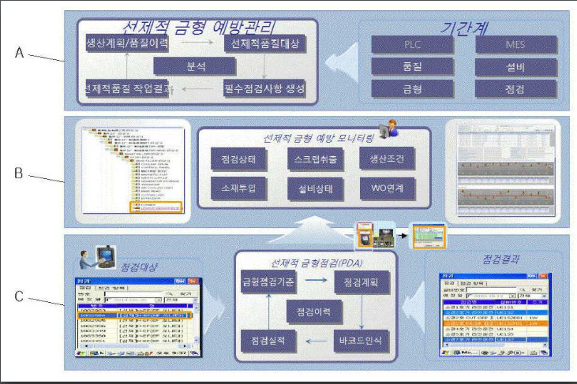
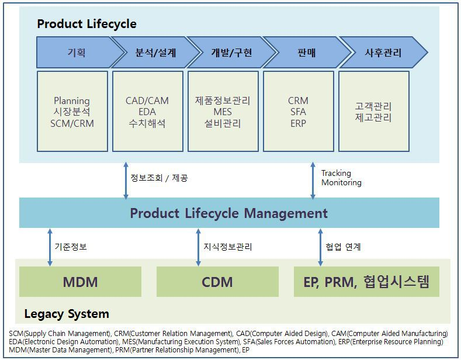

# 현대 오토에버 면접 준비

## 면접 스터디 자료

### 각자 분야의 기업 활동 정리(최소 5장 .hwp)

* 기사
* 현대오토에버 명의 특허
* IR 정보 요약
* 그 외 소스

### dart 사업보고서

* ICBM(IoT, Cloud, Big Data, Mobile) 중요시

* AI, 블록체인

* 판매 조직

  * 융합디지털 사업부
    * 완성차 업체 대상 IT 서비스 판매 및 지원
  * 부품 디지털 사업부
    * 자동차 부품 업체 대상 IT 서비스 판매 및 지원

* 판매 전략

  * 현대자동차그룹의 IT관련 서비스를 제공하면서 기술력 축적
  * 기술력 바탕으로 완성차 업체 및 부품 업체, 협력 업체로 고객군 다변화
  * 타산업(건설/철강)으로도 고객군 다변화 시도

  

* 연구개발 실적

  * 제어기용 암호 라이브러리 개발
  * 제어기용 HSM운영스택 개발

### 현대오토에버 특허

Google Patents에서 검색한 현대오토에버 관련 특허

* [자동차부품 컨테이너에 사용되는 rfid 태그 라벨링포켓](https://patents.google.com/patent/KR20130044085A/)

  자동차 부품의 컨테이너에 사용되는 RFID 태그 라벨링 기술

  생산이 완료된 자동차 부품은 출하 시에 컨테이너에 적재하여 출하 및 수송된다.

  자동차부품의 특징 상 컨테이너로는 철제로 만들어진 철제팔레트가 이용되고 있음.

  바코드 리딩 방식이 이용되고 있었는데 이 방식은 먼지, 날씨 등의 외부환경에 의해 바코드 인식의 오류가 빈번하게 발생하여 정확하고 신속한 물류정보를 획득하는데 저해 요인으로 작용되고 있음

  이를 해결하기 위해 RFID 태그를 철제팔레트에 부착하는데 기존에는 같은 철제인 RFID 메탈 태그가 적용됨 하지만 이는 고가고 물리적 충격에 취약함

  이 특허는 메탈태그를 대체하고 충격과 같은 외력에 잘 견딜 수 있는 RFID 태그 라벨링 포켓을 제공함.

  

* [웹 기반의 글로벌 통합 설비관리시스템](https://patents.google.com/patent/KR20150014569A/)

  국내외 산재해 있는 공장들의 설비관리가 통합적으로 이루어지도록 네트워크 및 통합관리서버를 도입함으로써(설비 관리에 대한 공장들 사이의 정보 공유가 이루어져) 전체 공장들의 설비관리에 대한 현황 파악이 가능하고 설비관리에 대한 통합적인 계획수립 및 분석을 수행할 수 있어 전체적인 기업관리의 효율성을 향상시킬 수 있고, 전사적자원관리(ERP) 시스템과 전사적 어플리케이션 통합(EAI)을 용이하게 할 수 있는 글로벌 통합 설비관리시스템을 제공함.

  

  

  

  

  

* [품질불량 이력을 활용한 선제적 금형 예방관리시스템 및 그 운용 방법](<https://patents.google.com/patent/KR20160005995A/ko>)

  제품생산계획 수립 시 DB의 금형 정보로부터 제품생산 불량률이 기준된 금형 목록화가 이루어지고, 선정된 선제적 품질관리대상을 제품생산 시작 전까지 모니터링 되어야 하는 설비관리기일이 설정되며, PDA(Personal Digital Assistant)를 이용한 무선 송수신으로 설비관리기일 동안 점검 및 수리가 이루어진 선제적 품질관리대상의 이력이 DB에 업데이트됨으로써 생산계획수립자가 공수 과다 소요나 현황 분석 어려움이나 과도한 노동 강도 없이 작업을 필요로 하지 않고, 특히 이메일 대신 PDA를 사용함으로써 생산계획수립자, 품질관리자, 금형설비관리자가 서로의 정보를 무선으로 실시간 공유할 수 있음

  

  

* [자동차 생산 라인에서의 품질 관리 시스템](https://patents.google.com/patent/KR20160048317A/)

  일반적으로 자동차 생산 라인은 차체 공정 라인, 도장 공정 라인, 의장 공정 라인, 각 공정 라인에서 발생한 결함을 리페어하는 리페어 라인 및 해당 차량에 대한 출고를 결정하는 출고 라인으로 이루어짐.

  각 공정 라인에 위치하는 작업자는 해당 공정의 기준 사양과 검사 대상 차량을 비교하여 해당 차량에 결함이 있는지 여부를 판단하고 검사지에 검사 대상 차량에 대한 검사 내역을 기입하고, 해당 검사지를 다음 공정 라인 또는 결함 리페어를 위한 리페어 라인으로 전달함

  리페어 라인에 위치하는 작업자는 공정 라인으로부터 전달되는 검사지를 확인하고, 해당 차량에 대한 결함을 리페어한 후, 리페어 내역을 기입하여 다음 공정 라인 또는 출고 라인으로 전달함.

  위 시스템에 의하면 차량에 대한 검사 내역 및 리페어 내역에 대한 누락이 발생할 가능성이 크므로, 결함이 있는 차량의 출고가 이루어질 가능성이 높음

  이 발명은 자동차 생산 라인들에서 생성되는 데이터들을 실시간으로 수집하고, 수집된 데이터들을 필요로 하는 라인으로 제공할 수 있음

  실시 예) 전자 펜으로부터 수신되는 궤적 정보를 기반으로 검사 대상 차량에 대한 디지털 검사 내역 데이터를 생성하는 제 1 키오스크

  제 1 키오스크로부터 수신되는 디지털 검사 내역 데이터를 저장하며, 상기 디지털 검사 내역 데이터가 해당 차량에 결함이 있음을 나타내는 경우 해당 결함과 관련된 리페어 요구 데이터를 생성하여 제 2 키오스크로 전송하는 품질 관리 서버를 포함한다. 이러한 실시 예들에 따르면, 자동차 생산 라인에서 차량 품질과 관련된 데이터를 실시간으로 수집할 수 있다.

  

  

  

  

* [조립품질 검증장치 및 그 방법](https://patents.google.com/patent/KR101483956B1/)

  기존에 부품들이 정상적으로 조립됐는 지 확인할 때 담당자가 육안으로 감지했음

  부품 조립 현장에서 촬영된 영상을 수신하고 해당 영상을 각 부품에 대한 기준 데이터와 비교함으로써 원격으로 각 부품들이 정상적으로 조립되어 있는지 검증하는, 조립품질 검증장치를 발명

  피사체의 2차원 영상을 촬영하는 촬영부, 촬영부를 통해서 촬영된 2차원 영상을 3차원 영상으로 변환하는 영상 변환부, 촬영부를 통해서 촬영된 피사체로부터 기준 거리 이내에 위치한 부품에 대한 기준 3차원 영상을 부품데이터 서버로부터 수신하는 통신부, 3차원 영상과 기준 3차원 영상을 비교하여 부품의 조립품질을 검증하는 제어부 및 3차원 영상과 기준 3차원 영상을 출력하는 디스플레이부를 포함함.

  

  

  

* [자동화 설비 cms의 제어 방법](<https://patents.google.com/patent/KR101913474B1/>)

  자동화 설비에 대한 CMS(Condition Monitoring System)에 관한 발명

  종래 자동화 설비에 적용된 CMS는 고가의 프로그램으로 구성됨, 특히 Raw Data를 저장하는 프로그램이 고가임

  종래 자동화 설비에 적용된 CMS의 경우, 별도의 독립적인 프로그램에서 알람 및 에러코드가 정의되어 있고 시스템에 이상이 발생하면 이러한 독립적인 프로그램이 구동되는 화면에 알람정보가 표시됨 프로그램이 이원화되어 있다보니 사용자는 서로 다른 2개의 프로그램을 이용하여 데이터를 분석하고 상황을 판단해야 해서 번거로움. 또한, 에러코드와 수집된 데이터를 이용해서 전문담당자가 분석함, 사전에 정의된 알람 및 에러 정보만 표시됨, 잠재적 알람이나 에러를 예지하거나 분석할 수 없음

  따라서 사전에 정의되지 않은 알람 및 에러에 대하여 조치 방법을 구체적으로 알려줄 수 있는 기술을 제공하고 비정형화된 데이터의 상관관계를 통한 설비의 예방점검이 가능하도록 지원하는 기술을 제공, 또한 담당자는 설비의 특정 부분에 대한 고장 또는 알람을 명확히 인지할 수 있으며 신속한 정비지원 환경을 지원하는 기술을 제공함

  

  

  

  

  

  

  

  

* [품질불량예방 관리시스템](<https://patents.google.com/patent/KR101549743B1/>)

  부품협력사의 품질관리서버와 완제품사의 품질관리서버를 연동시키고, 부품협력사들 및 완제품사의 부품품질에 대한 부품품질정보를 각 생산공정 별로 통계적 기법을 통해 분석하여 자동으로 각 생산공정 별 품질불량 경고를 생성함으로써 부품협력사로부터 완제품사까지의 전 제조 공정에서의 부품 불량율을 낮출 수 있는 관리시스템 제공

  부품협력사들에 품질불량예방관리시스템이 독립적으로 구축되고, 부품의 생산공정 별로 검사된 결과를 관리하며, 관리되는 검사정보를 네트워크를 통해 전송하는 품질관리 서버

  완제품사에 구축되어 상기 완제품사의 생산공정 별로 검사된 결과를 관리하고 상기 부품협력사로부터 전송되는 검사정보 및 상기 완제품사에 의해 관리되는 검사정보를 사전에 정해진 시간 별로 연속하여 축적하고 상기 축적된 검사 정보 중 해당 검사항목의 검사값이 생산공정 별로 사전에 정해진 설정기간 동안 설정 범위 내에 존재하는 분포여부를 분석하며, 그 해당 검사항목의 검사값의 분포여부에 대응하여 상기 생산공정 별 해당 검사항목의 공정품질의 상태를 생성하여 표시하는 부품불량관리서버를 포함함.

  상기 설정기간 및 설정범위는 생산공정 중 검사항목에 따라 다르게 정해질 수 있고, 설정범위는 해당 검사항목의 공정품질의 상태의 양호 여부를 판단하기 위한 관리하한선 이상 및 관리하한선 이하의 관리만족 범위와 공정품질의 규격 만족 여부를 판단하기 위한 규격하한선 이상 및 규격상한선 이하의 규격만족범위로 정해진다.

  공정품질 상태는 검사항목의 검사값이 관리만족 범위에서 분포하는경우 안정상태, 관리만족 범위에서 벗어나고 규격만족 범위에 분포하면 관리한계 이탈상태, 규격만족 범위를 벗어나 분포하면 규격한계 이탈상태

  공정품질의 상태가 설정기간 동안 관리한계 이탈상태에 해당되는 부포여부와 규격한계 이탈상태에 해당되는 분포여부를 분석하고 분석 결과에 대응하여 생산공정 별 검사항목에 대해 공정 불량 경보를 생성 가능

  부품불량관리서버는 공정불량 경보에 대응하는 UI를 생성하여 사용자에게 디스플레이하고, 품질관리서버로 전송

  

  

  

  

  

* [프로그램 실행장치, 네트워크 장치 및 자원분산 처리방법](<https://patents.google.com/patent/KR101771351B1>)

  하드웨어를 통해 연산을 처리하는 물리자원, 네트워크 통신으로 연결된 하나의 네트워크 장치를 통해 연산을 처리하는 논리자원, 물리자원 및 논리자원을 로컬자원으로 인식하고 물리자원 및 논리자원을 통해 프로그램의 실행에 필요한 제 1연산 및 제 2연산을 각각 수행하는 프로그램 구동부를 포함하는 프로그램실행장치를 제공함

  

  

  

* [모바일 기반 공장설비 점검시스템의 운용방법](<https://patents.google.com/patent/KR20150014570A/>)

  공장 설비의 점검 수행 과정 및 점검 결과를 관리하는 작업을 휴대용 단말장치를 이용하여 수행함으로써 점검 자체를 정확하게 수행할 수 있고, 점검 결과의 전산화를 용이하게 수행할 수 있어, 공장 설비의 점검 및 관리의 효율성 및 신뢰성을 향상시킬 수 있는 모바일 기반 공장설비 점검시스템

  공장 설비에 대해 수행할 점검작업 목록을 표시하고 점검결과의 입력이 가능한 UI를 제공하며, UI를 통해 입력되는 점검결과를 분석하여 공장 설비의 이상여부를 표시하고, 공장에 구축되는 내부 네트워크를 통해 점검결과 및 공장설비의 이상여부를 전송하는 모바일 단말기, 내부 네트워크를 통해 전송되는 점검 결과 및 공장 설비의 이상 여부를 이용하여 공장 설비의 전체 현황을 모니터링하고 관리하는 공장설비 관리서버를 포함함

  

  

  

* [자동차부품 물류관리시스템](<https://patents.google.com/patent/KR20130044084A/>)

  RFID 태그를 기반으로한 유비쿼터스 기술을 자동차부품의 물류관리에 적용하여, 실시간으로 물류관리를 수행할 수 있고, 자동부품업체, 물류센터 및 자동차제조공장으로 이어지는 자동차부품에 대한 물류의 전체적인 현황을 관리할 수 있는 자동차부품 물류관리시스템을 제공하는 것

  RFID 태그를 기반으로한 유비쿼터스 기술을 자동차부품의 물류관리에 적용하여 실시간으로 물류관리를 수행할 수 있고, 자동차부품업체, 물류센터 및 자동차제조공장으로 이어지는 자동차부품에 대한 물류의 전체적인 현황을 단계별로 신속하게 파악하여 관리할 수 있다.

  

  

  

* [부품품질 모니터링시스템의 운용방법](<https://patents.google.com/patent/KR20150014273A/>)

  부품협력사들의 품질관리 및 완제품사의 품질관리의 정보공유를 강화하고, 완제품사에서 부품협력사들의 부품품질에 대한 모니터링을 입고 전 단계로부터 완제품 생산 후 단계에 걸쳐 수행함으로써, 부품에 대한 완제품사의 요구상황에 대한 피드백이 부품협력사에 원활히 반영될 수 있고, 부품품질에 문제가 있는 경우에도 입고 전에 선행적으로 대처할 수 있는 부품품질 모니터링시스템 및 그 운용방법을 제공하는 것이다.

  

  

  

  

* [자동화부품공급시스템 및 이의 운용방법](<https://patents.google.com/patent/KR20140051556A/>)

  자동화부품공급시스템은 부품의 공급장에 설치된 디지털피킹시스템(Digital Picking System)을 이용하여 공급할 자재의 순서에 따라 피킹을 하여 무인반송차(Automated Guided Vehicle)에 적입을 하면 무인반송차 생산라인으로 부품을 무인 반송하는 방식

  RFID 기술을 기반으로 한 유비쿼터스 기술을 적용하여, 부품의 공급장에서의 부품의 피킹과 생산라인으로의 부품 공급을 수행함으로써 제조 현장의 물류효율 및 설비의 유연성을 향상시킬 수 있는 자동화 부품공급시스템 및 이의 운용방법을 제공함

  외부로부터 생산라인에 필요한 부품의 정보를 모니터링하고, 모니터링된 정보를 이용하여 반출할 부품에 대응하는 부품박스를 선택하며, 선택된 부품박스가 반출위치들 중 선택된 부품박스에 대응하는 반출위치로 이동하도록 디지털피킹시스템을 제어하는 DPS 서버, 무인반송차, 무인반송차가 생산라인으로 출발하기 전에 DPS서버로부터 무인반송차에 적재된 부품박스에 수용된 부품의 정보를 전송받고, 전송된 부품의 정보를 적재된 부품박스에 부착된 RFID 태그에 기록하는 부품공급장의 RFID리더기 생산라인에 도착된 무인반송차에 적재된 부품박스에 부착된 RFID 태그로부터 부품의 정보를 리딩하여 부품박스에 수용된 부품이 생산라인에 필요한 부품인지를 점검하는 생산라인의 RFID 리더기를 포함함

  DPS 서버와 연동하는 부품공급장의 RFID 리더기 및 생산 라인의 RFID 리더기를 이용하여 생산에 필요한 부품의 정보를 공유함으로써 제조 현장의 물류효율 및 설비의 유연성을 향상시킬 수 있다.

  

  

  

  

* DPS 표시기 및 이를 포함하는 디지털피킹시스템

  피킹할 부품을 지시하기 위한 DPS 표시기와 이를 포함한 디지털피킹시스템

  DPS를 이용하여 공급할 부품의 순서에 따라 피킹이 이루어지도록 운용되는 시스템이고 작업자에 의해 피킹된 부품은 무인반송차(AGS)와 같은 이송수단에 의해 생산라인과 같은 목적지로 이송될 수 있음, 부품의 피킹을 위한 작업 주체인 작업자와의 인터페이스 수단으로서 피킹할 부품을 표시하고 피킹 결과를 입력하기 위한 DPS표시기를 사용한다.

  본 발명은 작업자가 부품의 피킹 결과를 감지하기 용이한 입력수단을 구비하여 디지털피킹시스템의 부품관리의 정확성을 향상시킬 수 있고, DPS 표시기를 공장에서 널리 이용되는 PLC(Programmable Logic Controller)를 이용하여 제어함으로써 종래에 비해 안전성 및 신뢰서잉 향상될 수 있는 디지털피킹시스템을 제공하는 것이다.

  

  

### 현대오토에버 PLM


## 직무 대비

### 자동차 생산에 대해서

일반적으로 자동차 생산 라인은 차체 공정 라인, 도장 공정 라인, 의장 공정 라인, 각 공정 라인에서 발생한 결함을 리페어하는 리페어 라인 및 해당 차량에 대한 출고를 결정하는 출고 라인으로 이루어짐.

### CPS란?

Cyber Physical System

4차 산업혁명에서 추구하는 목표를 산업적인 측면에서 보면 3단계로 볼 수 있는데, 첫 번째 단계는 설비를 최적화하여 수익성을 극대화하는 것이고, 두 번째는 운영을 최적화하여 생산성을 향상시키는 것이고, 세 번째는 비즈니스를 최적화하여 수익성을 극대화하는 것이다. 현재 1단계인 설비 최적화의 수준은 많이 발전됐고 그 중에서 예지정비 시스템 분야에서 많이 발전했다. GE는 예전에는 항공기 엔진을 제작 판매했는데 현재는 판매를 하지 않고 리스를 하면서 동시에 유지보수 및 관리를 하고 있다. 항공사 입장에선 엔진을 사느라 목돈이 필요하지 않고 엔진 정비에 따로 신경쓰지않아도 되는 장점이 있다. GE는 전 세계 항공기에 달려 있는 자신들의 엔진에 수많은 센서를 심어놓고 운항기록과 함께 실시간으로 데이터를 수집하고, 이렇게 전송되는 막대한 양의 데이터를 모니터링하고 빅데이터 분석을 하여, 수십년간 쌓인 노하우를 이용해서 예지 정비를 한다. 이래서 엔진관련 문제로 운항에 지장을 주는 문제를 미리 예방하고 다음 엔진 개발에도 활용하고 있다.

(1) 디지털화 : 산업 현장에서 발생하는 모든 아날로그 신호를 디지털 신호로 획득하는 단계, 센서 등에 대한 지식 필요

(2) 연결화 : 현장의 모든 데이터를 실시간으로 확인 가능하게 하는 단계

(3) 스마트화 : 제일 중요한 단계로 제조 공정과 산업 현장을 모니터링, 예지정비, 시뮬레이션을 통한 최적화 등을 수행할 수 있는 단계로 이를 위하여 디지털 트윈을 구축하여야 함. 이를 위햐여 축적된 노하우가 필요하고 프로세스에 대한 (기계)공학적 지식이 필요하며, 빅데이터, 인공지능 등에 대한 지식도 필요할 수 있음.

공학적/물리적 시스템과 사이버 시스템의 기본 사항에 대한 이해뿐만 아니라 두 시스템이 어떻게 영향을 미치는지를 이해하여야 한다. 이를 위해서는 CPS의 핵심요소인 디지털 트윈을 이해하여야 하며 전공 지식과 경험이 매우 중요하다. 디지털 트윈은 실제 제품을 그대로 모사할 수 있는 가상의 모델을 의미한다. 이 모델은 현장에서 수집되는 빅데이터와 공학지식을 기초로 만들어지며 이를 이용하여 예지정비나 시뮬레이션을 통한 운영 최적화 등에 적용할 수 있다. 디지털 트윈은 하나의 설비에도 수백, 수천가지 모델이 존재할 수 있으며 이를 위해서는 공학 전공지식이 매우 중요하다. 터빈의 경우 디지털 트윈은 회전축 모델, 연소계통 모델, 압축기 모델, 윤활유 계통 모델 등등 수없이 많은 모델이 존재할 수 있다. CAE 등을 이용한 기존의 오프라인 모델과의 차이점은 디지털트윈은 4차 산업 혁명의 핵심 개념인 온라인으로 실제제품과 서로 연결되어 있다는 것이다. 예를 들면 디지털 트윈에서 시뮬레이션을 통해 운전조건을 바꾸면 실제 설비와 온라인으로 연결되어 있는 액추에이터가 작동되어 자동적으로 실제 설비의 운전조건이 따라서 바뀌어지는 시스템이다. GE는 엔진에 적용한 시스템을 자사에서 충분히 테스트하고 활용 및 검증한 후에 이 시스템을 새로운 비즈니스 모델로 개발해서 에너지와 플랜트 사업에도 동일한 방법을 적용하고 있다. 설비의 모든 정보와 데이터를 클라우드에 넣어 가상공간에 실물과 동일한 설비인 디지털 트윈을 만들고 실제 설비와 연결 및 통합시켜 운영상태 등을 모니터링하고 시뮬레이션도 한다. 현재는 이 시스템을 확대 응용한 Predix(예방정비 하는 거)라는 ICT 플랫폼을 만들어 막대한 수익을 올리고 있다. 4차 산업혁명에서의 비즈니스는 ICT 플랫폼을 개발하는 경쟁인 것 같지만, 순수 IT업체는 산업현장을 이해하지 못하기 때문에 이러한 플랫폼을 개발하기 어렵고, 십수년의 노하우가 있는 제조업체만이 ICT를 접목하여 플랫폼 개발을 할 수 있다.

### 스마트 팩토리

#### 생산 관리

공장의 모든 발생 상황을 실시간으로 파악하고, 계획된 작업의 수행 및 관리, 추적관리 및 생산 현황 종합분석 서비스를 제공


* 작업 계획 및 작업 실적 관리
  * 생산계획 정보의 ERP 연계
  * 생산지시 정보 실시간 현장 제공
  * 현장 정보의 실시간 수집 및 통합
* 공정 품질 및 추적 관리
  * 공정 불량 현황 및 수리이력 관리
  * 부품 투입 및 제품통과 이력 관리
  * 제품 테스트 이력 관리
* 생산성분석 및 현장 모니터링
  * 생산현황 종합 분석
  * 제조공정의 진척 현황 분석
  * 생산설비 상태 정보 모니터링

#### 품질 관리

제품이 최상의 품질 상태로 완성될 수 있도록 최신의 IT기술 기반의 실시간 통합제조품질관리 서비스 제공


* In-line 품질관리

  자동차 제조공장 및 부품협력사를 포함한 공급망 내 실시간 품질검사 시스템

* 통계적 공정관리(SPC, Statistical Process Control)

  설비에서 발생하는 제품의 측정 자료들을 실시간으로 수집하고 통계적 분석을 통해 제품 불량 사전 점검하고 개선

  공정의 상태를 데이터를 활용하여 진단하고 관리하는 품질 관리 방법

  Plan, Do, Check, Act로 이루어진 PDCA 사이클을 통해 효율적인 품질 개선을 이루어지도록 공정 관리

* 통합품질관리(TQMS, Total Quality Management)

  제조 산업의 특성을 반영하고 경영 환경변화에 부합하는 품질경영체계 구축 지원

  전사적 품질관리라고도 부르며 소비자가 만족할 수 있는 재화와 서비스를 제공하기 위해 조직 내 품질 개발, 유지, 개선노력을 통합하는 시스템

#### 물류 관리

생산 현장을 고려한 최적 물류를 설계하고, 무인크레인, 무인 운반대차, 자동포장 라인 등 자동화 물류 설비 공급에서 관련 시스템 구축까지 공장 자동화에 필요한 설비와 서비스 제공

#### 에너지 관리

공장 내 에너지 소비현황을 한눈에 모니터링하고, 공장별/라인별/설비별 에너지 사용현황을 실시간으로 분석/제어하여 에너지 사용을 최적화

#### 설비 관리

IoT 기술을 이용하여 공장 내 운영 중인 설비 및 로봇으로부터 각종 상태 정보를 실시간으로 수집하고, 빅데이터 분석을 통해 이상 현상을 사전에 감지하고 개선하는 스마트한 설비 정비 및 진단체계를 구축

#### IoT 플랫폼

설비 로봇 등 공장에 설치된 각종 센서를 통해 데이터를 수집하고, 분석하여 자동제어 할 수 있는 IoT 플랫폼 제공


* Iot 플랫폼
  * 제조업의 생산 현장 도메인 특화된 IoT 플랫폼 구성
  * 공장 설비부터 전사 시스템에 이르는 정보 파이프라인을 통한 응용 서비스 개발 기반 구축
* 스마트 설비/센서 연계
  * 생산 현장 내 설비, PC, 네트워크 환경에 특화된 접속 어댑터를 제공하여 실시간 정보 수집
* 빅데이터 실시간 수집 및 분석
  * 현장의 실시간 데이터를 수집하고 빅데이터 분석을 통해 인사이트 추출
* 제조 특화 서비스 제공
  * 현업의 요구사항을 반영하여 제조 산업에 특화된 응용 서비스 제공

### 현대오토에버 PLM이란?

[현대오토에버 PLM 구축 방법론](<http://www.cadgraphics.co.kr/plm/2012/presentation/PLM2012_D3.pdf>)

현대 오토에버는 프로젝트관리 방법론(ABLE PM)을 중심으로 하여 PLM 컨설팅 방법론 및 PLM 구축 방법론을 보유하고 있음

#### PLM 컨설팅 방법론

* Initiate, Analysis, Define, Planning 4 단계로 구성됨
* PLM 구축 전략 수립을 위해 경영전략을 근간으로 업무 프로세스, IT 솔루션을 분석


* Initiate

  * 프로젝트 착수

    Tools & Techniques

    * 프로젝트 팀 구성 및 교육
    * 방법론 Tailoring(주어진 대상에 딱 맞게 만듦)
    * 세부 추진 계획 수립

    --------------------------------------------------------------------

    Output

    * 프로젝트 수행 계획서
    * Kick-Off Meeting 

  * 기업 환경 분석

    Tools & Techniques

    - 대/내외/경쟁사동향 분석
    - 경영진 인터뷰
    - 시사점 및 KSF(Key Success Factor) 분석

    ------------------------------------------------

    Output

    * KSF 도출

* Analysis

  

* Define

  

* Planning

  

#### PLM 구축 방법론

국제 표준, 당사의 방법론과 PLM 프로젝트 수행 경험 기반으로 개발됨

CMMI, SPICE(ISO 15504) S/W 개발 국제 표준

ABLE_PM 프로젝트 관리 방법론

ABLE_OO 객체지향 개발 방법론

ABLE_QM 품질보증 방법론


Requirement, Design, Coding, Testing, Deploy 5 단계로 구성됨

1. Requirement

   * 시스템 요구사항 분석
   * 기능 모델 정의
   * 시스템 작업 시나리오
   * 데이터모델 정의
   * 시스템 I/F 정의
   * 표준화 방안 수립

   

2. Design

   * 사용자 I/F 설계
   * 시스템 I/F 설계
   * PLM 스키마 설계
   * 보안/권한 정의
   * 데이터 Mig. 설계

   

3. Coding

   * 개발 표준 작성
   * 데이터베이스 생성
   * 프로그램 코드 개발
   * 기준 정보 입력
   * 단위 테스트 실시

   

4. Testing

   * 통합 테스트 준비
   * 통합 테스트 실시
   * 프로그램 코드 보완
   * 사용자 교육 개발

   

5. Deploy

   * 사용자 교육 실시
   * 운영 환경 준비
   * 운영시스템 Open
   * 운영 전략 수립
   * 시스템 인수
   * 안정화 지원

   

Requirement  <- validation -> Deploy

Design <- validation -> Testing

#### 방법론 적용


### PLM이란?

제품을 정의하는 정보를 라이프사이클 동안 효율적으로 관리하여 정확한 정보를 필요한 사람에게 빠른 시간 내에 사용할 수 있도록 해주는 시스템

제품을 정의하는 정보는 설계도면, 3D 모델, 제품의 사양서, BOM 등 여러가지가 있다. 

CIMdata 사의 정의

`PLM은 제품의 라이프사이클 동안 제품에 관련된 지적 자산과 정보의 생성 및 관리, 사용에 대한 비지니스 접근법이다.`

PLM은 제품의 전 생명 주기 전반에 걸친 제품에 관련된 정보와 프로세스를 관리하는 것을 말하는데 여기서의 제품의 생명주기라는 것은 초기의 제품의 요구사항부터 개념 정의, 개발 및 생산 그리고 유통과 서비스 마지막 단계인 운용 및 유지보수 그리고 폐기나 재활용까지를 의미함.

제품의 수명 주기에 맞춰 분업화된 각 부문의 담당자간, 업무범위간 협업, 정보의 공유를 효과적으로 하여 불필요한 낭비 요인을 제거하여 연구개발에서 제조로 이어지는 정보흐름의 생산성과 정확성을 올려 기업활동의 영속성, 성장가능성을 확보하기 위해서 제품의 Lifecycle(수명주기) 을 관리하는 것은 매우 중요함.




PLM은 제품의 생명주기, 제품을 기획하고 개발하고 생산하고 판매하고 AS를 하는 **모든 과정을 제품정보 중심**으로 관리하고, 그 과정은 **협업적**으로 이루어져야 한다는 개념

PLM 주요 모듈

* PP(Portfolio & Program)

  어떤 제품을 개발할지를 관리하는 포트폴리오와 그 제품 개발 과정을 제대로 관리하기 위한 프로젝트, 그에 수반 되는 모든 정보를 관리하는 모듈

* PC(Product Cost)

  제품개발에 있어서 중요한 개발원가를 예측하고 실적을 관리하는 모듈

* CC(Collaboration & Community)

  협업을 위한 기본적인 의사소통 공간을 제공하고 제품 정보에 접근할 수 있는 채널을 제공하는 모듈

  협어벵 있어서 데이터의 공유와 App의 공유가 함께 이루어져야 협업의 효과가 발휘됨

* WF(Workflow & Foundation)

  제품개발을 위한 모든 프로세스를 지원하고 그에 따른 권한 등의 기능을 제공

PLM에서는 데이터베이스 말고도 파일형태의 데이터를 제공하는 Vault가 필요하다. 도면같은 파일을 저장해야하므로, 또한 Vault에는 checkin, checkout 데이터를 조작하는데 checkin은 vault에 파일을 저장하는 작업, 완성된 파일이라는 의미 checkout은 vault에 저장된 파일이 로컬로 복제되고 vault안에 있는 파일은 수정할 수 없다

CAD 파일 관리 기능도 중요하다.

### PTC사 PLM

현기차가 PTC 사의 제품 라이프사이클 관리(PLM) 시스템 1단계를 구축했음!

현기차가 전사적으로 동시에 제품 개발을 지원하고, 신속한 변화 요구에 대응할 수 있는 PLM 시스템 구축을 희망했음

PTC 사의 Windchill을 전사 PLM 솔루션으로 선정했음

PTC의 Windchill PLM 솔루션은 기존의 여러 시스템을 단일 플랫폼으로 통합시켜 자동차 개발과 관련한 중요 제품 데이터 및 관련 프로세스를 관리하게 됨

Windchill은 완성 차량의 기록 시스템을 구축하기 위해, CATIA와 Creo를 포함해 서로 다른 다양한 시스템에서 나온 설계 데이터를 포함한 차량 개발을 위한 데이터를 포함한다.

또한, Windchill은 차량 변경 관리 요청 증가에 따른 복잡성을 처리하고, 포괄적인 DMU(Digital Mock-Up) 환경을 제공함

#### 설명

PLM 솔루션을 구축하면 BOM(Bill of Material) 관리, 변경 및 사양 추적부터 요구사항 관리 및 품질 관리에 이르는 다양한 이점을 누릴 수 있습니다. 데이터는 엔터프라이즈 시스템 및 사물 자체에서 가져와 맥락에 맞게 조정됩니다.

#### 주요 기능

* BOM 관리

  조직 전체에서 모든 제품 데이터의 BOM을 SSOT(Single Source of Truth)에 기반하여 관리하는 부품 중심 접근 방식을 채택

  디지털 BOM이 없으면 조직 전반의 비용 증가, 제품 품질 저하 및 출시 시간 지연 등의 문제점 발생

  조직 전체의 모든 제품 데이터에 SSOT를 제공하여 부품 중심적 방식으로 BOM을 관리 할 수 있습니다. 초기 개념에서 모든 반복, 디자인주기 및 단계를 거쳐 제품이 완전히 릴리스 될 때까지 진정한 폐쇄 루프 수명주기 관리를 경험하십시오.

* 변경 및 사양 관리

  제품 라이프사이클 전 과정에서 변경 사항을 동적으로 조율하여 항상 최신 정보를 제공할 수 있음

  제품 라이프 사이클 전반에 걸쳐 역동적이고 빠르게 진행되고 조정 된 변경 사항을 적용하여 모든 이해 관계자가 최신 제품 정보에 액세스 할 수 있습니다. 제품 라이프 사이클 전반에 걸쳐 확장 가능하고 맞춤 가능한 추적 성은 PTC PLM의 핵심입니다. 기업의 가시성을 높이고 시장 압력에보다 빠르고 정확하게 대응할 수 있습니다.

* 요구사항 관리

  제품 라이프사이클 전 과정에서 요구사항을 추적하고 제품이 산업 표준을 준수하도록 보장

  고객의 안전과 보안을 보장하기 위해 제품 및 서비스는 산업 표준을 충족해야 합니다. PTC의 요구사항 및 검증 솔루션을 사용하면 제품 라이프 사이클 전반에 걸쳐 요구사항을 추적할 수 있습니다. CAD 설계자에게 전송되는 고유한 변경 관리 알림에 요구사항 링크가 포함되어 있어 팀은 최신의 제품 데이터를 기반으로 올바른 결정을 내릴 수 있습니다.

* 품질

  제품 라이프사이클에 품질을 통합하여 서비스 과정에서 발생하는 문제를 제품 개선 작업에 활용

  워런티 비용과 재작업으로 인해 실패비용(COPQ)이 급격히 증가하게 되고 이는 곧 시장 점유율 저하로 이어집니다. 최고 품질의 제품을 보장하려면 품질 부서를 제품 개발 프로세스에 통합해야 합니다.

  PTC 제품 라이프사이클 관리(PLM) 솔루션은 품질 정보와 제품 정보를 연결합니다. 서비스 과정에서 발생하는 모든 문제가 라이프사이클에 반영되므로, 지속적으로 제품을 개선하고 고객의 만족도를 높이며 비용을 절감할 수 있습니다.

* 플랫폼 구조

  제품과 설계를 플랫폼으로 사용하여 더욱 효율적인 제품 변형을 제작

  고객은 특정 시장, 지리 또는 산업에 관계없이 점점 더 커스텀 화를 찾고 있습니다. 고객별로 고가의 일회용품을 생산하는 대신 제품 개발에 대한 플랫폼 접근 방식을 채택 할 수 있습니다.

  제품과 디자인을 플랫폼으로 생각하면 제품을보다 효율적으로 변형 할 수 있습니다. PTC PLM (Product Lifecycle Management)을 사용하면 고객이 원하는 제품을 얻을 수 있도록 전략적으로 제품 변형을 설계, 생성, 관리 및 검증 할 수 있습니다.

* 협업

  제품 관계자에게 역할 기반 데이터 액세스를 제공하여 필요한 데이터만 보게함

  세계 각지에 분산된 여러 부문 간에 안전한 협업의 중요성이 더욱 강조되고 있습니다. PTC는 제품 관계자에게 역할 기반 데이터 액세스를 제공하여 필요한 데이터만 볼 수 있도록 합니다. 엔터프라이즈 시스템에 직접 액세스해야 하거나 협업 공간에서 공유할 정보의 사본을 만들거나 외부 공급업체에 기술 데이터 패키지를 보내야 하는 등 어떤 경우든 PTC는 고객의 지적 재산을 완벽하게 보호할 수 있는 제품 라이프사이클 관리(PLM) 솔루션을 제공합니다.

* 제품 데이터 관리

  단일 시스템에서 멀티 CAD 데이터를 관리하고 Creo, SolidWorks, AutoCAD 등 기타 CAD 도구와의 긴밀한 통합을 통해 모든 문서의 라이프사이클을 지원

  평균적으로 엔지니어는 주어진 업무 시간의 25%를 데이터 관리에 사용합니다. 즉, 파일 검색, 데이터 재생성, 시스템 업데이트, 요청에 대한 답변 제공 등의 업무에 아까운 시간을 허비하고 있습니다.

  PTC 솔루션을 사용하면 최신 멀티 CAD 및 제품 데이터를 단일 보기로 확인하여 데이터 관리가 간편해집니다. 역할 기반 셀프 서비스 응용 프로그램과 3D 시각화 기술을 통해 엔지니어링과 무관한 동료도 더욱 쉽게 이용 가능한 데이터를 안전하게 공유해 보십시오.

  이제 PTC Cloud에서도 이용 가능한 PDM은 데이터 관리에 대한 부담을 없애주어 설계에 집중할 수 있도록 해 줍니다.

* 통합 및 표준

  산업 표준을 수용하고 정의함

  PTC는 선도적 인 파트너의 기술에 대한 기본 통합과 기술, 소프트웨어 및 하드웨어 공급 업체가 포함 된 강력한 에코 시스템을 포함하는 개방적이고 유연한 아키텍처를 제공합니다. 또한 PTC는 업계 표준을 정의하고이를 선도합니다.

### PL(Product Lifecycle)이란?

제품이 시장에 나오는 순간 생명을 얻게 되는데 제품들은 외부 환경의 영향을 받으면서 성장하고 때로는 위기를 겪기도 하며, 성숙해지기도 하고, 시간이 흘러 쇠퇴하여 사라짐

1. 도입기(Introduction Stage)

   제품이 처음으로 시장에 등장하는 시기

   제품의 인지도가 낮고 잠재 구매고객이 정확하게 파악되지 않는 경우가 많기 때문에 이익이 많이 창출되지 않는다. 좋은 품질의 제품을 내놓는 것과 동시에 제품 인지도를 높이기 위한 마케팅, 세일즈 프로모션에 많은 투자가 필요한 시기

   CPIM 관점에서는 세일즈의 볼륨이 높지 않기 때문에, 제조전략 자체를 대량 생산 쪽보다는 소량생산에 포커스를 둔다. 타 회사와의 제품 차별화 전략을 선호

   다품종 소량생산에 집중하여 상품의 다양성에 초점을 둠

2. 성장기(Growth stage)

   제품이 어느 정도 인지도를 얻게 됨에 따라 판매가 급속도로 증가하는 시기

   경쟁업체에서 모방상품을 내놓게 되는데, 기업은 자사제품의 장점을 강조하는 마케팅을 펼쳐 고정 소비자를 확보하는 동시에 소비자들의 선택적 수요를 자극

   경쟁업체의 등장은 점유율을 낮출 수 있지만 시장이 커질 수 있어서 총 판매량 증가 가능, 또한 경쟁을 통해 품질이 향상된다.

   CPIM 관점에서는 소량생산에서 대량생산으로 넘어가는 단계이기 때문에 Focused Factory나 Cellular 방식을 통한 특정 제품군에 대한 라인화를 통해 상대적으로 높아지는 물량에 대비한 전략을 씀

3. 성숙기(Maturity stage)

   판매 증가율이 감소하기 시작하면서 판매량이 일정수준에서 꾸준히 유지되는 시기

   경쟁 심화로 인한 가격인하나 판매촉진 비용의 증대로 이윤이 감소하기도 하고 경쟁에서 밀린 업체들은 시장을 떠난다. 기업의 목표는 자사 제품의 경쟁 우위를 점하고 고정 고객을 꾸준히 관리하는데 있다. 경쟁에서 우위를 점한 기업은 자사의 성공 지점을 오랫동안 유지하기 위해 브랜드 파워를 강화하고 품질개선을 지속적으로 실시

   CPIM 관점에서는 제조전략 자체를 대량생산에 포커스를 둔다. 대량생산을 통해 원가우위전략을 취함 반복적이고 꾸준한 판매데이터를 바탕으로 시계열 예측방법이나, 인과형 모델을 통해 중기 정량적 수요예측을 바탕으로 계속적인 생산관리계획 및 실시를 통해 재고를 최소화 하려고 노력함

4. 쇠퇴기(Decline stage)

   시간이 지남에 따라 과도한 경쟁, 트렌드의 변화, 기술혁신에 따른 기존 제품의 불필요, 열악한 시장환경 같은 요소로 인해 쇠퇴기에 접어든다. 판매량이 지속적으로 감소해서 마케팅을 줄인다. 적자가 나면 생산을 중단하고 제품계열에서 폐기시키는 경우가 많다.

   CPIM 관점에서 보면 쇠퇴기는 생산라인을 하나씩 중단시키면서, 기존의 고객을 끝까지 유지하기 위해 포장이나, 고객 맞춤 차별화를 실시

### 제조 방법

* 사출

  주조는 녹인 소재를 금형에 넣어서 만드는 방식인데 플라스틱 소재를 녹여서 만들면 사출, 금속을 녹여서 만들면 다이캐스팅

  양산에서 압도적으로 많이 쓰이고, 녹인 플라스틱을 금형에 고압으로 밀어 넣어 원하는 모양으로 만드는 방식

  장점 : 제작단가가 낮고 생산 속도가 빠름

  단점 : 초기 투자 비용이 큼 금형 제작 비용이 높고 수정하기 힘듦

  

* 다이캐스팅

  금형에 녹인 금속을 넣어 만듦, 플라스틱보다 더 튼튼하게 힘을 견뎌야 하는 제품, 부품에 많이 사용함, 자도차 부품, 오토바이 부품, 공구, 기계 구조물 등

  장점 : 사출과 마찬가지로 싸고, 제작 속도가 빠르고 튼튼함

  단점 : 사출보다 비쌈 제작 장비가 비싸고 금형 제작비가 높음, 소량생산에 부적합함, 금형의 내열 강도 때문에 재료가 용융점이 낮은 알루미늄, 아연, 주석과 같은 비철금속을 주로 사용함 후가공이 어렵고 비쌈, 부품의 구멍같은 부분은 다시 뚫어야 함

* 프레스

  판재에 힘을 가해서 모양을 만드는 가공, 주로 금속판에 압력을 가해 여러 모양을 만들어냄, 짧은 시간에 정확한 치수 모양으로 가공할 수 있음

  장점 : 사출보다 싸고, 빠르고, 튼튼하고, 후가공할 것이 별로 없음

  단점 : 판을 이용해 만들다보니 형상이 제한됨

* 압출

  재료를 용기에 넣고 가열 또는 가열하지 않은 상태로 특정한 모양의 구멍이 있는 다이를 통해 밀어내 일정하고 긴 모양의 제품을 연속적으로 생산하는 방식

  장점 : 금형이 싸고, 금형의 가장자리에 경사를 넣을 필요가 없어 균일한 평면이 길게 나옴

  단점 : 봉이나 관 등 원통형의 모양으로 형태가 제한됨

* 정밀 가공

  높은 정밀도를 요구하는 기계 부품이나 제품을 만들 때 사용함, 밀링머신 같은 기계로 정밀하게 깎아서 만듦

  장점 : 금형 없이 바로 깎아서 만들기 때문에 초기 투자 비용이 적음, 수정이 쉽고 수정 자체도 어렵지 않음

  단점 : 하나씩 깎아서 만들기 때문에 제작 기간이 오래 걸리고 비쌈

### BOM이란?

**제품을 생산하는데 소요되는 원재료 또는 부분품에 대한 상세 내역**

제품의 생성부터 폐기까지 제품정보와 속성을 공유하고 지속적으로 관리해야 함

BOM은 어떤 물품을 생산하고자 할 때 어떠한 부품이 몇 개 소요되고 주요 부분품들은 어떤 것이 있으며, 이러한 부분품을 어떻게 모아서 최종 완제품을 구성하게 되는지 일목요연하게 정리한 소요자재명세표임

**BOM은 제조업의 경쟁력을 좌우하는 핵심역량**

제대로 만들고 기획하면, 기획-개발-양산에 이르기까지 원가, 중량, 투자비 변동과 추이 분석이 가능하고 고객의 다양한 요구에 대응하기 쉬워짐 설계변경 관리 공수가 감소하고, 공정별로 부품 소요량을 실시간 산출할 수 있고, AS를 위한 재고를 줄일 수 있음

**제품을 생산하는 각 단계에서 필요한 정보의 범위와 우선순위가 다르기 때문에 BOM을 종류별로 나눈다.**


#### BOM이 중요한 이유

BOM에는 부품의 품명과 품번이 들어감 하나의 제품에 품명이 겹치는 부품들이 많다면, 품번이 잘 구분되어 있어야 조립할 때 문제가 생기지 않고 생산 라인이 원활하게 돌아감

도면 다음으로 제품의 정보를 가장 많이 담고 있는 문서가 BOM이다. 제품을 생산하기 위한 정보와 노하우, 어디에서 얼마에 어떻게 만들어지고 후처리 공정은 어떻게 하는지까지 다 명시되어 제품 그 자체라고 봐도 무방하다.

**BOM 버전 관리도 중요하다.** 제품명이 안 바뀌었더라도 제품 안의 부품이 달라질 수 있기 때문이다.

## 자소서 대비

* 제조 IT
  * 완성차 및 부품 PLM 시스템 설계/구축 프로젝트 수행
  * PLM(Product Lifecycle Management)
  * PLM 수행 직무 경우 CATIA, CREO 등 CAD 활용 가능자 우대

* 오일석(현대 오토에버 대표이사) 의 말

  ```
  현대자동차 그룹의 패러다임 변화를 주도하는 핵심 파트너로 거듭나겠다.
  
  그룹 IT 표준화 및 통합사업(One-IT)등을 통해 그룹 내부의 역량을 결집, 사업을 고도화할 것
  
  이를 바탕으로 IT 기술력 기반 플랫폼 서비스 기업으로 발전하겠다.
  
  스마트 모빌리티 플랫폼 구축을 통해 다양한 커넥티드카 서비스를 제공하고 지능형 교통체계(C-ITS)와 연계된 스마트시티까지 사업영역을 확대할 방침
  
  인수합병 등을 통해 기존 역량에 활력을 더하고, 차세대 핵심사업의 주요 서비스 제공과 플랫폼 구축에 디지털 신기술을 제공해 그룹 전략에 대응할 것
  
  One-IT는 각 기업마다 상이해 호환이 힘든 현 전산시스템을 통합해 그룹 표준에 맞춰 통합 플랫폼을 운영하는 것, 각 계열사 별 중복 투자되는 IT 인력과 비용을 줄이고 향후 인프라의 표준화와 통합화로 그룹 IT 통합 시너지 제고
  글로벌 시장이 공유경제로 가면서 제조 비즈니스보다 서비스 비즈니스가 중요해지고 있다. 현대차그룹뿐만 아니라 제조업의 상징이라 할 수 있는 도요타도 제조업이 아니라 서비스업회사로 발전하겠다는 발표를 했는데 그 이면에는 이제 제조에서 판매로 가는 비즈니스가 아니라 서비스를 하는 회사로 가겠다는 것이다. 지금은 제조를 규모로 늘려서 가는 것이라 서비스로 전환하는 과정이다. 
  
  그런 면에서 IT의 역할이 바뀌었다. 과거 IT가 레거시 시스템 운영 등에 초점을 맞췄다고 하면 앞으로 ICT기술을 어떻게 활용하는지가 중요하다. 많은 부분에서 IT의 역할이 중요해지고 있다. 때문에 현대차그룹에선 작년부터 IT를 통합하자는 얘기가 나왔다. 효율성 면에서 10명이 하던 일을 합치면 7명이 할 수 있기 때문이다. 
  
  IT인력 통합으로 구조조정은 없을 것이다. 우리도 내부적으로 인력이 부족한데도 불구하고 신기술 개발에도 인력을 배치해야 한다. 시장에서 인력을 계속 찾고 있다. 인력통합과 구조조정은 없다. 사람이 더 필요하기 때문이다. 
  
  재무시스템은 현대차, 기아차, 모비스도 있는데 하나의 통합 시스템으로 만들고 회사별로 사용하게 하면 자원 자체 소요 비용이 적어질 것이다. 또, 각 계열사가 중소형의 IDC를 가지고 있는데 인프라 통합을 통해 비용절감이 가능해질 것이다.  
  ▲현대오토에버는 매출의 90% 이상이 그룹내에서 나오고 있는데. 
  
  그룹사 내부 비중이 높은 것에 대해서는 우리가 앞으로 스마트 팩토리, 시티, 모빌리티의 중심적 역할을 해야 하는데 내부에서 일을 찾는 것도 벅차다. 삼성SDS 등 타 IT서비스업체와  성격이 다른 것이 그들은 외부에서 마켓셰어를 늘려가는 전략을 피고 있는데 우리는 현대차그룹이 디지털 트랜스포메이션하는데 보조를 맞추지 못하면 그룹에 누를 끼친다. 현대차그룹이 45조원의 투자 계획을 밝힌 만큼 향후 5년간 밖으로 나갈 여유가 없다. 
  ```

* Why Me? (직무/역량 관점에서 본인이 채용되어야 하는 이유)

  다 대 일 심층 대면면접

  주제에 대한 구술 PT(5분) + 면접위원 질의응답(15~20분)

  희망 직무 및 사유, 직무 수행을 위한 본인만의 강점 어필(관련 지식, 경험, 기술, 전공, 가능성, 포부 등)

  ```
  뭘해야되나 ㅎㅎ
  ```

* 자소서

  * 지원 직무를 희망하는 이유와 해당 직무에 대해 본인이 이해하고 있는 내용을 상세하게 기술 바랍니다.

    ```
    제가 제조 IT 직무를 희망하는 이유는 제조업을 운영하시는 아버지를 보며 제조 기술 혁신에 관한 관심이 있었기 때문입니다.
    아버지께서 공장을 운영하실 때, 제조 프로세스가 숙련된 직원에 의해 이루어져 직원들에 대한 의존도가 높았습니다. 이런 모습을 보고 과거의 제조 기술의 문제점을 알게 됐고 제조 기술 혁신에 관해 관심을 가졌습니다. 그래서 제조 IT 직무에 지원하게 됐습니다.
    PLM이란 제품의 고안부터 폐기될 때까지의 과정을 데이터화하여 관리하고 데이터들을 통해 작업 과정들의 효율을 극대화하는 것을 말합니다.
    CATIA같은 CAD 프로그램을 이용해 제조 전에 미리 모델링하고 분석합니다. 그래서 미리 모델의 문제점을 파악하고 수정합니다. 또한, PLM Express 같은 모듈을 통해 작업 환경을 최적화합니다. 그리고 이러한 데이터들을 회사 전체에 공유함으로써, 표준화된 제조 프로세스를 갖게 됩니다. 제조 IT 직무는 위와 같은 PLM 시스템을 설계하고 구축하게 됩니다.
    ```

  * 업(業)에 대한 본인의 가치관과 신념은 무엇이며, 입사 후 이를 어떻게 지켜나갈 것인지 구체적으로 기술 바랍니다

    ```
    업에 대한 제 가치관과 신념은 '고객을 위한 혁신'입니다. 모든 기술 혁신은 고객의 불편함을 고치겠다는 생각을 기반으로 이루어져야 한다고 생각합니다. 저는 아버지의 공장을 견학했을 때, 사람들이 위험한 작업을 손으로 하는 것을 보고 이를 고치기 위해 '핸드폰 센서를 이용한 로봇팔 제어' 프로젝트를 수행한 경험이 있습니다.
    이처럼 제 가치관을 지키기 위해 제조 현장을 꾸준히 찾아가서 현직자들과 소통할 것입니다. 또한, 제조 현장에서 생기는 문제점들을 끊임없이 관찰하겠습니다. 이를 바탕으로 고칠 점을 찾고 더 나은 제조 현장을 만들기 위해서 노력하겠습니다.
    또한, 혁신을 이루기 위해서는 최신 기술에 관한 끊임없는 공부가 필요하다고 생각합니다. 저는 지금도 최신 IT 기술에 관해 공부하기 위해서 Udacity를 통해 AI에 대한 학습을 진행하고 있고, Google 머신러닝 스터디 잼 입문반을 수료했습니다.
    현대 오토에버에 입사해서도 최신 기술에 대한 꾸준한 학습으로 혁신을 이뤄내겠습니다.
    ```

  * 지원 직무를 수행함에 있어 본인만의 강점과 핵심역량은 무엇인가요?

    ```
    제조 IT 직무를 수행하기 위한 제 강점은 IT 업무 수행 능력과 CAD 활용 능력에 있습니다.
    저는 <컴퓨터 이용제도>라는 과목에서 CATIA 사용법에 대해서 배우고, <재난 현장 탐지에 용이한 육족보행 로봇> 프로젝트를 진행하면서 능력을 키웠습니다.  재난 현장 탐지라는 목적을 수행하기 위해서는 다양한 움직임과 안정성이 요구됐기에, 모델을 구현해보고 DMU를 통한 다양한 움직임을 시뮬레이션해보고 Analysis를 통해 적합한 모델을 찾는 과정을 거쳤습니다. 이를 통해 모델링 기능뿐만 아니라 DMU와 Analysis 등 다양한 기능에 대해서 숙달할 수 있었습니다.
    이뿐만 아니라 저는 다양한 IT 프로젝트를 통해 IT 업무 수행 능력을 키웠습니다. 그 중 '클라우드에 접속 가능한 스마트 책상'이라는 프로젝트를 진행하면서 클라우드 활용 능력과 서버 제작 등의 IT 업무 수행 능력을 키웠습니다.
    제 강점을 활용해서 PLM 시스템 설계/구축에 필요한 전반적인 업무를 수행하고 싶습니다.
    ```

  * 현대오토에버 입사 후 해당 분야에서 이루고자 하는 (직무관점에서의) 궁극적인 목표와 실행 계획은 무엇인가요?

    ```
    제가 현대 오토에버에 입사해서 이루고 싶은 궁극적인 목표는 시장에서 경쟁력 있는 PLM 시스템을 구축하여 현대차 그룹에 대한 매출을 제외하고 새로운 시장을 개척하고 싶습니다.
    현재 현대오토에버의 매출액의 90%가 웃도는 정도를 그룹에 의존하고 있습니다. 아직 전통적인 제조 방식을 유지하고 있는 회사들이 많으므로, 현대 오토에버만의 경쟁력 있는 PLM 시스템을 외부 시장에 판매한다면 현대 오토에버가 더욱 성장할 것으로 생각합니다.
    목표를 달성하기 위해서 먼저 경쟁력 있는 PLM 시스템을 만들기 위해 노력하겠습니다. 현재 현대 오토에버의 PLM 시스템을 사용하고 있는 제조사들의 데이터들을 기반으로 신뢰도가 높은 분석 Tool을 만들겠습니다. 각 회사에 맞는 분석을 통해 품질은 높이고 제조비를 절감할 수 있는 PLM 시스템을 만들겠습니다.
    또한, 경쟁력 있는 PLM 시스템을 바탕으로 다양한 제조업에 대한 사전 조사를 통해 현대 오토에버의 새로운 시장개척에 앞장서겠습니다.
    ```

    

* 작년에 받았던 질문

  * C, C++, C# 의 차이
  * toString, toInt
  * mySQL 명령문 기억나는거
  * 클라우드 컴퓨팅 코딩 다른 점
  * 프로젝트 관련 질문
  * 아버지 공장에 실제로 도입한 적?
  * 자동화 공정을 도입했냐?
  * 기계랑 IT랑 융합해서 mes 시스템에 도움이 될만한 것이 있나?
  * 클라우드 책상 설명, 뭐했는지
  * mes 시스템에 대한 설명
  * 포부
  * 학과 관련된 질문
  * 기계쪽으로 강점은 뭐가 있나?